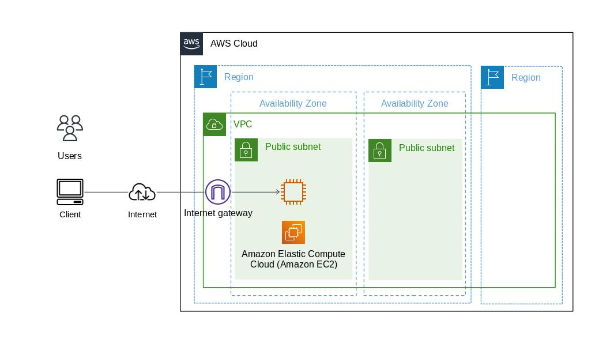

# AWSの基礎知識

（最終更新： 2022/12/29）

## 目次

1. [AWS](#aws)
1. [クラウド設計のポイント](#クラウド設計のポイント)
	1. [RASとRASIS](#rasとrasis)
	1. [ACID特性](#acid特性)
	1. [冗長化](#冗長化)
	1. [ホットスタンバイとウォームスタンバイとコールドスタンバイ](#ホットスタンバイとウォームスタンバイとコールドスタンバイ)
	1. [フェイルオーバー](#フェイルオーバー)
	1. [その他のポイント](#その他のポイント)
1. [AWSの基本的な仕組み](#awsの基本的な仕組み)
	1. [リージョンとAZ](#リージョンとaz)
	1. [マルチAZ](#マルチaz)
1. [AWSのコアサービス](#awsのコアサービス)
	1. [最重要サービス](#最重要サービス)
	1. [重要なサービス](#重要なサービス)

## AWS

**AWS**（Amazon Web Service）は、Amazonが提供する**クラウドコンピューティングサービス**で、インターネットを介して、サーバやストレージ、データベース、ソフトウェアなどを利用することができる。AWSのようなクラウドコンピューティングサービスを利用することにより、従来の**オンプレミス**（コンピュータの実体を企業や団体の元で管理する方式）に比べて低いコストでサービスを運用できたり、障害への対策や負荷分散が手軽に行えるといった利点がある。

## クラウド設計のポイント

### RASとRASIS

**RAS**(Reliability, Availability and Serviceability)、**RASIS**(Reliability, Availability, Serviceability, Integrity, Security)はクラウド設計のポイントとなる特性を組み合わせた用語。RASは1970年代にIBMが製品の特性を表す用語として用いたのが定着したもので、RASISは日本ではよく使われるものの海外では一般的ではない。

**信頼性**(Reliability)は障害の発生のしにくさのことで、システムやサービスが使用できなくなる頻度やその間隔を表す指標。**平均故障間隔**(MTBF: Mean Time Between Failures)で表され、この数値が大きいほど信頼性の高いシステムであるといえる。平均故障間隔は $MTBF = \frac{コンピュータが正常に稼働している時間の累計}{故障回数}$ で求めることができる。

**可用性**(Availability)あるいは**稼働率**はシステムやサービスが継続して稼働できる能力のこと。システムの停止時間が少ないほど可用性が高く、ユーザが利用したい時に利用できる確率が高い。信頼性や耐障害性が高いシステムは可用性が高いといえる。稼働率は $稼働率 = \frac{コンピュータが正常に稼働した時間の累計}{コンピュータ通電時間の累計} = \frac{MTBF}{MTBF + MTTR}$ で求めることができる。

**保守性**(Serviceability)あるいは**平均修理時間**はメンテナンスの容易さを表す概念。**平均修復時間**(MTTR: Mean Time to Repair)で表され、この数値が小さいほど保守性が高いシステムであるといえる。平均修復時間は $MTTR = \frac{修理に要した時間の累計}{故障回数}$ で求めることができる。保守性が高いほど可用性が高く保たれる。

**完全性・整合性**(Integrity)は情報が矛盾を起こさずに一貫性を保てる度合いを表す概念。データの処理や転送等に際して、目的となるデータが常に欠損なく存在することをデータのインテグリティという。データに対する正規化や制約が不十分でデータ間の関係に矛盾が生じたり、装置の障害やソフトウェアのバグによってデータが欠損したり、外部からの攻撃によってデータが改ざんされたりするとデータのインテグリティが損なわれる。

**機密性**(Security)は情報の外部流失の起きにくさの度合いを表す概念。コンピュータやソフトウェアのデータ、通信路などを暗号化したり、アクセス制御を行うなどの対策によってセキュリティを向上させることができる。

### ACID特性

**ACID特性**(Atomicity, Consistency, Isolation, Durability)はトランザクション処理が保証するべき4つの性質を合わせた用語。

**原始性・不可分性**(Atomicity)はある操作がそれ以上細かい単位や要素に分割されない性質のこと。原始性を持つ操作は、「実行される」か「実行されない」かのどちらかしか起きないことが保障されており、データベースの**トランザクション**（複数の操作をひとつにまとめ上げて管理すること）は原始性を持つ操作となっている。トランザクションは「全て成功」か「全て失敗」のいずれかとなることが保障されている。

**一貫性・整合性**(Consistency)はあるデータが更新された場合に必ず変更後の状態を取得できる性質のこと。変更中のデータを別の操作により取得しようとした場合、古いデータが参照されることなく最新のデータが取得できることが保障される（**強整合性**）。トランザクションの前後ではデータの整合性が保たれ、矛盾が発生しないことが保障されている。

**独立性・隔離性**(Isolation)はある操作の処理中はその内容が他の操作から隠蔽される性質のこと。独立性を持つ操作は別の処理が並行して実行されたとしても影響を受けないことが保障されており、データベースのトランザクションは独立性を持つ操作となっている。トランザクションを複数同時に実行しても、単独で実行した場合と同じ結果を得られることが保障されている。

**永続性・持続性**(Durability)は捜査結果が失われない確率あるいは性質のこと。数値としての永続性は、1から**AFR**（年間故障率）を引いた確率で表される。また、データベースのトランザクションは永続性を持つ操作となっており、トランザクションの結果は障害が発生しても失われてはいけない。トランザクションにおけるデータ操作はログに記録され、障害発生時にはログをもとに更新を反映させる。

また強整合性と比較して用いられる**結果整合性**は、更新が反映されるまでに時間がかかる場合に保存前や変更前の状態が見える可能性があるという性質のこと。一貫性を保とうとした場合、あるユーザが操作中のデータに他のユーザが一時的にアクセスできなくなるため、可用性を犠牲にすることとなる。強整合性が必要となるか結果整合性がとれていれば問題ないかはシステムや処理に応じて判断する必要がある。

### 冗長化

**冗長性**(Redundancy)あるいは**多重性**はシステムに障害が発生した場合に備えて冗長な予備装置を運用する仕組みのこと。システムに冗長性を持たせることを**冗長化**という。メインのサーバに加えて障害時に備えた予備のサーバを常に運用しておくのは、冗長化の例である。

### ホットスタンバイとウォームスタンバイとコールドスタンバイ

冗長化の手法として代表的なものにホットスタンバイとウォームスタンバイとコールドスタンバイがある。

**ホットスタンバイ**は運用系のシステムと全く同じ環境にデータを常に同期し続け、障害発生時に即座に待機系（予備のサーバなど）を運用系と切り替える手法。保守性を高めることができる一方でコストが大きくなる。

**ウォームスタンバイ**は待機系のシステムを最小限のリソースで起動しておき、障害発生時に運用系と切り換える手法。切り替えの際には運用系に比べてスペックが落ちるため、切り替え時にリソースを追加する必要がある場合もある。

**コールドスタンバイ**は通常時は待機系のシステムに電源を供給せず、障害発生時に待機系のシステムを起動してリソースなどを用意した後に運用系と切り換える手法。最もコストが低いが復旧までに時間がかかり、保守性が下がってしまう。

### フェイルオーバー

冗長化されているシステムにおいて、障害時に運用系から待機系のシステムに自動的に切り替える機能のことを**フェイルオーバー**という。フェイルオーバー機能が組み込まれたシステムは可用性や信頼性が高いといえる。

### その他のポイント

**耐障害性**（**フォールトトレランス**、fault tolerance）は問題が起こった場合に自動で復旧する仕組みや設計方針のこと。**単一障害点**(**SPOF**: Single Point Of Failure)を排除することで耐障害性を向上させることができる。復旧後に復旧前よりもシステムが使いづらくなるようであれば、耐障害性はないと言える。

**障害回避**（**フォールトアボイダンス**、fault avoidance）はそもそも問題を発生させないための仕組みのこと。

**堅牢性**はハードウェアが丈夫で壊れにくい設計になっていることや、予期しないエラーや障害に柔軟に対応できることなどを指す幅広い概念。信頼性や可用性、耐障害性が総じて高いことを表現している。

**再現性**は別の環境や手法を用いても同じ、あるいは近い結果が得られる性質のこと。エラーやトラブルについて再現性が低い場合、その原因を特定することが難しく解決されにくい。

**冪等性**はある操作を繰り返し行っても得られる結果が同じであるという性質のこと。

## AWSの基本的な仕組み

クラウドコンピューティングサービスの役割は、コンピュータや通信機器を設置することに特化した施設（**データセンター**）のハードウェア資源をインターネットを介してユーザに提供することである。AWSは単一のデータセンターではなく、複数の地域にまたがったデータセンターから構成されている。

### リージョンとAZ

**リージョン**はデータセンターが設置されている地域を指し、日本であれば東京リージョンと大阪リージョン、海外ではロンドンやパリ、バーレーンなど様々な地域にリージョンがある。各地のリージョンは相互に高速回線で接続されている。

**アベイラビリティゾーン**（**AZ**）は1つのリージョン内に複数あり、それぞれ物理的に切り離されており、電力やネットワークなどについて冗長化されている。

### マルチAZ

システムのインフラを構築する際には、複数のAZをまたいだ**マルチAZ**の構成を意識することで高い耐障害性や可用性を実現できる。

## AWSのコアサービス

### 最重要サービス

AWSで提供される数あるサービスの中でも、最も基本的で重要なサービスをいくつか示す。

**IAM**（AWS Identity and Access Management）は、ポリシーの作成やユーザに対する権限の付与などといった、権限管理のサービス。

**VPC**（Amazon Virtual Private Cloud）は、仮想ネットワーク環境におけるリソースの配置、接続性、セキュリティなどを制御するためのサービス。

**EC2**（Amazon Elastic Computing Cloud）は、Webサーバやバッチサーバなど様々な役割を持ったサーバを構築できるサービス。ディスク領域として**EBS**（Amazon Elastic Block Store）を使用するので、併せて理解を深めるとよい。**ECS**（Amazon Elastic Container Service）や**Lambda**との違いを意識して使い分けることがポイント。

**ELB**（Elastic Load balancing）は、EC2をWebサーバとして使用する際に、負荷分散の役割を果たすロードバランサのサービス。EC2のインスタンスを複数台配置してサーバの停止に備えるなど、可用性の高い設計を目指したときに必須となる。また、動的にサーバの数を増減させる**Auto Scaling**も、コスト最適化や可用性向上といった目的で重要なサービスとなる。

**RDS**（Amazon Relational Database Service）は、リレーショナルデータベースマネージドサービス（RDBMS）。中でもAWSが独自に開発したデータベースエンジンである**Aurora**は重要なので押さえておく。

**S3**（Amazon Simple Storage Service）は、オブジェクトストレージサービスである。ファイルが置かれたことをトリガーに後続の処理が動いたり、他のシステムとのファイル連携に利用したり、サーバログの定期的な退避先に使われたりと、広いユースケースのあるサービスである。

### 重要なサービス

続いて重要度が比較的高いサービスについて見ていく。

**Route53**は、AWSのDNSサービスである。新旧のシステムを入れ替えるブルーグリーンデプロイメントとの相性も良い。

**CloudWatch**は、AWSのリソースの状態や各種ログの監視を行うサービス。

**CloudFormation**は、インフラを自動構築するサービス。また、自動構築を支援するサービスとしては**Elastic Beanstalk**や**OpsWorks**といったサービスもある。

