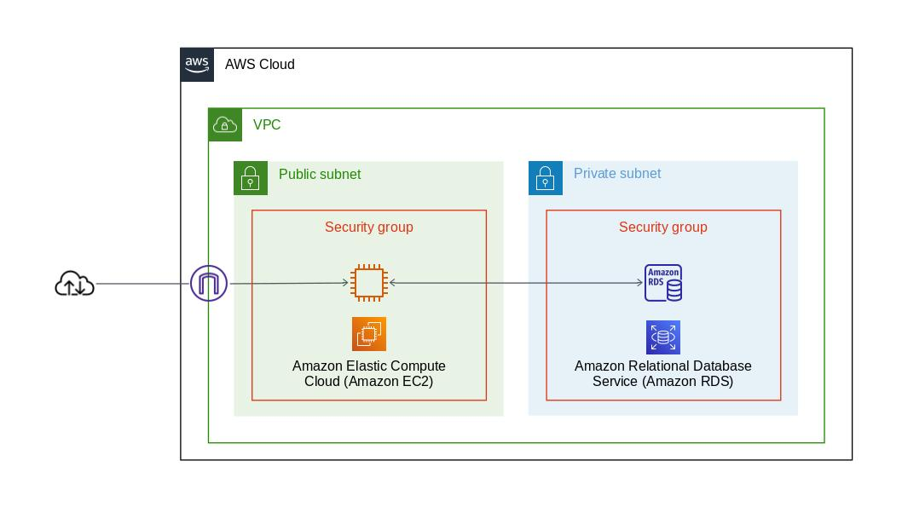
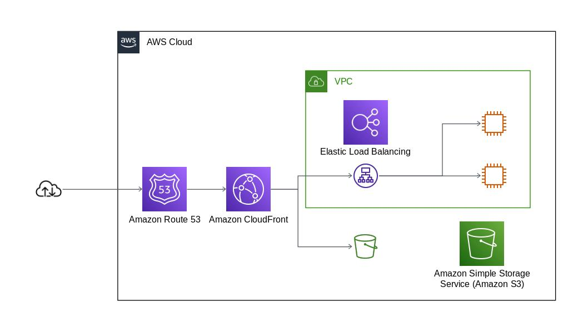

# ネットワーキングとコンテンツ配信

（最終更新： 2023/1/3）

## 目次

1. [VPC](#vpc)
	1. [IPアドレス](#ipアドレス)
	1. [サブネット](#サブネット)
	1. [ルーティングテーブル](#ルーティングテーブル)
	1. [セキュリティグループ](#セキュリティグループ)
	1. [ネットワークACL](#ネットワークACL)
	1. [ゲートウェイ](#ゲートウェイ)
	1. [VPCエンドポイント](#vpcエンドポイント)
	1. [ピアリング接続](#ピアリング接続)
	1. [VPCフローログ](#vpcフローログ)
	1. [Direct Connect](#direct-connect)
1. [CloudFront](#cloudfront)
	1. [キャッシュルール](#キャッシュルール)
1. [Route 53](#route-53)
	1. [ドメイン管理](#ドメイン管理)
	1. [権威DNS](#権威dns)
	1. [ホストゾーンとレコード情報](#ホストゾーンとレコード情報)
	1. [トラフィックルーティング](#トラフィックルーティング)
	1. [トラフィックフロー](#トラフィックフロー)
	1. [DNSフェイルオーバー](#dnsフェイルオーバー)

## VPC

**VPC**（Amazon Virtual Private Cloud）は[AWS](./01_basic_knowledge_of_aws.ja.md#aws)のネットワークサービスの中心であり、利用者ごとのプライベートなネットワークを[AWS](./01_basic_knowledge_of_aws.ja.md#aws)内に作成する。VPCから[インターネット](../../internet/chapters/01_basic_knowledge_of_network.ja.md#インターネット)への出口を[インターネットゲートウェイ](#ゲートウェイ)、VPCからオンプレミスの各拠点への出口を[仮想プライベートゲートウェイ](#ゲートウェイ)という。

[S3](./06_storage.ja.md#s3)や[CloudWatch](./05_management_and_governance.ja.md#cloudwatch)、[DynamoDB](./07_database.ja.md#dynamodb)など、VPCに入れられないサービスも多数あるので注意する。

### IPアドレス

[VPC](#vpc)には自由な[IPアドレス](../../internet/chapters/07_internet_layer.ja.md#ipアドレス)（[CIDR](../../internet/chapters/07_internet_layer.ja.md#cidrとvlsm)ブロック）をアサインできる。この時、[ネットワーク部](../../internet/chapters/07_internet_layer.ja.md#ipアドレス)（ネットワーク空間）をできるだけ大きなサイズ（/16）で作成すると後々の拡張性が向上する。

### サブネット

**サブネット**は[VPC](#vpc)内部でさらにアドレスを分割するために用いられる。[AZ](./01_basic_knowledge_of_aws.ja.md#リージョンとaz)を指定して作成し、[サブネット](../../internet/chapters/07_internet_layer.ja.md#サブネットマスク)ごとに[ルーティングテーブル](#ルーティングテーブル)、[ネットワークACL](#ネットワークacl)を1つだけ指定する。

[インターネット](../../internet/chapters/01_basic_knowledge_of_network.ja.md#インターネット)上に公開するものを**パブリックサブネット**、[VPC](#vpc)内部で用いるものを**プライベートサブネット**と呼ぶ。

### ルーティングテーブル

宛先アドレスとターゲットとなる[ゲートウェイ](#ゲートウェイ)（ネクスト[ホップ](../../internet/chapters/07_internet_layer.ja.md#経路制御)）を指定した情報をまとめた表を**ルーティングテーブル**という。[ルーティング](../../internet/chapters/10_routing_protocol.ja.md#経路制御)には、静的にルーティングテーブルに記載する方法（[スタティックルーティング](../../internet/chapters/07_internet_layer.ja.md#ipアドレスと経路制御)）と、**ルート伝搬**（**プロパゲーション**）機能で動的に反映する方法（[ダイナミックルーティング](../../internet/chapters/07_internet_layer.ja.md#ipアドレスと経路制御)）がある。

### セキュリティグループ

**セキュリティグループ**は[EC2](./04_computing.ja.md#ec2)や[ELB](./04_computing.ja.md#elb)、[RDS](./07_database.ja.md#rds)など、インスタンス単位の通信制御に利用される。**インバウンド**（外部から[VPC](#vpc)）と**アウトバウンド**（[VPC](#vpc)から外部）の両方を制御することが可能。制御項目は[プロトコル](../../internet/chapters/01_basic_knowledge_of_network.ja.md#プロトコル)や[ポート](../../internet/chapters/08_transport_layer.ja.md#ポート番号)範囲、送受信先の[CIDR](../../internet/chapters/07_internet_layer.ja.md#cidrとvlsm)（[IPアドレス](#ipアドレス)）もしくは他のセキュリティグループなど。デフォルトではすべての通信を拒否する。

セキュリティグループはステートフルで、応答トラフィックはルールに関係なく通信が許可される。

### ネットワークACL

**ネットワークACL**(Access Control List)は[サブネット](../../internet/chapters/07_internet_layer.ja.md#サブネットマスク)ごとの通信制御に利用される。制御項目は[セキュリティグループ](#セキュリティグループ)とほぼ同じ。デフォルトではすべての通信を許可する。

ネットワークACLはステートレスで、応答トラフィックであろうと明示的に許可設定をしていないと通信遮断してしまうので注意が必要である。

### ゲートウェイ

**インターネットゲートウェイ**（IGW）は[VPC](#vpc)と[インターネット](../../internet/chapters/01_basic_knowledge_of_network.ja.md#インターネット)を接続する[ゲートウェイ](../../internet/chapters/01_basic_knowledge_of_network.ja.md#ゲートウェイ)で各[VPC](#vpc)にひとつだけアタッチ可能。[単一障害点](./01_basic_knowledge_of_aws.ja.md#単一障害点)となる懸念があるが、実際は[冗長化](./01_basic_knowledge_of_aws.ja.md#冗長化)や障害時の復旧が自動的に行われる。

[パブリックサブネット](#サブネット)は[ルーティング](../../internet/chapters/10_routing_protocol.ja.md#経路制御)でインターネットゲートウェイを向いているもの、[プライベートサブネット](#サブネット)は[ルーティング](../../internet/chapters/10_routing_protocol.ja.md#経路制御)で直接インターネットゲートウェイに向いていないものとなる。

[EC2インスタンス](./04_computing.ja.md#ec2)が[インターネット](../../internet/chapters/01_basic_knowledge_of_network.ja.md#インターネット)と通信するには、パブリックIPを持っているか、**NATゲートウェイ**を経由する必要がある。

**仮想プライベートゲートウェイ**（VPG）は[VPC](#vpc)が[VPN](../../internet/chapters/06_datalink_layer.ja.md#vpn)や[Direct Connect](#direct-connect)と接続するための[ゲートウェイ](../../internet/chapters/01_basic_knowledge_of_network.ja.md#ゲートウェイ)。

### VPCエンドポイント

[VPC](#vpc)から他の[AWS](./01_basic_knowledge_of_aws.ja.md#aws)サービスに接続するには、[IGW](#ゲートウェイ)か**VPCエンドポイント**を利用する。VPCエンドポイントにはゲートウェイエンドポイントとインタフェースゲートポイントがある。

**ゲートウェイエンドポイント**は[VPC](#vpc)に[ゲートウェイ](#ゲートウェイ)を設置することで、[インターネット](../../internet/chapters/01_basic_knowledge_of_network.ja.md#インターネット)を介さずに[VPC](#vpc)内のサービスと[VPC](#vpc)外のサービスを通信する機能。[S3](./06_storage.ja.md#s3)や[DynamoDB](./07_database.ja.md#dynamodb)と接続する場合にはゲートウェイエンドポイントを使用する。

**インタフェースエンドポイント**（**AWS PrivateLink**）は[VPC](#vpc)内にインタフェースを設置して[IGW](#ゲートウェイ)を介さずに[VPC](#vpc)外のサービスにアクセスするための機能。

### ピアリング接続

**VPCピアリング**は2つの[VPC](#vpc)間でプライベートな接続をするための機能。[EC2インスタンス](./04_computing.ja.md#ec2)などとは通信できるが、[IGW](#ゲートウェイ)や[VGW](#ゲートウェイ)には**トランジット**（接続）できない。

### VPCフローログ

**VPCフローログ**（VPC Flow Logs）は[VPC](#vpc)内の通信の解析に用いる。VPCフローログは[AWS](./01_basic_knowledge_of_aws.ja.md#aws)の仮想[ネットワークインタフェースカード](../../internet/chapters/01_basic_knowledge_of_network.ja.md#アドレスとnic)である**ENI**（Elastic Network Interface）単位で記録される。

### Direct Connect

**AWS Direct Connect**は[AWS](./01_basic_knowledge_of_aws.ja.md#aws)とオフィスや[データセンター](./01_basic_knowledge_of_aws.ja.md#awsの基本的な仕組み)などの物理的拠点とを専用線でつなげたい場合のサービス。**Direct Connect Gateway**を利用すると、1つのDirect Connect接続で拠点と複数の[AWSアカウント](./02_overview_of_services.ja.md#awsアカウントの種類)や[VPC](#vpc)に接続することができる。また**AWS Transit Gateway**は、複数の[VPC](#vpc)と[オンプレミス](./01_basic_knowledge_of_aws.ja.md#aws)ネットワークを中央ハブを介して接続するサービスである。

## CloudFront

**Amazon CloudFront**は、HTMLファイルやCSS、画像、動画といった静的コンテンツをキャッシュし、**バックエンドサーバ**（**オリジンサーバ**）の代わりに配信する**CDN**（Contents Delivery Network）サービスである。オリジンサーバとしては[EC2](./04_computing.ja.md#ec2)や[ELB](./04_computing.ja.md#elb)、[S3](./06_storage.ja.md#s3)の静的ホスティング、[オンプレミス](./01_basic_knowledge_of_aws.ja.md#aws)サーバを利用することができる。

CloudFrontを利用することで、ユーザは最も近い**エッジロケーション**からコンテンツを取得することができるため、[レイテンシ](./01_basic_knowledge_of_aws.ja.md#レイテンシ)を最小化することができる。

### キャッシュルール

[CDN](#cloudfront)ではキャッシュの扱いがとても重要で、頻繁に更新されるコンテンツのキャッシュ期間は短く設定しておく必要がある。

## Route 53

**Amazon Route 53**は[ドメイン管理](#ドメイン管理)機能と[DNS](../../internet/chapters/07_internet_layer.ja.md#dnsの役割)機能を持つサービス。

### ドメイン管理

[Route 53](#route-53)で新規[ドメイン](../../internet/chapters/07_internet_layer.ja.md#dnsの役割)の取得や更新などの手続きができる。[ドメイン](../../internet/chapters/07_internet_layer.ja.md#dnsの役割)の取得から**ゾーン情報**（[権威DNS](#権威dns)が管理する変換情報や設定）まで、[Route 53](#route-53)で一貫した管理が可能になる。

### 権威DNS

**権威DNS**は[ドメイン名](../../internet/chapters/07_internet_layer.ja.md#dnsの役割)と[IPアドレス](#ipアドレス)の変換情報を保持している[DNS](../../internet/chapters/07_internet_layer.ja.md#dnsの役割)のことで、変換情報を保持していない**キャッシュDNS**と区別される。

### ホストゾーンとレコード情報

**ホストゾーン**はレコード情報の管理単位を表し、通常は[ドメイン名](../../internet/chapters/07_internet_layer.ja.md#dnsの役割)となる。**レコード情報**は[ドメイン名](../../internet/chapters/07_internet_layer.ja.md#dnsの役割)と[IPアドレス](#ipアドレス)を変換するための情報。

レコード情報には**Aレコード**、**MXレコード**、**CNAMEレコード**などがある。[Route 53](#route-53)の特徴的なレコードである**Aliasレコード**は、登録する値として[CloudFront](#cloudfront)や[ELB](./04_computing.ja.md#elb)、[S3](./06_storage.ja.md#s3)などの[AWS](./01_basic_knowledge_of_aws.ja.md#aws)リソース**FQDN**（Fully Qualified Domain Name、ホスト名や[ドメイン名](../../internet/chapters/07_internet_layer.ja.md#dnsの役割)などをすべて省略せずに指定した記述形式）、Zone Apexを指定できる。**Zone Apex**は最上位ドメインのこと。

### トラフィックルーティング

[Route 53](#route-53)に[ゾーン情報](#ドメイン管理)を登録する際に名前解決の問い合わせに対する応答を決めるための、7種類の**ルーティングポリシー**がある。

- **シンプルルーティングポリシー** 特別なルーティングポリシーを使わない1対1の[ルーティング](../../internet/chapters/10_routing_protocol.ja.md#経路制御)。
- **フェイルオーバールーティングポリシー** アクティブ/スタンバイ方式で、アクティブ側への[ヘルスチェック](./01_basic_knowledge_of_aws.ja.md#ヘルスチェック)が失敗したときにスタンバイ側のシステムへ[ルーティング](../../internet/chapters/10_routing_protocol.ja.md#経路制御)する。本番システム障害時に**Sorryサーバ**（Webサイトやサービスが停止していることを知らせるサーバ）の[IPアドレス](#ipアドレス)をセカンダリレコードとして登録しておくなどの使い方。
- **位置情報ルーティングポリシー** ユーザの位置情報に基づいてトラフィックを[ルーティング](../../internet/chapters/10_routing_protocol.ja.md#経路制御)する。
- **地理的近接性ルーティングポリシー** リソースの場所に基づいてトラフィックを[ルーティング](../../internet/chapters/10_routing_protocol.ja.md#経路制御)する。
- **レイテンシールーティングポリシー** 遅延が最も少ないサーバに[リクエスト](../../internet/chapters/09_application_layer.ja.md#http)を[ルーティング](../../internet/chapters/10_routing_protocol.ja.md#経路制御)する。
- **複数値回答ルーティングポリシー** 1つのレコードに異なる[IPアドレス](#ipアドレス)を複数登録して、ランダムに返却された[IPアドレス](#ipアドレス)に接続する。[ヘルスチェック](./01_basic_knowledge_of_aws.ja.md#ヘルスチェック)がNGになったサーバの[IPアドレス](#ipアドレス)は返却されない。
- **加重ルーティングポリシー** 指定した比率で複数のリソースにトラフィックを[ルーティング](../../internet/chapters/10_routing_protocol.ja.md#経路制御)する。

### トラフィックフロー

**トラフィックフロー**は複雑な[ルーティングポリシー](#トラフィックルーティング)をビジュアル化して、設定/管理するためのソリューション。

### DNSフェイルオーバー

**DNSフェイルオーバー**は[Route 53](#route-53)が持つ[フォールトトレラント](./01_basic_knowledge_of_aws.ja.md#その他のポイント)アーキテクチャ。**フォールトトレラントアーキテクチャ**とは、システムに異常が発生した場合でも被害を最小限に抑えるための仕組みのことを指す。

[ヘルスチェック](./01_basic_knowledge_of_aws.ja.md#ヘルスチェック)の結果を見てSorryサーバに切り替えるなどの処理を実行できる。
