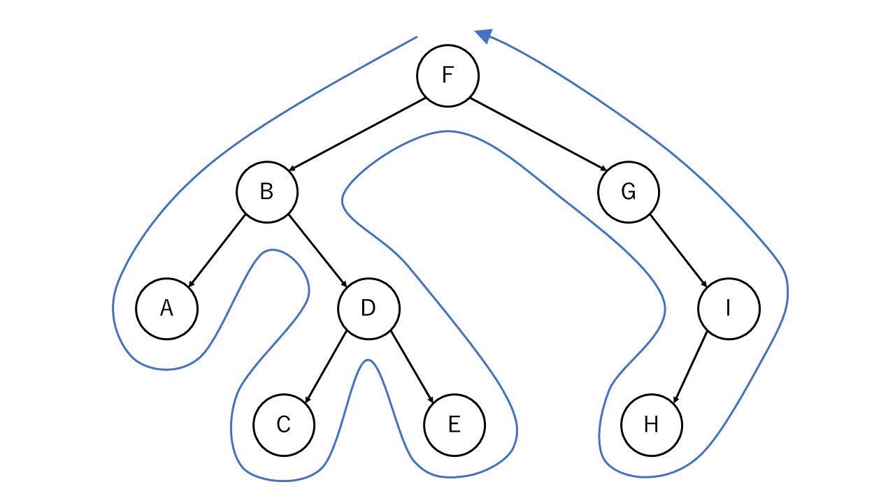
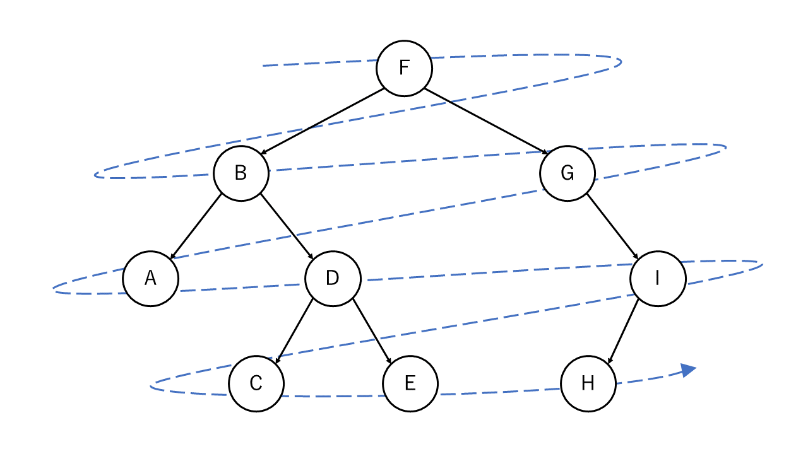

# 『グラフ理論』ノート

（最終更新： 2023-03-03）

## 目次

1. [グラフ](#グラフ)
	1. [有向グラフ](#有向グラフ)
	1. [無向グラフ](#無向グラフ)
1. [隣接行列](#隣接行列)
1. [木](#木)
	1. [走査](#走査)

## グラフ

**グラフ**は、有限個の点（**ノード**）から構成され、これらの点が線（**エッジ**）で結ばれたもの。通信網やリンク、電子回路といったものの関係を抽象化するために用いられる。

### 有向グラフ

**有向グラフ**は、[エッジ](#グラフ)がどちらからどちらに向かっているかという方向を持っている[グラフ](#グラフ)。[エッジ](#グラフ)は矢印によって表される。

### 無向グラフ

**無向グラフ**は、[エッジ](#グラフ)が向きを持たない[グラフ](#グラフ)。[エッジ](#グラフ)は単純な線によって表される。

## 隣接行列

**隣接行列**は、[グラフ](#グラフ)を表現するために用いられる[行列](./numerical_calculation.md#行列)。[行列](./numerical_calculation.md#行列)の各[行](./numerical_calculation.md#行列)と[列](./numerical_calculation.md#行列)はそれぞれ[グラフ](#グラフ)の[ノード](#グラフ)に対応しており、[ノード](#グラフ)同士が[エッジ](#グラフ)で接続されている部分を $1$ に、それ以外を $0$ にしたものとなっている。また、[エッジ](#グラフ)が重みを持つような[グラフ](#グラフ)の場合は、 $1$ の代わりに重みを入れた[行列](./numerical_calculation.md#行列)とする。

## 木

**木**は、[無向グラフ](#無向グラフ)のうち循環するような関係を持たないもの。

木の中にある1つの[ノード](#グラフ)を基準とすると、他の[ノード](#グラフ)との親子関係を明確にすることができる。この時、最上位の階層となる（親を持たない）[ノード](#グラフ)のことを**ルート**（**根**）、一番下の階層となる（子を持たない）[ノード](#グラフ)のことを**リーフ**（**葉**）という。

### 走査

**走査**は、[木](#木)の持つ各[ノード](#グラフ)を順番に読んでいく操作。

### 深さ優先探索

**深さ優先探索**は、現在の[ノード](#グラフ)について調査した後にその子[ノード](#グラフ)に対して同じことを繰り返す[走査](#走査)方法。再帰呼出しによって容易に表現でき、先行順、中間順、後行順の3つの方法がある。**先行順**では根[ノード](#グラフ)を調査してから子[ノード](#グラフ)を探索し、**中間順**では子[ノード](#グラフ)左側を探索してから根[ノード](#グラフ)を調査して子[ノード](#グラフ)右側を探索し、**後行順**では子[ノード](#グラフ)を探索してから根[ノード](#グラフ)を調査する。

下のような[木](#木)をそれぞれの方法で走査した場合、結果は次のようになる。

- 先行順 : F, B, A, D, C, E, G, I, H
- 中間順 : A, B, C, D, E, F, G, H, I
- 後行順 : A, C, E, D, B, H, I, G, F

### 幅優先探索

**幅優先探索**は、深さが同じ[ノード](#グラフ)を浅い方から順に[走査](#走査)する方法。

下のような[木](#木)を幅優先探索で走査した場合、結果は次のようになる。

- 幅優先探索 : F, B, G, A, D, I, C, E, H

## 参考文献

- [角谷一成.令和05年 基本情報技術者合格教本.株式会社技術評論社, 2022, 575](https://gihyo.jp/book/2022/978-4-297-13164-7)
- [瀬戸美月.徹底攻略 応用情報技術者教科書 令和4年度.株式会社インプレス, 2021, 814](https://book.impress.co.jp/books/1121101057)
