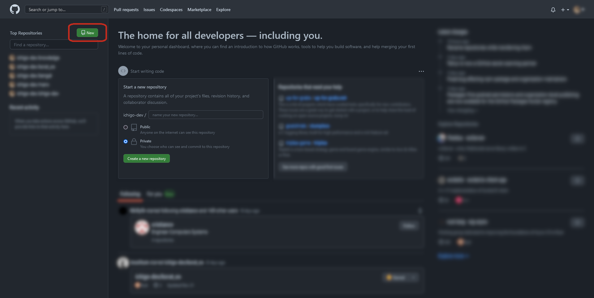
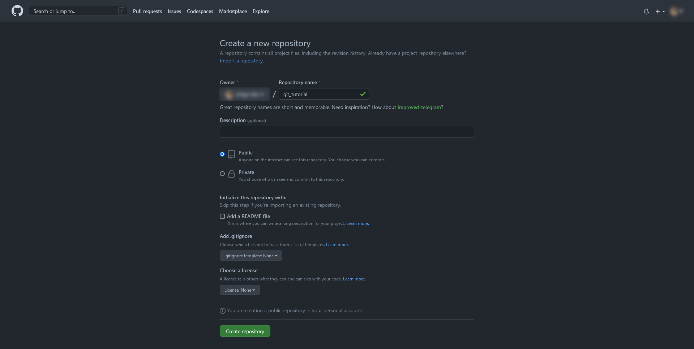
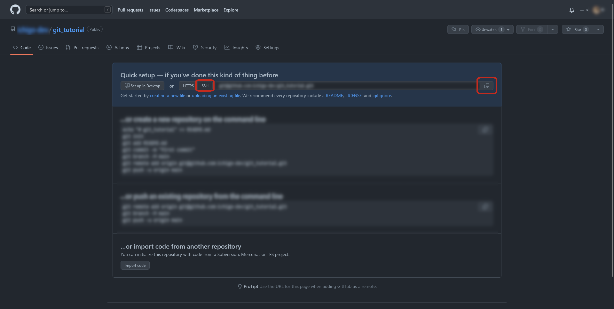

# チュートリアル


## 目次

1. [Gitの使い方](#gitの使い方)
1. [リポジトリの作成](#リポジトリの作成)
1. [リポジトリのクローン](#リポジトリのクローン)
1. [リモートリポジトリの作成](#リモートリポジトリの作成)
	1. [GitHubのSSH接続](#githubのssh接続)
1. [リモートリポジトリとの接続](#リモートリポジトリとの接続)
1. [変更の保存](#変更の保存)
1. [リモートリポジトリへの同期](#リモートリポジトリへの同期)
1. [ローカルリポジトリへの同期](#ローカルリポジトリへの同期)
1. [スタッシュの利用](#スタッシュの利用)
1. [変更の確認](#変更の確認)
1. [ブランチの分岐と合流](#ブランチの分岐と合流)


## Gitの使い方

Gitの使い方を学ぶために、本章の手順に従って実際にリポジトリを操作することを推奨する。可能であればGitホスティングサービスなどを用いた複数人での作業を疑似体験できる環境が望ましい。各コマンドの詳しい説明やGitのTipsについては次の章以降で説明する。

まずは任意のターミナルソフトウェア（Gitのインストール時に同梱されているGit Bashか、Macであればターミナル、Windowsであればコマンドプロンプトかターミナルなど）を開く。シェルによっては利用できないコマンドがあるかもしれないので注意。


## リポジトリの作成

Gitリポジトリを設置したいディレクトリに移動して、本チュートリアル用のディレクトリを作成しその中に移動する。

```sh
# 任意のディレクトリに移動
$ cd <path to any directory>

# チュートリアル用のディレクトリを作成
$ mkdir git_tutorial

# ディレクトリが作成されたことを確認
$ ls
git_tutorial/

# 作成したディレクトリへ移動
$ cd git_tutorial
```

現在のディレクトリをGitリポジトリとして初期化する。

```sh
$ git init
Initialized empty Git repository in /path/to/git_tutorial/.git/
```

成功するとメッセージが表示され、現在のディレクトリ直下に `.git` ディレクトリが作成される。

```sh
# .gitは隠しディレクトリなので、-aオプションをつけて存在を確認する
$ ls -a
./  ../  .git/

# .gitの中身は次のようになっている
$ ls .git
HEAD  config  description  hooks/  info/  objects/  refs/
```


## リポジトリのクローン

既に存在するリポジトリをサーバから複製する場合には、 `git clone` を使用する。一度ひとつ上のディレクトリに戻り、試しにリポジトリをクローンしてみる。

```sh
# いったんひとつ上のディレクトリに戻る
$ cd ../

# 戻ったことを確認
$ ls
git_tutorial/

# 適当なリポジトリをクローン
$ git clone https://github.com/libgit2/libgit2
Cloning into 'libgit2'...
remote: Enumerating objects: 119184, done.
remote: Counting objects: 100% (119184/119184), done.
remote: Compressing objects: 100% (32735/32735), done.
Receiving objects: 100% (119184/119184), 61.20 MiB | 11.69 MiB/s, done.eused 0

Resolving deltas: 100% (84540/84540), done.
Updating files: 100% (11537/11537), done.

# クローンが成功したことを確認
$ ls
git_tutorial/ libgit2/

# クローンしたリポジトリの中身を確認
$ ls libgit2
AUTHORS         COPYING    SECURITY.md   ci/     deps/  examples/  git.git-authors  package.json  src/
CMakeLists.txt  README.md  api.docurium  cmake/  docs/  fuzzers/   include/         script/       tests/
```

ここでクローンしてきたリポジトリのURL、[https://github.com/libgit2/libgit2](https://github.com/libgit2/libgit2)にアクセスしてみると、先ほど確認したディレクトリ構成と全く同じになっていることがわかる。Gitではこのように、リモートのリポジトリのソースコードを容易に自身のコンピュータ上に再現できる。クローンしてきたリポジトリはもう使わないので削除してもよい。

```sh
# リポジトリを削除
$ rm -rf libgit2

$ ls
git_tutorial/
```


## リモートリポジトリの作成

複数人での開発では、Gitがインストールされた中央サーバに変更内容を集約する。Gitホスティングサービスを利用することで、中央サーバを用意する手間を省くことができる。ここでは、最も代表的なGitホスティングサービスである[GitHub](https://github.com/)を使用して複数人での開発の準備を行う。

まずは[GitHub](https://github.com/)にアクセスし、右上の「Sign up」からアカウントを作成する。既にアカウントを作成している場合はサインインする。


アカウントを作成してメール認証を行い、アンケートへの回答やプランの選択（Freeで問題ない）を終えたら、ダッシュボードが表示される。



ダッシュボードの左サイドメニュー上部にある「New」をクリックし、リポジトリの作成画面に移動する。リポジトリ名を入力し、公開範囲がPublicになっていることを確認して「Create repository」をクリックする。



リポジトリを作成したら、リポジトリの詳細画面から「SSH」を選択し、表示されるURLをコピーする。



リモートリポジトリの作成が完了したので、このURLからリポジトリをクローンすることもできるが、次節では作成済みのローカルリポジトリをリモートリポジトリに接続する方法を用いる。

### GitHubのSSH接続

リポジトリへの変更の適用については、セキュリティ面での安全性を考慮する必要がある。GitHubではSSH接続を用いてクライアントの信頼性を保障している。次の手順でGitHub用のSSHキーペアを作成し、GitHubに公開鍵を登録する必要がある。

```
# SSHキー用のディレクトリへ移動
$ cd ~/.ssh

# SSHキーペアを作成
# 途中で入力を求められる部分については全て何も入力せずにEnterでよい
$ ssh-keygen -t ed25519
Generating public/private ed25519 key pair.
Enter file in which to save the key (/<HOME>/.ssh/id_ed25519): 
Enter passphrase (empty for no passphrase):
Enter same passphrase again:
Your identification has been saved in /<HOME>/.ssh/id_ed25519
Your public key has been saved in /<HOME>/.ssh/id_ed25519.pub
The key fingerprint is:
SHA256:xxxxxxxxxxxxxxxxxxxxxxxxxxxxxxxxxxxxxxxxxxx
The key's randomart image is:
+--[ED25519 256]--+
|o=o.             |
|o=o    .         |
|o =o  +          |
|.+.=.+ o         |
|+ =o*.o S        |
|oo++**           |
|oEo=o.o          |
|=oo  o..         |
|=*+.o  ..        |
+----[SHA256]-----+

# クリップボードに公開鍵をコピー
$ clip < id_ed25519
```

GitHubページ右上のアイコンからメニューを開き、「Settings」に移動する。左側に表示されるタブの中から「SSH and GPG keys」を選択し、「New SSH key」からクリップボードにコピーした公開鍵を登録する（名前は任意）。

次のコマンドにより、SSHでGitHubに接続できることを確認する。

```sh
# GitHubにSSH接続
$ ssh -T git@github.com
Hi <your account>! You've successfully authenticated, but GitHub does not provide shell access.
```


## リモートリポジトリとの接続

Gitのリポジトリは、別のコンピュータ上のリポジトリと接続することで互いに同期することができる。最初に作成した `git_tutorial` リポジトリのディレクトリに戻り、現在接続中のリモートリポジトリを確認する。

```sh
# git_tutorialがあるリポジトリへ移動
$ cd <path to any directory>

# git_tutorialリポジトリ内へ移動
$ cd git_tutorial

# 接続中のリモートリポジトリを確認
$ git remote
```

まだ接続されているリモートリポジトリはないので、ここでは何も表示されない。次に、前節で作成したGitHub上のリポジトリを接続先として追加する。

```sh
# GitHubリポジトリを接続先として追加（名前はoriginとする）
$ git remote add origin git@github.com:<your account>/git_tutorial.git

# 接続先が追加されたことを確認
$ git remote
origin

# より詳細な接続先の情報を確認
$ git remote -v
origin  git@github.com:<your account>/git_tutorial.git (fetch)
origin  git@github.com:<your account>/git_tutorial.git (push)
```

これでGitHub上のリポジトリが `origin` という名前で接続先に追加された。


## 変更の保存

ここでは初めてのコミットの作成を目標とする。まずは `git status` コマンドにより、現在のワークツリーとステージの状態を確認してみる。

```sh
$ git status
On branch main

No commits yet

nothing to commit (create/copy files and use "git add" to track)
```

まだリポジトリには何も変更を加えていないので、 `nothing to commit` と表示される。ローカルリポジトリ上で何かファイルをつくり、ワークツリーに変更を加えてた上で改めて `git status` を実行してみる。

```sh
# ファイルを作成
$ touch test.txt

# 作成したファイルに文字列を書き込み
$ echo "Hello, world!" >> test.txt

# ファイルの中身を確認
$ cat test.txt
Hello, world!

# 改めて状態を確認
$ git status
On branch main

No commits yet

Untracked files:
  (use "git add <file>..." to include in what will be committed)
        test.txt

nothing added to commit but untracked files present (use "git add" to track)
```

`Untracked files` の項目に作成したファイルが表示される。このファイルをワークツリーからステージに移動してみる。

```sh
# ファイルをステージング
$ git add test.txt

# 改めて状態を確認
On branch main

No commits yet

Changes to be committed:
  (use "git rm --cached <file>..." to unstage)
        new file:   test.txt
```

`Untracked files` の項目がなくなり、 `Changes to be committed` の項目に追加したファイルが移動された。ここで、さらに2つのファイルを新規作成してみる。

```sh
# 2つのファイルを新規作成
$ touch test2.txt test3.txt

# 改めて状態を確認
$ git status
On branch main

No commits yet

Changes to be committed:
  (use "git rm --cached <file>..." to unstage)
        new file:   test.txt

Untracked files:
  (use "git add <file>..." to include in what will be committed)
        test2.txt
        test3.txt
```

先ほどステージングした `test.txt` のみが `Changes to be committed` の項目に存在しているのが確認できる。続いて、ステージングされた `test.txt` をコミットする。

```sh
# コミット履歴を確認
$ git log
fatal: your current branch 'main' does not have any commits yet

# コミットを作成
$ git commit -m "first commit"
[main (root-commit) 03013b4] first commit
 1 file changed, 1 insertion(+)
 create mode 100644 test.txt

# 状態を確認
$ git status
On branch main
Untracked files:
  (use "git add <file>..." to include in what will be committed)
        test2.txt
        test3.txt

nothing added to commit but untracked files present (use "git add" to track)

# 改めてコミット履歴を確認
$ git log
commit xxxxxxxxxxxxxxxxxxxxxxxxxxxxxxxxxxxxxxxx (HEAD -> main)
Author: xxxxx <xxxxx@xxxxx>
Date:   Tue Dec 13 15:15:24 2022 +0900

    first commit
```

これで初めてのコミットが作成できた。


## リモートリポジトリへの同期

前節では初めてのコミットを作成することに成功した。コミットは自身のコンピュータ内のリポジトリにおける変更の確定であり、GitHub上のリポジトリには変更は反映されていない。リモートリポジトリへ変更を保存するために、 `git push` コマンドを使用する。

```sh
# リモートリポジトリへの同期
$ git push origin main
Enumerating objects: 3, done.
Counting objects: 100% (3/3), done.
Writing objects: 100% (3/3), 227 bytes | 227.00 KiB/s, done.
Total 3 (delta 0), reused 0 (delta 0), pack-reused 0
To github.com:<your account>/git_tutorial.git
 * [new branch]      main -> main
```

同期に成功したことを確認するため、先ほどリポジトリを作成したWebページに移動する。下のようにコミットしたファイルがリモートリポジトリにも反映されていれば成功。


## ローカルリポジトリへの同期

次に、リモートリポジトリの変更をローカルリポジトリに同期してみる。GihHubリポジトリのコラボレータとして別のユーザを招待して、そのユーザがコミットした内容をローカルリポジトリに反映することで疑似的に複数人での共同作業を再現できる。1人で試したい場合は、GitHub上から直接ファイルを編集してコミットを作成することもできるので、ここではそちらの方法をとる。

GitHub上で前節でpushした `test.txt` を開き、編集ボタンを押す。ファイルに任意の変更を加えてコミットを作成する。ローカルリポジトリから `git pull` コマンドを実行し、リモートリポジトリのコミットをローカルリポジトリに同期する。

```sh
# ローカルリポジトリへの同期
$ git pull origin main
remote: Enumerating objects: 5, done.
remote: Counting objects: 100% (5/5), done.
remote: Total 3 (delta 0), reused 0 (delta 0), pack-reused 0
Unpacking objects: 100% (3/3), 642 bytes | 8.00 KiB/s, done.
From github.com:<your account>/git_tutorial
 * branch            main       -> FETCH_HEAD
   xxxxxxx..xxxxxxx  main       -> origin/main
Updating xxxxxxx..xxxxxxx
Fast-forward
 test.txt | 2 ++
 1 file changed, 2 insertions(+)

# 変更されたことを確認
$ cat test.txt
Hello, world!

Hello, git!
```

ローカルリポジトリの更新は実際には2段階に分かれており、 `git pull` は `git fetch` と `git merge` を同時に行うショートハンドコマンドとなっている。リモートリポジトリの変更を確認したいがワークツリーにはまだ反映したくない、という場合には `git fetch` コマンドを用いると良い。


## 変更の確認

ここでは、ワークツリーにどのような変更を加えたのかを確認してみる。

```sh
# 現状のファイルの内容を確認
$ cat test.txt
Hello, world!

Hello, git!

# ファイルの末尾に文字列を追加
$ echo "additional text" >> test2.txt

# 改めてファイルの内容を確認
$ cat test.txt
Hello, world!

Hello, git!
additional text

# ワークツリーの変更内容を確認
$ git diff
diff --git a/test.txt b/test.txt
index xxxxxxx..xxxxxxx xxxxxx
--- a/test.txt
+++ b/test.txt
@@ -1,3 +1,4 @@
 Hello, world!

 Hello, Git!
+additional text
```


## スタッシュの利用

スタッシュを利用すると一時的にローカルの変更内容を退避させておくことができる。ここでは前節で加えた変更を退避し、ワークツリーを変更前の状態に戻してみる。

```sh
# 変更を退避
$ git stash
Saved working directory and index state WIP on main: xxxxxxx

# スタッシュの一覧を表示
$ git stash list
stash@{0}: WIP on main: xxxxxxx

# ファイルの内容を確認
$ cat test.txt
Hello, world!

Hello, git!

# スタッシュから復元
$ git stash apply
On branch main
Changes not staged for commit:
  (use "git add <file>..." to update what will be committed)
  (use "git restore <file>..." to discard changes in working directory)
        modified:   test.txt

no changes added to commit (use "git add" and/or "git commit -a")

# コメント付きでスタッシュを追加
$ git stash save "additional text"
Saved working directory and index state On main: additional text

# 改めてスタッシュを確認
$ git stash list
stash@{0}: On main: additional text
stash@{1}: WIP on main: xxxxxxx

# インデックス指定でスタッシュを復元
$ git stash apply "stash@{1}"
On branch main
Changes not staged for commit:
  (use "git add <file>..." to update what will be committed)
  (use "git restore <file>..." to discard changes in working directory)
        modified:   test.txt

no changes added to commit (use "git add" and/or "git commit -a")

# スタッシュをクリア
$ git stash clear
```


## ブランチの分岐と合流

Gitの変更履歴はブランチによって分岐することができる。ここまえ作業を進めてきたのは、本流となる `main` ブランチであったが、ここでは別のブランチを分岐して変更を加え、最終的に `main` ブランチにマージするということを試してみる。

```sh
# ブランチの一覧を確認
$ git branch
* main

# ブランチを分岐
$ git branch develop

# 改めてブランチの一覧を確認
$ git branch
  develop
* main

# developブランチに移動
$ git checkout develop
Switched to branch 'develop'
M       test.txt

# ファイルにさらに変更を加える
$ echo "more additional text" >> test.txt

# 変更をコミット
$ git commit -a -m "additional text"
[develop xxxxxxx] additional commit
 1 file changed, 2 insertions(+)

# mainブランチへ移動
$ git checkout main
Switched to branch 'main'

# developブランチをmainブランチにマージ
$ git merge develop
Updating xxxxxxx..xxxxxxx
Fast-forward
 test.txt | 2 ++
 1 file changed, 2 insertions(+)
```
