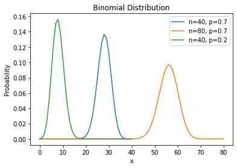
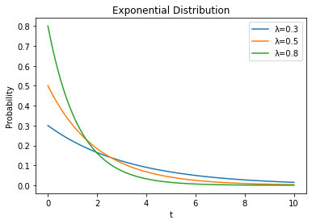
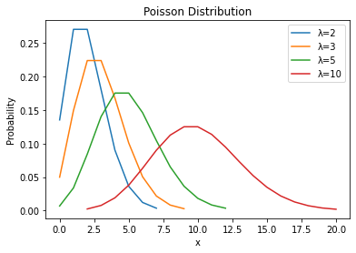
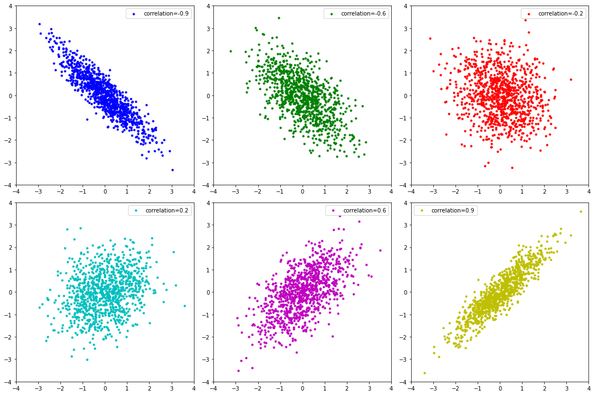

# 『確率と統計』ノート

（最終更新： 2023-03-12）


## 目次

1. [順列](#順列)
1. [組合せ](#組合せ)
1. [確率](#確率)
	1. [試行](#試行)
	1. [事象](#事象)
	1. [排反](#排反)
	1. [独立](#独立)
	1. [余事象](#余事象)
	1. [加法定理](#加法定理)
	1. [乗法定理](#乗法定理)
	1. [条件付き確率](#条件付き確率)
	1. [ベイズの定理](#ベイズの定理)
1. [基本統計量](#基本統計量)
	1. [代表値](#代表値)
	1. [散布値](#散布値)
	1. [平均値](#平均値)
	1. [中央値](#中央値)
	1. [最頻値](#最頻値)
	1. [範囲](#範囲)
	1. [分散](#分散)
	1. [標準偏差](#標準偏差)
1. [確率の分布](#確率の分布)
	1. [確率変数](#確率変数)
	1. [確率分布](#確率分布)
	1. [ベルヌーイ試行](#ベルヌーイ試行)
	1. [二項分布](#二項分布)
	1. [指数分布](#指数分布)
	1. [ポアソン分布](#ポアソン分布)
	1. [正規分布](#正規分布)
	1. [標準正規分布](#標準正規分布)
1. [マルコフ過程](#マルコフ過程)
	1. [マルコフ連鎖](#マルコフ連鎖)
1. [相関関係](#相関関係)
	1. [相関図](#相関図)
1. [回帰直線](#回帰直線)
	1. [回帰分析](#回帰分析)
	1. [ロジスティック回帰分析](#ロジスティック回帰分析)
	1. [主成分分析](#主成分分析)
	1. [因子分析](#因子分析)
1. [推定](#推定)
1. [度数分布表](#度数分布表)
	1. [ヒストグラム](#ヒストグラム)


## 順列

**順列**は、複数の異なる[要素](../../../discrete_mathematics/_/chapters/set_and_proposition.md#要素)を持つ[集合](../../../discrete_mathematics/_/chapters/set_and_proposition.md#集合)から[要素](../../../discrete_mathematics/_/chapters/set_and_proposition.md#要素)を取り出し、それらを並べる場合の数を求める方法。

[要素](../../../discrete_mathematics/_/chapters/set_and_proposition.md#要素)数が $n$ 個の場合、それを並べる場合の数は以下の式で表される。

```math
1 \times 2 \times \cdots (n - 1) \times n = n!
```

また、 $n$ 個の[要素](../../../discrete_mathematics/_/chapters/set_and_proposition.md#要素)の中から $r$ 個の[要素](../../../discrete_mathematics/_/chapters/set_and_proposition.md#要素)を取り出して、それを並べる並べ方は以下の式で表される。

```math
\begin{array}{cc}
{}_n P_r = \frac{n!}{(n - r)!} & (0 \leq r \leq n)
\end{array}
```


## 組合せ

**組合せ**は、複数の異なる[要素](../../../discrete_mathematics/_/chapters/set_and_proposition.md#要素)を持つ[集合](../../../discrete_mathematics/_/chapters/set_and_proposition.md#集合)からいくつか[要素](../../../discrete_mathematics/_/chapters/set_and_proposition.md#要素)を取り出すときのパターンの総数。[順列](#順列)とは異なり、取り出す順番は意味を持たない。

[要素](../../../discrete_mathematics/_/chapters/set_and_proposition.md#要素)数が $n$ 個の[集合](../../../discrete_mathematics/_/chapters/set_and_proposition.md#集合)から $r$ 個の[要素](../../../discrete_mathematics/_/chapters/set_and_proposition.md#要素)を取り出す組み合わせの数は、以下の式で表される。

```math
{}_n C_r = \frac{{}_n P_r}{r!} = \frac{n!}{(n - r)!r!}
```


## 確率

**確率**は、ある[試行](#試行)に対して得られる全ての結果に対し、特定の[事象](#事象)が起こる頻度（起こりやすさ）を表したもの。通常は $0$ から $1$ までの実数で表され、 $0$ に近いほどその[事象](#事象)が起こりにくく、 $1$ に近いほど起こりやすい。

ある[試行](#試行)によって[事象](#事象) $A$ の起こる確率 $P(A)$ は、[事象](#事象) $A$ の起こりうる場合の数を $n$ 、全事象の数を $m$ とすると以下の式で表される。

```math
P(A) = \frac{n}{m}
```

### 試行

**試行**は、ある[事象](#事象)が起こるかどうかを確かめるために行われる一連の行為。同じ条件で何度も繰り返すことができ、その結果が偶然によって決まる実験や観測のことを指す。

試行の例としては、サイコロを振ることやコインを投げることなどが挙げられる。

### 事象

**事象**は、[試行](#試行)の結果起こりうる事柄。

例えば、コインを1回投げるという[試行](#試行)においては、「表が出る」あるいは「裏が出る」という事象が起こりうる。

### 排反

**排反**は、ある2つの[事象](#事象)について、両方が同時に起こることがないという性質。一方の[事象](#事象)が起こった場合にもう一方の[事象](#事象)は起こり得ない。

例えば、コインを1回投げた場合に、「表が出る」という[事象](#事象)と「裏が出る」という[事象](#事象)は同時に起こり得ないため、これらは排反である。

### 独立

**独立**は、ある2つの[事象](#事象)について、それぞれが無関係に起こったり起こらなかったりするという性質。一方の[事象](#事象)が起こっても、他方の[事象](#事象)に影響を与えず、逆もまた同様であるような[事象](#事象)の組み合わせ。言い換えると、[従属](#従属)ではないこと。

例えば、コインを2回投げた場合、1回目の表裏がどうであろうと、2回目の表裏には影響を与えず、2回目に表が出る[確率](#確率)と裏が出る[確率](#確率)はそれぞれ $\frac{1}{2}$ であり、これらの事象は独立である。

### 従属

**従属**は、ある2つの[事象](#事象)について、一方の[事象](#事象)が起こる[確率](#確率)がもう一方の[事象](#事象)の発生の有無によって変わるという性質。言い換えると、[独立](#独立)ではないこと。従属な[事象](#事象)の場合、一方の[事象](#事象)が既に発生したことが、もう一方の[事象](#事象)が発生する[確率](#確率)に影響を与えるため、それらの[確率](#確率)を求める際には、同時に考慮する必要がある。

### 余事象

**余事象**は、ある[事象](#事象)の[補集合](../../../discrete_mathematics/_/chapters/set_and_proposition.md#補集合)を表す言葉で、その[事象](#事象)が起こらないという[事象](#事象)。ある[事象](#事象) $A$ が起こらない[確率](#確率) $P(\bar{A})$ （余事象の[確率](#確率)）は次のように求められる。

```math
P(\bar{A}) = 1 - P(A)
```

### 加法定理

**加法定理**は、ある2つの[事象](#事象) $A, B$ のいずれかが起こるという[事象](#事象)（**和事象**）の[確率](#確率)を求めるための定理。

2つの[事象](#事象)が互いに[排反](#排反)である場合、和事象の確率 $P(A \cup B)$ は、それぞれの[事象](#事象)の[確率](#確率)の和で求められる。

```math
P(A \cup B) = P(A) + P(B)
```

2つの[事象](#事象)が互いに[排反](#排反)でない場合、和事象の[確率](#確率) $P(A \cup B)$ は、それぞれの[事象](#事象)の[確率](#確率)の和から重複する部分（両方が同時に起こる[確率](#確率)）の[確率](#確率)を引くことで求められる。

```math
P(A \cup B) = P(A) + P(B) - P(A \cap B)
```

### 乗法定理

**乗法定理**は、ある2つの[事象](#事象) $A, B$ の両方が同時に起こるという[事象](#事象)（**積事象**）の[確率](#確率)を求めるための定理。

2つの[事象](#事象)が互いに[独立](#独立)である場合、積事象の[確率](#確率) $P(A \cap B)$ は、それぞれの[事象](#事象)の[確率](#確率)の積で求められる。

```math
P(A \cap B) = P(A) \times P(B)
```

2つの[事象](#事象)が互いに[従属](#従属)である場合、積事象の[確率](#確率) $P(A \cap B)$ は、一方の[事象](#事象)の[確率](#確率)ともう一方の[条件付き確率](#条件付き確率)の積で求められる。

```math
P(A \cap B) = P(A) \times P(B|A)
```

### 条件付き確率

**条件付き確率**は、ある[事象](#事象) $A$ が起こるという条件の下で別の[事象](#事象) $B$ の起こる[確率](#確率)のことで、 $P(B|A)$ のように表す。条件付き確率は次の式で求められる。

```math
P(B|A) = \frac{P(A \cap B)}{P(A)}
```

### ベイズの定理

**ベイズの定理**（**原因の確率**）は、2つの[事象](#事象) $A, B$ が互いに[排反](#排反)であり、そのいずれかの[事象](#事象)によって[事象](#事象) $E$ が発生したとき、その[事象](#事象) $E$ が発生した原因が[事象](#事象) $A$ または $B$ である[確率](#確率)を求めるための定理。

[事象](#事象) $E$ の発生する[確率](#確率)を $P(E)$ 、[事象](#事象) $A$ の発生する[確率](#確率)を $P(A)$ 、[事象](#事象) $A$ が原因で[事象](#事象) $E$ が起こる[確率](#確率)を $P(E|A)$ 、[事象](#事象) $B$ の発生する[確率](#確率)を $P(B)$ 、[事象](#事象) $B$ が原因で[事象](#事象) $E$ が起こる[確率](#確率)を $P(E|B)$ とすると、[事象](#事象) $E$ が起こる原因が $A$ である[確率](#確率) $P(A|E)$ は以下の式で表される。

```math
P(A|E) = \frac{P(A) \times P(E|A)}{P(E)} = \frac{P(A) \times P(E|A)}{P(A) \times P(E|A) + P(B) \times P(E|B)}
```


## 基本統計量

### 代表値

**代表値**は、集団内のデータを代表する値のことで、主に[平均値](#平均値)や[中央値](#中央値)、[最頻値](#最頻値)などが用いられる。

### 散布値

**散布値**は、データのばらつきを表すような指標となる値のことで、主に[範囲](#範囲)や[分散](#分散)、[標準偏差](#標準偏差)などが用いられる。

### 平均値

**平均値**（**算術平均**）は、データの合計をデータの個数で割ることで得られる値。 $n$ 個のデータ $x_1, x_2, \dots, \x_n$ の平均値 $\bar{x}$ は以下のように求められる。

```math
\bar{x} = \frac{1}{n} \sum_{i=1}^n x_i
```

### 中央値

**中央値**（**メジアン**）は、データを昇順もしくは降順に並べたときに真ん中の順位に位置するデータの値。データの個数が奇数の場合には中央に位置する値、偶数の場合には中央に位置する2つの値の[平均値](#平均値)を中央値とする。極端な外れ値が存在するデータや、分布に偏りのあるデータには、[平均値](#平均値)よりも[代表値](#代表値)として適している場合がある。

### 最頻値

**最頻値**（**モード**）は、データ群の中で最も頻繁に出現する値。どの値が出やすいかという傾向を見るのに適した指標。最頻値は常に一意に定まるわけではなく、複数存在する場合や存在しない場合もある。

### 範囲

**範囲**（**レンジ**）は、データの最大値と最小値の差を表す指標。データのばらつきを簡単に表現することができる。極端に大きな値や小さな値が存在する場合には、範囲が大きくなりすぎて、データ全体の特徴を表す指標としては不適切になることがある。

### 分散

**分散**は、データのばらつき具合を表す指標のひとつで、[平均値](#平均値)と各データとの差の2乗の[平均値](#平均値)。分散が小さいほどデータは[平均値](#平均値)付近に集中しており、大きいほど散らばっていることを意味する。データ数を $n$ 、分散を $s^2$ 、[平均値](#平均値)を $\bar{x}$ とすると、以下の式で表される。

```math
s^2 = \frac{1}{n} \sum^{n}_{i=1}{(x_i - \bar{x})^2}
```

全てのデータが等しいとき、分散は $0$ となる。なお、各データに対する[平均値](#平均値)との差 $x_i - \bar{x}$ を**偏差**という。

### 標準偏差

**標準偏差**は、データのばらつき具合を表す指標のひとつで、[分散](#分散)の平方根をとったもの。標準偏差が小さいほどデータは[平均値](#平均値)付近に集中しており、大きいほど散らばっていることを意味する。標準偏差を $s$ 、[分散](#分散)を $s^2$ とすると、以下の式で表される。[分散](#分散)は各データと[平均値](#平均値)との差の二乗をとるため単位が元のデータと異なるが、標準偏差を求めることで単位が元に戻り分析しやすくなる。

```math
s = \sqrt{s^2}
```


## 確率の分布

### 確率変数

**確率変数**は、ある[事象](#事象)に対して[確率](#確率)を割り当てる変数で、その値が特定の[確率分布](#確率分布)に従うときに用いられる。確率変数は離散的な場合と連続的な場合がある。

### 確率分布

**確率分布**は、[確率変数](#確率変数)の取りうる値と、その値をとる[確率](#確率)との関係を示したもの。確率変数が離散的な値を取る場合には**確率関数**、連続的な値を取る場合には**確率密度関数**として表現される。代表的なものには[二項分布](#二項分布)や[ポアソン分布](#ポアソン分布)、[正規分布](#正規分布)、[指数分布](#指数分布)などがある。

### 期待値

**期待値**は、[確率変数](#確率変数)の全ての値に[確率](#確率)の重みをつけた加重平均。1回の[試行](#試行)で得られる結果の[平均値](#平均値)を表す。[確率変数](#確率変数) $X$ について、その期待値 $E(X)$ は、[確率変数](#確率変数) $X$ が取り得る値の個数を $n$ 、 $X$ が $i$ 番目の値を取るときの値を $x_i$ 、 $X$ が $i$ 番目の値を取るときの[確率](#確率)を $p_i$ とすると、以下の式で表される。

```math
E(X) = \sum_{i=1}^n {x_i \times p_i}
```

### ベルヌーイ試行

**ベルヌーイ試行**は、とりうる結果が2種類（成功と失敗など）で、繰り返し行った各[試行](#試行)が[独立](#独立)となるような[試行](#試行)。

例えば、コインを投げる[試行](#試行)はベルヌーイ試行である。

ベルヌーイ試行では、[確率変数](#確率変数) $X$ がとりうる値の一方を $1$ 、もう一方を $0$ とする。[試行](#試行)が成功となる[確率](#確率)を $p$ とすると、成功と失敗の[確率](#確率)はそれぞれ次のように表される。

```math
\begin{eqnarray}
P(X=1) & = & p \
P(X=0) & = & 1 - p
\end{eqnarray}
```

### 二項分布

**二項分布**は、[ベルヌーイ試行](#ベルヌーイ試行)を繰り返し行ったときに、ある[事象](#事象)が起こった回数を[確率変数](#確率変数)とした離散型の[確率分布](#確率分布)。

例えば、ある製品の生産ラインで1個あたりの不良品率を $p$ としたときに、 $n$ 個の製品を生産したときに不良品が $k$ 個含まれている確率を求めることができる。

成功する[確率](#確率)が $p$ のある[ベルヌーイ試行](#ベルヌーイ試行)を $n$ 回行って成功する回数 $X$ は以下の式で表され、 $X$ が二項分布に従うとき $X \sim B(n, p)$ と表す。

```math
\begin{array}{cc}
P(X = k) = {}_n C_k p^k (1 - p)^{n-k} & (k = 0, 1, 2, \cdots, n)
\end{array}
```



### 指数分布

**指数分布**は、ある[事象](#事象)の発生から次の発生までの期間を表す[確率分布](#確率分布)。[事象](#事象)が発生する[確率](#確率)は一定として考える。指数分布は単位時間あたりの平均事象数 $\lambda$ をパラメータとして持つ。

指数分布は生存関数やハザード関数、密度関数などの様々な関数形を持つ。

生存関数は、ある時間 $t$ までに[事象](#事象)が起こる[確率](#確率)を表し、次の式で与えられる。

```math
S(t) = \exp^{- \lmabda t}
```

ハザード関数は、ある時間 $t$ に[事象](#事象)が起こる[条件付き確率](#条件付き確率)を表し、次の式で与えられる。

```math
h(t) = \lambda
```

密度関数は、ある時間 $t$ で[事象](#事象)が起こる確率密度を表し、次の式で与えられる。

```math
f(t) = \lambda \exp^{- \lambda t}
```



指数分布は、[待ち行列](./waiting_queue_theory.md#待ち行列)やシステムの信頼性解析などにおいてよく用いられる。

### ポアソン分布

**ポアソン分布**は、[試行](#試行)回数が十分に大きく、発生[確率](#確率)が低い[ベルヌーイ試行](#ベルヌーイ試行)を繰り返し行ったときに、ある[事象](#事象)が何回起こるかを示した離散型の[確率分布](#確率分布)。

成功する[確率](#確率)が $p$ のある[ベルヌーイ試行](#ベルヌーイ試行)を $n$ 回行ったとき、期待発生回数を $\lambda = np$ とおく。このとき、成功する回数 $X$ は以下の式で表され、 $X$ がポアソン分布に従うとき $X \sim Po(\lambda)$ と表す。

```math
\begin{array}{cc}
P(X = k) = \frac{\lambda^k e^{-\lambda}}{k!} & (k = 0, 1, 2, \cdots)
\end{array}
```



### 正規分布

**正規分布**（**ガウス分布**）は、連続的な[確率分布](#確率分布)の1つであり、[平均値](#平均値)と[標準偏差](#標準偏差)によって特徴づけられる。正規分布は[平均値](#平均値)を中心としたベル型曲線としてグラフ化される。自然現象や社会現象の多くは正規分布に従っており、実験や推定なども正規分布を前提として行うことが多い。

[平均値](#平均値)を $\mu$ 、[分散](#分散)を $s^2$ とおく。このとき、[確率変数](#確率変数) $X$ は以下の式で表され、 $X$ が正規分布に従うとき $X \sim N(\mu, s^2)$ と表す。

```math
f(x) = \frac{1}{\sqrt{2 \pi s^2}} \exp \left( -\frac{(x - \mu)^2}{2 s^2} \right)
```


### 標準正規分布

**標準正規分布**は、[平均](#平均値)が $0$ 、[標準偏差](#標準偏差)が $1$ であるような[正規分布](#正規分布)のことで、 $N(0, 1)$ と表す。任意の[正規分布](#正規分布)を標準正規分布に変換することで、[確率変数](#確率変数)の値を**標準正規分布表**から求めることができる。


## マルコフ過程

**マルコフ過程**は、ある時点での状態にのみ依存して次の状態が決まるような性質を持つ[確率](#確率)過程。マルコフ過程は過去の状態や未来の状態に依存せず、数学的に扱いやすい。さらに、挙動を決定する変数が1つのみであるものを**単純マルコフ過程**と呼ぶ。

### マルコフ連鎖

**マルコフ連鎖**は、連鎖的な時間軸での[マルコフ過程](#マルコフ過程)。


## 相関関係

**相関関係**は、2つの変数の関連性の強さを表すための指標。相関関係を数値で表したものを**相関係数**という。

相関係数 $r$ は $-1 \leq r \leq +1$ であり、この値が $1$ に近いほど強い正の相関があるといい、 $-1$ に近いほど強い負の相関があるという。

### 相関図

**相関図**（**散布図**）は、何らかの[相関関係](#相関関係)があると予想される2つのデータ系列をそれぞれ縦軸と横軸にとってここのデータをプロットしたもの。




## 回帰直線

### 回帰分析

**回帰分析**は、[相関関係](#相関関係)にある2つの変数の関係を数式で表現し、データを分析・予測する統計的手法。2つの変数のうち、値が分かっている変数を**説明変数**、その値を基に予測したい変数を**目的変数**という。説明変数が1つの場合を**単回帰分析**、2つ以上の場合を**重回帰分析**という。回帰直線は説明変数の各値からの距離の二乗和が最小となるような直線とし、これを**最小二乗法**という。

### ロジスティック回帰分析

**ロジスティック回帰分析**は、1つの**カテゴリ変数**（2値の変数）の発生[確率](#確率)を、複数の[説明変数](#回帰分析)によって予測する解析手法。

### 主成分分析

**主成分分析**は、高次元のデータをできるだけ情報を失わずに低次元に変換する手法。**主成分**とは、変換後の低次元のデータについて[分散](#分散)が最大となるものを**第一主成分**、次に分散が大きくなるものを**第二主成分**という。

### 因子分析

**因子分析**は、高次元のデータの背景にある共通因子を探る手法。[主成分分析](#主成分分析)は高次元のデータを合成することを目的としているが、因子分析では高次元データに対して影響を与えている原因を抽出するため、因果関係が逆になっている。


## 推定

**推定**とは、データ量が多く全てのデータを調査することが困難な場合において、いくつかのデータを取り出してそれを基に全体の[平均](#平均値)・[分散](#分散)などの傾向を算出すること。全体のデータのことを**母集団**、推定のために取り出したデータのことを**標本**という。


## 度数分布表

**度数分布表**とは、データの散らばりや分布をわかりやすくするために、データをいくつかの階級に分けてその階級に属するデータの数をまとめた表。

### ヒストグラム

**ヒストグラム**とは、[度数分布表](#度数分布表)をもとにプロットした棒グラフ。


## 参考文献

- [角谷一成.令和05年 基本情報技術者合格教本.株式会社技術評論社, 2022, 575](https://gihyo.jp/book/2022/978-4-297-13164-7)
- [瀬戸美月.徹底攻略 応用情報技術者教科書 令和4年度.株式会社インプレス, 2021, 814](https://book.impress.co.jp/books/1121101057)
