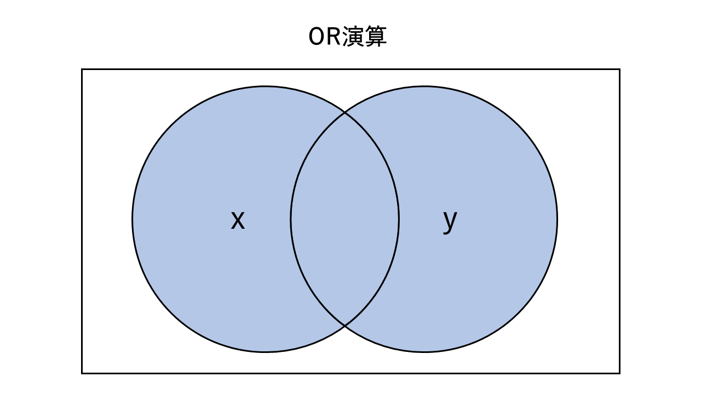
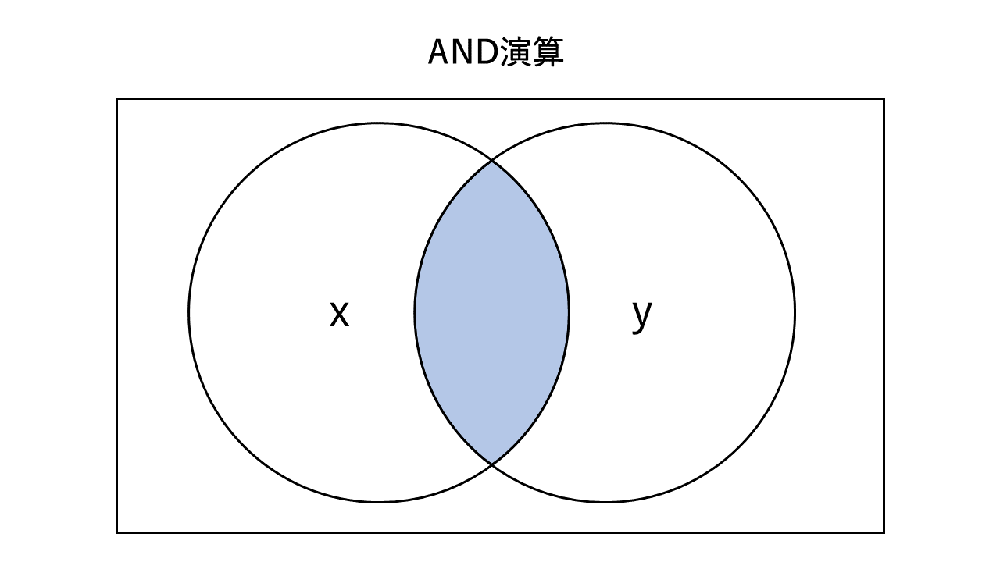
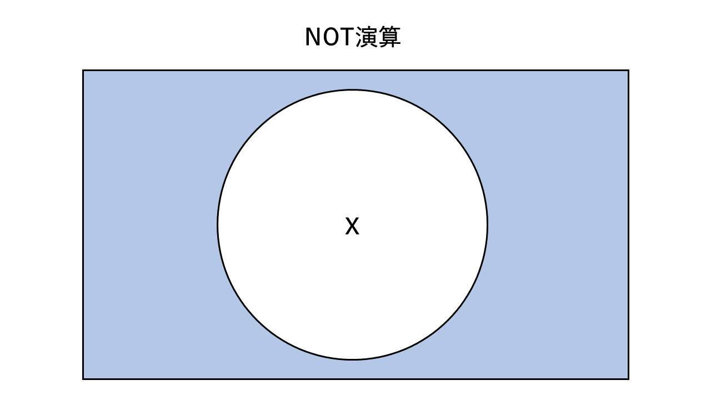
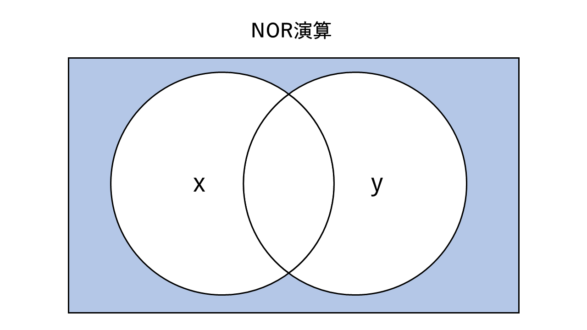
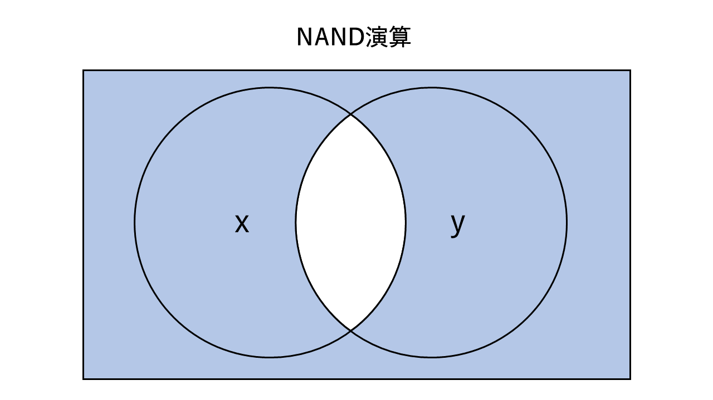
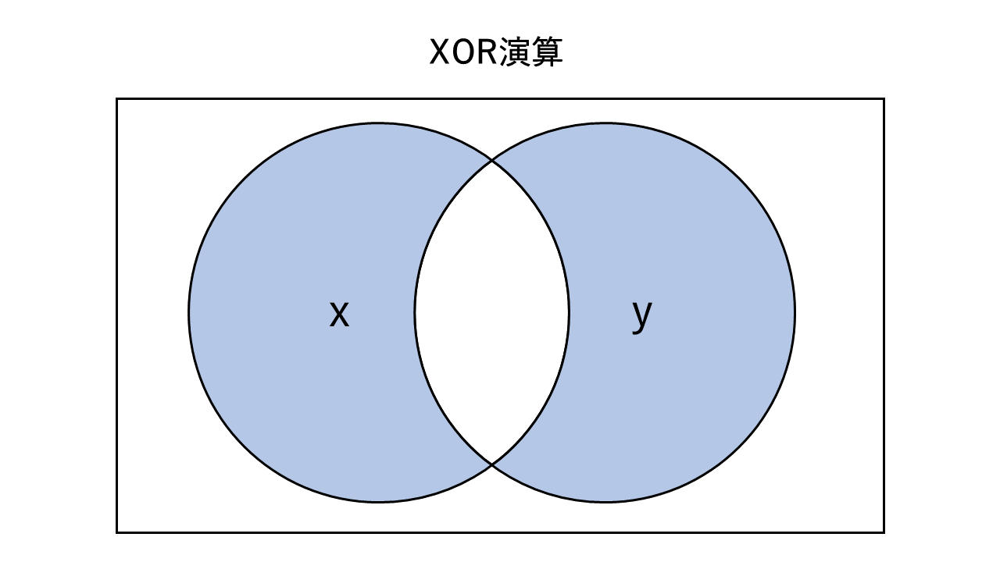

# 『論理演算』ノート

（最終更新： 2023-03-12）


## 目次

1. [論理演算](#論理演算)
	1. [真理値表](#真理値表)
	1. [OR演算](#or演算)
	1. [AND演算](#and演算)
	1. [NOT演算](#not演算)
	1. [NOR演算](#nor演算)
	1. [NAND演算](#nand演算)
	1. [XOR演算](#xor演算)
1. [ド・モルガンの法則](#ドモルガンの法則)
1. [ビット列に対する論理演算](#ビット列に対する論理演算)
	1. [マスクビット](#マスクビット)
	1. [ビットマスク演算](#ビットマスク演算)
	1. [ビットの反転](#ビットの反転)


## 論理演算

**論理演算**は、[真偽値](./set_and_proposition.md#真偽値)を対象として行う演算。

基本的な論理演算には、[OR演算](#or演算)、[AND演算](#and演算)、[NOT演算](#not演算)があり、これらは[コンピュータ](../../../../computer/_/chapters/computer.md#コンピュータ)が行う演算の最小単位となる。[真偽値](./set_and_proposition.md#真偽値)は[2進数](./radix.md#2進数)1桁で表現することができ、これは[コンピュータ](../../../../computer/_/chapters/computer.md#コンピュータ)が扱う情報の最小単位であるため、[コンピュータ](../../../../computer/_/chapters/computer.md#コンピュータ)が行う演算は全てこれらの論理演算の組み合わせにより成り立っている。

また、基本論理演算を組み合わせた複合的な論理演算として、[NOR演算](#nor演算)、[NAND演算](#nand演算)、[XOR演算](#xor演算)などがある。

論理演算の入出力関係は[真理値表](#真理値表)や[ベン図](./set_and_proposition.md#ベン図)を用いて表されることが多い。

### 真理値表

**真理値表**は、[論理演算](#論理演算)の入力の組み合わせと出力を表で表現したもの。入力を $x$ 、出力を $z$ とし、 $x$ を反転した値を出力するような[論理演算](#論理演算)の真理値表は以下のように表される。

| $x$ | $z$ |
| --- | --- |
| $0$ | $1$ |
| $1$ | $0$ |

### OR演算

**OR演算**（**論理和**）は、2つの[真偽値](./set_and_proposition.md#真偽値)の入力値のうち、どちらか一方でも真であれば真を出力する。

2つの入力変数をそれぞれ $x, y$ 、出力を $z$ とすると、[真理値表](#真理値表)と[ベン図](./set_and_proposition.md#ベン図)は次のようになる。

| $x$ | $y$ | $z$ |
| --- | --- | --- |
| $0$ | $0$ | $0$ |
| $0$ | $1$ | $1$ |
| $1$ | $0$ | $1$ |
| $1$ | $1$ | $1$ |



### AND演算

**AND演算**（**論理積**）は、2つの[真偽値](./set_and_proposition.md#真偽値)の入力値のうち、両方が真であるときにだけ真を出力する。

2つの入力変数をそれぞれ $x, y$ 、出力を $z$ とすると、[真理値表](#真理値表)と[ベン図](./set_and_proposition.md#ベン図)は次のようになる。

| $x$ | $y$ | $z$ |
| --- | --- | --- |
| $0$ | $0$ | $0$ |
| $0$ | $1$ | $0$ |
| $1$ | $0$ | $0$ |
| $1$ | $1$ | $1$ |



### NOT演算

**NOT演算**（**論理否定**）は、1つの[真偽値](./set_and_proposition.md#真偽値)の入力値を反転した値を出力する。

入力変数を $x$ 、出力を $z$ とすると、[真理値表](#真理値表)と[ベン図](./set_and_proposition.md#ベン図)は次のようになる。

| $x$ | $z$ |
| --- | --- |
| $0$ | $1$ |
| $1$ | $0$ |



### NOR演算

**NOR演算**（**否定論理和**）は、[OR演算](#or演算)と[NOT演算](#not演算)を組み合わせたもので、2つの[真偽値](./set_and_proposition.md#真偽値)の入力値のうち、どちらか一方でも真であれば偽を出力する。

2つの入力変数をそれぞれ $x, y$ 、出力を $z$ とすると、[真理値表](#真理値表)と[ベン図](./set_and_proposition.md#ベン図)は次のようになる。

| $x$ | $y$ | $z$ |
| --- | --- | --- |
| $0$ | $0$ | $1$ |
| $0$ | $1$ | $0$ |
| $1$ | $0$ | $0$ |
| $1$ | $1$ | $0$ |



### NAND演算

**NAND演算**（**否定論理積**）は、[AND演算](#and演算)と[NOT演算](#not演算)を組み合わせたもので、2つの[真偽値](./set_and_proposition.md#真偽値)の入力値のうち、両方が真であるときにだけ偽を出力する。

2つの入力変数をそれぞれ $x, y$ 、出力を $z$ とすると、[真理値表](#真理値表)と[ベン図](./set_and_proposition.md#ベン図)は次のようになる。

| $x$ | $y$ | $z$ |
| --- | --- | --- |
| $0$ | $0$ | $1$ |
| $0$ | $1$ | $1$ |
| $1$ | $0$ | $1$ |
| $1$ | $1$ | $0$ |



### XOR演算

**XOR演算**（**排他的論理和**）は、2つの[真偽値](./set_and_proposition.md#真偽値)の入力値の値が異なる場合にのみ真を出力する。

2つの入力変数をそれぞれ $x, y$ 、出力を $z$ とすると、[真理値表](#真理値表)と[ベン図](./set_and_proposition.md#ベン図)は次のようになる。

| $x$ | $y$ | $z$ |
| --- | --- | --- |
| $0$ | $0$ | $0$ |
| $0$ | $1$ | $1$ |
| $1$ | $0$ | $1$ |
| $1$ | $1$ | $0$ |




## ド・モルガンの法則

**ド・モルガンの法則**は、[否定論理和](#nor演算)および[否定論理積](#nand演算)をそれぞれ[論理和](#or演算)と[論理積](#and演算)に変換する式で、以下のように表される。

```math
\begin{eqnarray}
\overline{A \cdot B} & = & \overline{A} + \overline{B} \\
\overline{A + B}     & = & \overline{A} \cdot \overline{B}
\end{eqnarray}
```


## ビット列に対する論理演算

### マスクビット

**マスクビット**は、ある[ビット](../../../_/chapters/computer_and_number.md#ビット)列の特定の[ビット](../../../_/chapters/computer_and_number.md#ビット)にだけ操作を行いたい場合などに用いる[ビット](../../../_/chapters/computer_and_number.md#ビット)列で、操作対象となる[ビット](../../../_/chapters/computer_and_number.md#ビット)に対応する[ビット](../../../_/chapters/computer_and_number.md#ビット)を $1$ 、それ以外を $0$ としたものとなる。

```
# 8ビットのビット列の下位6ビットを対象としたマスクビット
00111111
```

### ビットマスク演算

**ビットマスク演算**（**ビットマスク**）は、[ビット](../../../_/chapters/computer_and_number.md#ビット)列のうち特定の部分だけを取り出すために使用される演算。取り出したい[ビット](../../../_/chapters/computer_and_number.md#ビット)に対する[マスクビット](#マスクビット)との[AND演算](#and演算)を行うことで得られる。対象としなかった部分は $0$ で埋められる。

次の例では、対象となる[ビット](../../../_/chapters/computer_and_number.md#ビット)列 $10011011$ に対して末尾の4[ビット](../../../_/chapters/computer_and_number.md#ビット)を取り出す操作を行っている。

```math
\begin{array}{rr}
     & 10011011 \
\lor & 00001111 \
\hline
     & 00001011
\end{array}
```

### ビットの反転

[2進数](./radix.md#2進数)で表された数の各桁を反転した（ $0$ を $1$ に、 $1$ を $0$ にした）新しい数を出力するには、反転したい[ビット](../../../_/chapters/computer_and_number.md#ビット)に対する[マスクビット](#マスクビット)との[XOR演算](#xor演算)を行う。

次の例では、対象となる[ビット](../../../_/chapters/computer_and_number.md#ビット)列 $10011011$ に対して全体を反転する操作を行っている。

```math
\begin{array}{rr}
       & 10011011 \
\oplus & 11111111 \
\hline
       & 01100100
\end{array}
```


## 参考文献

- [角谷一成.令和05年 基本情報技術者合格教本.株式会社技術評論社, 2022, 575](https://gihyo.jp/book/2022/978-4-297-13164-7)
- [瀬戸美月.徹底攻略 応用情報技術者教科書 令和4年度.株式会社インプレス, 2021, 814](https://book.impress.co.jp/books/1121101057)
