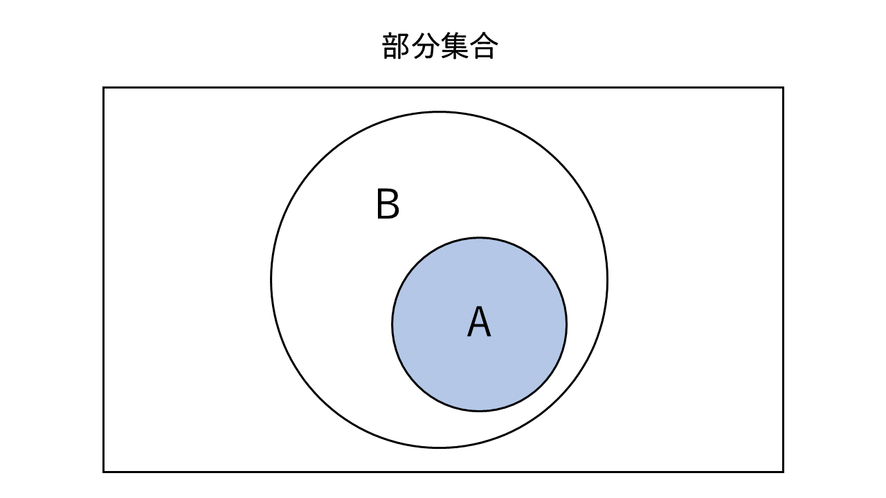

# 『集合と命題』ノート

（最終更新： 2023-03-12）

## 目次

1. [集合](#集合)
	1. [ベン図](#ベン図)
	1. [部分集合](#部分集合)
	1. [補集合](#補集合)
	1. [和集合](#和集合)
	1. [積集合](#積集合)
	1. [差集合](#差集合)
	1. [対称差集合](#対称差集合)
1. [命題](#命題)
	1. [真偽値](#真偽値)

## 集合

**集合**は、一定の規則に従ってまとめられた[要素](#要素)の集まり。集合は[要素](#要素)の数や種類、順序などには一切意味を持たない。

集合は中括弧を用いて表現される。例えば、 ${1, 2, 3}$ という集合は、[要素](#要素)が $1, 2, 3$ からなっていることを表す。

集合には[和集合](#和集合)や[積集合](#積集合)、[差集合](#差集合)、[補集合](#補集合)などの演算があり、これらを用いてより複雑な集合を作ることができる。

### 要素

**要素**は、[集合](#集合)に属する個々のもののことで、数字や文字、形、色、音などどのようなものでもよい。

### ベン図

**ベン図**は、複数の[集合](#集合)同士の関係や[集合](#集合)の範囲を図として表現したもの。ベン図を用いることで、複数の[集合](#集合)がどのように重なり合い、共通する[要素](#要素)を持つのかといったことを可視化することができる。

ベン図は一般的に円や楕円といった閉曲線を用いて表現される。それぞれの円や楕円は1つの[集合](#集合)を表し、[集合](#集合)の[要素](#要素)をその中に表記する。2つ以上の[集合](#集合)が共通する[要素](#要素)を持つ場合、それらの円や楕円は重なり合う図となる。

### 全体集合

**全体集合**は、考える対象となる[要素](#要素)全体の[集合](#集合)。

### 部分集合

2つの[集合](#集合) $A, B$ において、 $A$ の全ての[要素](#要素)が $B$ の[要素](#要素)に含まれているような場合、 $A$ は $B$ の**部分集合**であるという。2つの[集合](#集合)の[要素](#集合)が全て同じであるとき、 $A$ は $B$ の部分集合であると同時に $B$ も $A$ の部分集合となる。

$A$ が $B$ の部分集合で、 $A$ と $B$ が同じ[集合](#集合)ではない時、 $A$ は $B$ の**真部分集合**であるという。

### 補集合

[全体集合](#全体集合)の[部分集合](#部分集合) $A$ があったとき、 $A$ に属さない[要素](#要素)の[集合](#集合)を $A$ の**補集合**という。

### 和集合

2つの[集合](#集合) $A, B$ において、少なくともどちらか片方に属している[要素](#要素)の[集合](#集合)を**和集合**という。

### 積集合

2つの[集合](#集合) $A, B$ において、両方の[集合](#集合)に属している[要素](#要素)の[集合](#集合)を**積集合**という。

### 差集合

2つの[集合](#集合) $A, B$ において、 $A$ から $B$ を除いた[集合](#集合)を $A$ と $B$ の**差集合**という。

### 対称差集合

2つの[集合](#集合) $A, B$ において、 $A$ と $B$ のどちらか一方にだけ属する[要素](#要素)の[集合](#集合)を $A$ と $B$ の**対称差集合**という。

## 命題

**命題**は、正誤が明確にできる文章や条件式のことで、真(true)か偽(false)のどちらかの値をとる。例えば、 $1 + 1 = 2$ という数式は、真である命題。

### 真偽値

**真偽値**（**ブール値**）は、真(true)または偽(false)のどちらかをとるような値。[2進数](./radix.md#2進数)においては $0$ を真、 $1$ を偽として1[ビット](../../../_/chapters/computer_and_number.md#ビット)で表現することができる。

## 参考文献

- [山本真基. 離散数学 テキスト. 成蹊大学, 2022, 91](https://www.ci.seikei.ac.jp/yamamoto/lecture/dm/text.pdf)
- [瀬戸美月.徹底攻略 応用情報技術者教科書 令和4年度.株式会社インプレス, 2021, 814](https://book.impress.co.jp/books/1121101057)
