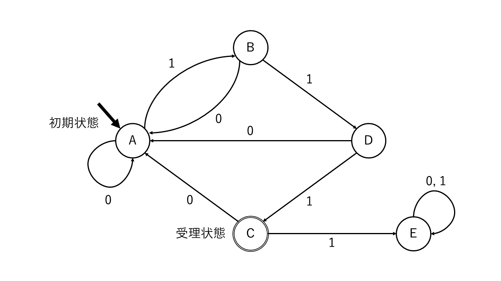

# 『オートマトン』

（最終更新： 2023-01-15）

## 目次

1. [オートマトン](#オートマトン-1)
	1. [状態遷移表](#状態遷移表)
	1. [状態遷移図](#状態遷移図)

## オートマトン

**オートマトン**は、入力とその時の状態によって出力が決定される機会をモデル化したもの。コンピュータの動きを数学的な観点からモデル化することで、問題解決のための処理手順を定式化することができる。オートマトンのうち、**初期状態**からいくつかの状態を遷移して**受理状態**で終了するものを**有限オートマトン**という。

### 状態遷移表

**状態遷移表**は、[オートマトン](#オートマトン-1)の状態遷移を表で表したもの。

以下は、A～Eまでの状態をとり得る[オートマトン](#オートマトン-1)の状態遷移表の例である。

| 遷移元 \ 遷移先 |  A     |  B  |  C  |  D  |  E  |
| --------------- | ------ | --- | --- | --- | --- |
| A               | $0$    | $1$ |     |     |     |
| B               | $0$    |     |     | $1$ |     |
| C               | $0$    |     |     |     | $1$ |
| D               | $0$    |     | $1$ |     |     |
| E               | $0, 1$ |     |     |     |     |

### 状態遷移図

**状態遷移図**は、[オートマトン](#オートマトン-1)の状態遷移を図で表したもの。矢印と丸のセットで表したものが初期状態で、二重丸で表したものが受理状態。

以下は、A～Eまでの状態をとり得る[オートマトン](#オートマトン-1)の状態遷移図の例である。

## 参考文献

- [角谷一成.令和05年 基本情報技術者合格教本.株式会社技術評論社, 2022, 575](https://gihyo.jp/book/2022/978-4-297-13164-7)
- [瀬戸美月.徹底攻略 応用情報技術者教科書 令和4年度.株式会社インプレス, 2021, 814](https://book.impress.co.jp/books/1121101057)
