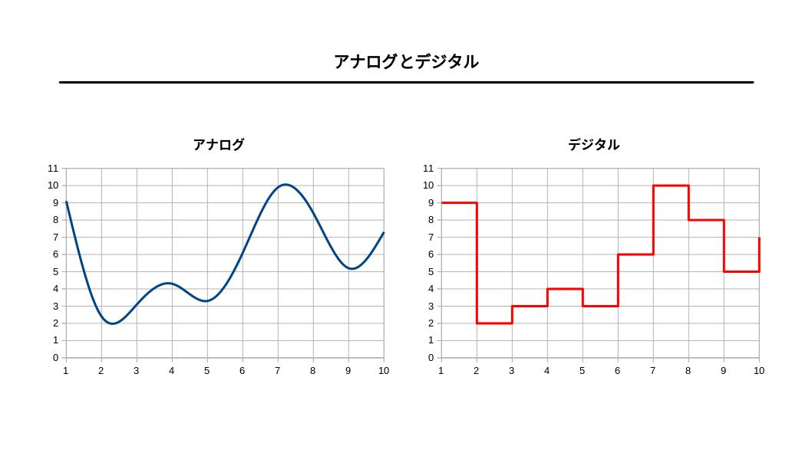

# 『符号理論』

（最終更新： 2023-02-22）

## 目次

1. [圧縮](#圧縮)
	1. [圧縮率](#圧縮率)
	1. [可逆圧縮](#可逆圧縮)
	1. [非可逆圧縮](#非可逆圧縮)
1. [解凍](#解凍)
	1. [自己解凍形式](#自己解凍形式)
1. [情報源符号](#情報源符号)
	1. [ハフマン符号化](#ハフマン符号化)
	1. [ランレングス符号化](#ランレングス符号化)
1. [伝送路符号](#伝送路符号)
1. [アナログとデジタル](#アナログとデジタル)
	1. [アナログ](#アナログ)
	1. [デジタル](#デジタル)
1. [エンディアン](#エンディアン)

## 圧縮

**圧縮**は、データの意味を変えずにデータの容量を小さくする処理。圧縮を行うことで、記憶容量の節減や、伝送時間の短縮ができる。

### 圧縮率

**圧縮率**は、[圧縮](#圧縮)によってデータの容量をどれだけ小さくできるかという指標。

### 可逆圧縮

**可逆圧縮**は、[圧縮](#圧縮)したデータを[解凍](#解凍)したときに完全に元の状態に戻せるような[圧縮](#圧縮)。ただし、[圧縮](#圧縮)には限界があるため、[非可逆圧縮](#非可逆圧縮)に比べて[圧縮率](#圧縮率)は小さくなる。

### 非可逆圧縮

**非可逆圧縮**は、[圧縮](#圧縮)したデータを[解凍](#解凍)したときにデータが品質劣化を起こすような[圧縮](#圧縮)。[圧縮率](#圧縮率)は[可逆圧縮](#可逆圧縮)に比べて高いものの、完全に元のデータに戻すことはできない。

## 解凍

**解凍**（**伸張**、**展開**）は、[圧縮](#圧縮)したデータを元の状態に復元する処理。

### 自己解凍形式

**自己解凍形式**は、[圧縮](#圧縮)したデータの[解凍](#解凍)をそのデータの情報自身でできるような形式のこと。

## 情報源符号

**情報源符号**は、情報源で転送前にデータを効率的に[圧縮](#圧縮)することを目的とする符号化。

### ハフマン符号化

**ハフマン符号化**は、ファイル[圧縮](#圧縮)の技術のひとつで、[可逆圧縮](#可逆圧縮)。出現回数の多い文字を短い[ビット](../../../_/chapters/computer_and_number.md#ビット)列に、出現回数の少ない文字を長い[ビット](../../../_/chapters/computer_and_number.md#ビット)列に置き換えることでファイルサイズを小さくする。

### ランレングス符号化

**ランレングス符号化**は、主に画像ファイルに用いられる[圧縮](#圧縮)技術のひとつで、[可逆圧縮](#可逆圧縮)。連続する同一の値を、 $\rm{値} \times \rm{回数}$ という情報に置き換える。単純な画像データほど[圧縮率](#圧縮率)が高い。

## 伝送路符号

**伝送路符号**（**通信路符号**）とは、データ伝送時に通信路上のノイズに対応するために冗長[ビット](../../../discrete_mathematics/_/chapters/computer_and_number.md#ビット)を付加する符号化。

- [通信理論 - 伝送理論 - 誤り検出と訂正](../../../communication_theory/_/chapters/transmission_theory.md#誤り検出と訂正)

## アナログとデジタル

### アナログ

**アナログ**とは、データを連続的に変化していく量（連続値）で表したもの。アナログデータは、通信の際にノイズの影響を受けやすく、完全な複製を行うことができないため、時間の経過やコピーによって情報が劣化する。

### デジタル

**デジタル**とは、データを一定の間隔で区切った値（離散値）で表したもの。デジタルデータは、コンピュータによる処理がしやすく、通信時のノイズによる情報の劣化にも強い。ただし値を近似値として記録しているため、正確な値をデータにすることはできない。

自然界に存在するほとんどの情報は、人間が観測するスケールにおいてはアナログであるが、アナログデータはコンピュータでは扱いにくいのでデジタルデータへの変換（[A/D変換](../../../measurement_and_control/_/chapters/signal_processing.md#ad変換)）がよく行われる。

## エンディアン

**エンディアン**（**バイトオーダ**）は、複数の[バイト](../../../_/chapters/computer_and_number.md#バイト)などを並べる際の方式。エンディアンは[CPU](../../../../computer/hardware/_/chapters/processor.md#cpu)によって決まっており、異なる機器間でデータをやり取りする際はエンディアンに留意する必要がある。

### ビッグエンディアン

**ビッグエンディアン**は、複数の[バイト](../../../_/chapters/computer_and_number.md#バイト)で構成されるデータを上位[バイト](../../../_/chapters/computer_and_number.md#バイト)から下位[バイト](../../../_/chapters/computer_and_number.md#バイト)の順に取り扱う手法。

### リトルエンディアン

**リトルエンディアン**は、複数の[バイト](../../../_/chapters/computer_and_number.md#バイト)で構成されるデータを下位[バイト](../../../_/chapters/computer_and_number.md#バイト)から上位[バイト](../../../_/chapters/computer_and_number.md#バイト)の順に取り扱う手法。

## 参考文献

- [角谷一成.令和05年 基本情報技術者合格教本.株式会社技術評論社, 2022, 575](https://gihyo.jp/book/2022/978-4-297-13164-7)
- [瀬戸美月.徹底攻略 応用情報技術者教科書 令和4年度.株式会社インプレス, 2021, 814](https://book.impress.co.jp/books/1121101057)
