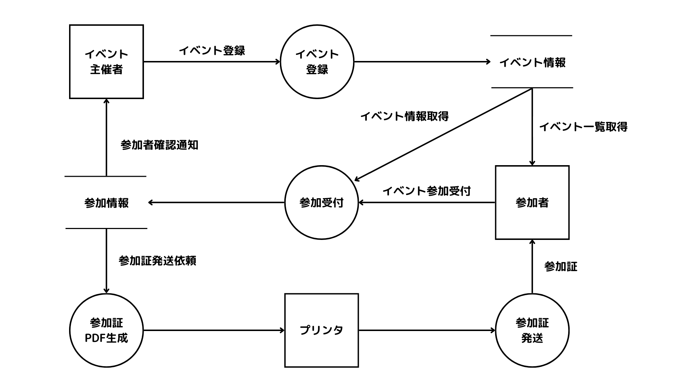

# 『開発プロセス』ノート

（最終更新： 2023-06-27）

## 目次

1. [共通フレーム](#共通フレーム)
	1. [V字モデル](#v字モデル)
1. [要件定義](#要件定義)
	1. [機能要件](#機能要件)
	1. [非機能要件](#非機能要件)
1. [レビュー](#レビュー)
	1. [ウォークスルー](#ウォークスルー)
	1. [インスペクション](#インスペクション)
1. [フローチャート](#フローチャート)
1. [POA](#poa)
	1. [DFD](#dfd)
	1. [プロセス](#プロセス)
	1. [ターミネータ](#ターミネータ)
	1. [データストア](#データストア)
	1. [データフロー](#データフロー)
1. [DOA](#doa)
1. [OOA](#ooa)
	1. [UML](#uml)
	1. [クラス図](#クラス図)
	1. [シーケンス図](#シーケンス図)

## 共通フレーム

**共通フレーム**は、[ソフトウェア](../../../../computer/software/_/chapters/software.md#ソフトウェア)、[システム](../../../../system/_/chapters/system.md#システム)、サービスの構想から開発、運用、保守、破棄に至るまでのライフサイクルを通じて必要な作業項目、役割などを包括的にまとめたガイドライン。共通フレームでは、各プロセスをアクティビティ、タスク、注記と徐々に詳細化していく。

### V字モデル

**V字モデル**は、開発からテスト、リリースまでの一連の流れをV字型に並べ、対応関係を表現したモデル。図の左側が開発工程、右側がテスト工程で、それぞれの段階に対応したテストケースを用意することによって、要件を明確化し、品質や信頼性の向上を図ることができる。

## 要件定義

**要件定義**は、[ソフトウェア](../../../../computer/software/_/chapters/software.md#ソフトウェア)開発プロセスの初期段階で行われる重要な工程で、[システム](../../../../system/_/chapters/system.md#システム)や[ソフトウェア](../../../../computer/software/_/chapters/software.md#ソフトウェア)の目的や機能、制約条件などを明確に定義する。

### 機能要件

**機能要件**は、[ソフトウェア](../../../../computer/software/_/chapters/software.md#ソフトウェア)や[システム](../../../../system/_/chapters/system.md#システム)に求められる具体的な機能や振る舞いの要件。その[システム](../../../../system/_/chapters/system.md#システム)がどのような機能を提供しなければならないかを明確に定義し、開発やテストの基準となる。

アカウント登録、ログイン、プロフィール編集、メッセージ送信、ファイルアップロード、検索機能、レポート生成、通知機能、といったものは機能要件の例である。

### 非機能要件

**非機能要件**は、[ソフトウェア](../../../../computer/software/_/chapters/software.md#ソフトウェア)や[システム](../../../../system/_/chapters/system.md#システム)に対して機能以外の要求や制約を表す要件。その[システム](../../../../system/_/chapters/system.md#システム)の品質や性能、[セキュリティ](../../../../system/security/_/chapters/security.md#セキュリティ)、信頼性、使いやすさなどの側面に関わる要求を定義する。

パフォーマンス、[可用性](../../../../system/_/chapters/system_performance_evaluation.md#可用性)、[セキュリティ](../../../../system/security/_/chapters/security.md#セキュリティ)、拡張性、ユーザビリティ、メンテナンス性、といったものは非機能要件の例である。

## レビュー

**レビュー**は、[システム](../../../../system/_/chapters/system.md#システム)の設計ドキュメントやアーティファクトを評価し、問題や改善点を特定するプロセス。設計が要件を満たしており、[システム](../../../../system/_/chapters/system.md#システム)が適切に構築されることを確認するために行われる。

### ウォークスルー

**ウォークスルー**は、[システム](../../../../system/_/chapters/system.md#システム)開発における[レビュー](#レビュー)手法のひとつで、開発チームや関係者が実際の[ソフトウェア](../../../../computer/software/_/chapters/software.md#ソフトウェア)やドキュメントを順に見ていき、問題や改善点を特定するための対話的なセッションが行われる。ウォークスルーは、問題の早期発見や、理解と共有の促進、チームのコラボレーションを目的として行われる。

### インスペクション

**インスペクション**は、[システム](../../../../system/_/chapters/system.md#システム)開発における[レビュー](#レビュー)手法のひとつで、[ソフトウェア](../../../../computer/software/_/chapters/software.md#ソフトウェア)やドキュメントの品質を向上させるために、経験豊富なチームメンバーや専門家が詳細な検査を行う。インスペクションは、問題の早期発見や、品質の向上、[レビュー](#レビュー)の効率化を目的として行われる。

## フローチャート

**フローチャート**（流れ図）は、プロセスや手順をグラフィカルに表現する図。図やシンボルを使って、タスクの流れや意思決定のフロー、プロセスの手順を表現する。フローチャートでは、順次、選択、繰り返しといった[プログラム](../../../../programming/_/chapters/programming.md#プログラム)における基本的な[制御構文](../../../../programming/_/chapters/control_flow.md#制御フロー)を表現することができる。

## POA

**POA**（プロセス中心アプローチ: Process Oriented Approach）は、[ソフトウェア](../../../../computer/software/_/chapters/software.md#ソフトウェア)の機能（プロセス）を中心としたアプローチで、[システム](../../../../system/_/chapters/system.md#システム)を[サブシステム](../../../../system/_/chapters/system.md#サブシステム)に、さらに段階的に詳細化指定木、最終的には最小機能の単位である[モジュール](../../../../computer/software/_/chapters/package.md#モジュール)に分割する。データの流れを表現する[DFD](#dfd)やプロセスの状態遷移を表現する[状態遷移図](../../../../basics/information_theory/_/chapters/automaton.md#状態遷移図)が用いられたり、[プログラミング言語](../../../../programming/_/chapters/programming.md#プログラミング言語)として[C言語](../../../../programming/_/chapters/programming_language.md#c言語)などの構造化言語がよく採用される。

### DFD

**DFD**(Data Flow Diagram)は、[POA](#poa)においてよく用いられる、[プロセス](#プロセス)を中心にデータの流れをグラフィカルに表現する図。[システム](../../../../system/_/chapters/system.md#システム)の入出力がどのような情報なのかを示し、データがどこから来てどこへ行くのか、どこに格納されるのかといったことを示す。[プロセス](#プロセス)、[ターミネータ](#ターミネータ)、[データストア](#データストア)、[データフロー](#データフロー)という要素によって描かれる。

### プロセス

**プロセス**は、[DFD](#dfd)において、入力データに対して何かしらの処理を施し、データを出力する要素。必ず入力と出力の[データフロー](#データフロー)が存在する。

### ターミネータ

**ターミネータ**（外部実体）は、[DFD](#dfd)において、データの入力先、または出力先となる外部要素。

### データストア

**データストア**は、[DFD](#dfd)において、データの保存先となる要素。[データベース](../../../database/_/chapters/database.md#データベース)に限らず、[ファイル](../../../../computer/software/_/chapters/file_system.md#ファイル)などのデータを保管する媒体全体を指す。

### データフロー

**データフロー**は、[DFD](#dfd)において、データの移動経路や方向を矢印で表したもの。

## DOA

**DOA**（データ中心アプローチ: Data Oriented Approach）は、業務で扱うデータに着目したアプローチで、業務で扱うデータ全体を[ER図](../../../database/_/chapters/rdb.md#er図)を用いてモデル化する。個々の[システム](../../../../system/_/chapters/system.md#システム)はこの[データベース](../../../database/_/chapters/database.md#データベース)を中心に設計することによって、データの整合性や一貫性が保たれ、[システム](../../../../system/_/chapters/system.md#システム)間でのやり取りが容易になる。[プログラミング](../../../../programming/_/chapters/programming.md#プログラミング)と[データベース](../../../database/_/chapters/database.md#データベース)を分離するデータ独立の考え方となっている。

## OOA

**OOA**（オブジェクト指向アプローチ: Object Oriented Approach）は、[プログラム](../../../../programming/_/chapters/programming.md#プログラム)やデータをオブジェクトとして捉え、それを組み合わせて[システム](../../../../system/_/chapters/system.md#システム)を構築するアプローチ。オブジェクトを表現するために、[クラス図](#クラス図)や[シーケンス図](#シーケンス図)といった[UML](#uml)が用いられたり、[プログラミング言語](../../../../programming/_/chapters/programming.md#プログラミング言語)として[Java](../../../../programming/_/chapters/programming_language.md#java)などの[オブジェクト指向言語](../../../../programming/_/chapters/programming.md#オブジェクト指向プログラミング)がよく採用される。

### UML

**UML**（統一モデリング言語: Unified Modeling Language）は、[オブジェクト指向](../../../../programming/_/chapters/object_oriented.md#オブジェクト指向)で用いられる表記法で、[クラス図](#クラス図)や[シーケンス図](#シーケンス図)などの様々な図が定義されている。

### クラス図

**クラス図**は、[クラス](../../../../programming/_/chapters/object_oriented.md#クラス)の仕様と[クラス](../../../../programming/_/chapters/object_oriented.md#クラス)間の関係を表現する図。[ER図](../../../database/_/chapters/rdb.md#er図)の発展形のようになっており、データのエンティティだけでなく、[プログラム](../../../../programming/_/chapters/programming.md#プログラム)の持つプロセス（[メソッド](../../../../programming/_/chapters/object_oriented.md#メソッド)）も表現する。

### シーケンス図

**シーケンス図**は、[インスタンス](../../../../programming/_/chapters/object_oriented.md#インスタンス)間の相互作用を時系列で表現する図。
