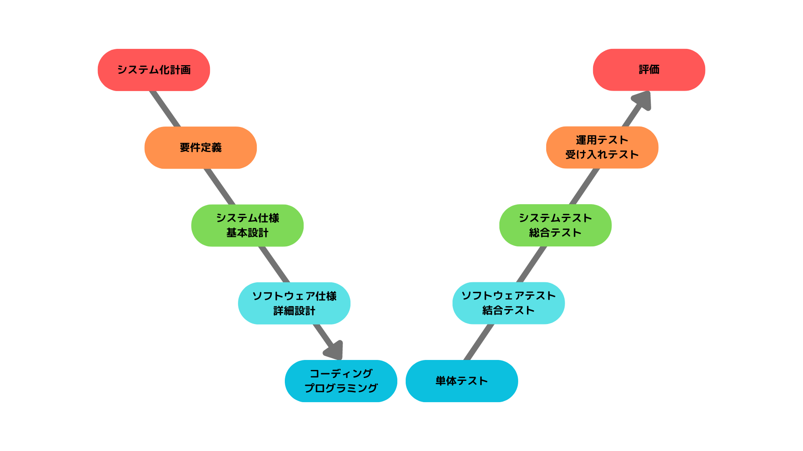

# 『開発プロセス』ノート

（最終更新： 2023-06-09）

## 目次

1. [共通フレーム](#共通フレーム)
	1. [V字モデル](#v字モデル)
1. [要件定義](#要件定義)
	1. [機能要件](#機能要件)
	1. [非機能要件](#非機能要件)
1. [レビュー](#レビュー)
	1. [ウォークスルー](#ウォークスルー)
	1. [インスペクション](#インスペクション)
1. [POA](#poa)
	1. [DFD](#dfd)

## 共通フレーム

**共通フレーム**は、[ソフトウェア](../../../../computer/software/_/chapters/software.md#ソフトウェア)、[システム](../../../../system/_/chapters/system.md#システム)、サービスの構想から開発、運用、保守、破棄に至るまでのライフサイクルを通じて必要な作業項目、役割などを包括的にまとめたガイドライン。共通フレームでは、各プロセスをアクティビティ、タスク、注記と徐々に詳細化していく。

### V字モデル

**V字モデル**は、開発からテスト、リリースまでの一連の流れをV字型に並べ、対応関係を表現したモデル。図の左側が開発工程、右側がテスト工程で、それぞれの段階に対応したテストケースを用意することによって、要件を明確化し、品質や信頼性の向上を図ることができる。

## 要件定義

**要件定義**は、[ソフトウェア](../../../../computer/software/_/chapters/software.md#ソフトウェア)開発プロセスの初期段階で行われる重要な工程で、[システム](../../../../system/_/chapters/system.md#システム)や[ソフトウェア](../../../../computer/software/_/chapters/software.md#ソフトウェア)の目的や機能、制約条件などを明確に定義する。

### 機能要件

**機能要件**は、[ソフトウェア](../../../../computer/software/_/chapters/software.md#ソフトウェア)や[システム](../../../../system/_/chapters/system.md#システム)に求められる具体的な機能や振る舞いの要件。その[システム](../../../../system/_/chapters/system.md#システム)がどのような機能を提供しなければならないかを明確に定義し、開発やテストの基準となる。

アカウント登録、ログイン、プロフィール編集、メッセージ送信、ファイルアップロード、検索機能、レポート生成、通知機能、といったものは機能要件の例である。

### 非機能要件

**非機能要件**は、[ソフトウェア](../../../../computer/software/_/chapters/software.md#ソフトウェア)や[システム](../../../../system/_/chapters/system.md#システム)に対して機能以外の要求や制約を表す要件。その[システム](../../../../system/_/chapters/system.md#システム)の品質や性能、[セキュリティ](../../../../system/security/_/chapters/security.md#セキュリティ)、信頼性、使いやすさなどの側面に関わる要求を定義する。

パフォーマンス、[可用性](../../../../system/_/chapters/system_performance_evaluation.md#可用性)、[セキュリティ](../../../../system/security/_/chapters/security.md#セキュリティ)、拡張性、ユーザビリティ、メンテナンス性、といったものは非機能要件の例である。

## レビュー

**レビュー**は、[システム](../../../../system/_/chapters/system.md#システム)の設計ドキュメントやアーティファクトを評価し、問題や改善点を特定するプロセス。設計が要件を満たしており、[システム](../../../../system/_/chapters/system.md#システム)が適切に構築されることを確認するために行われる。

### ウォークスルー

**ウォークスルー**は、[システム](../../../../system/_/chapters/system.md#システム)開発における[レビュー](#レビュー)手法のひとつで、開発チームや関係者が実際の[ソフトウェア](../../../../computer/software/_/chapters/software.md#ソフトウェア)やドキュメントを順に見ていき、問題や改善点を特定するための対話的なセッションが行われる。ウォークスルーは、問題の早期発見や、理解と共有の促進、チームのコラボレーションを目的として行われる。

### インスペクション

**インスペクション**は、[システム](../../../../system/_/chapters/system.md#システム)開発における[レビュー](#レビュー)手法のひとつで、[ソフトウェア](../../../../computer/software/_/chapters/software.md#ソフトウェア)やドキュメントの品質を向上させるために、経験豊富なチームメンバーや専門家が詳細な検査を行う。インスペクションは、問題の早期発見や、品質の向上、[レビュー](#レビュー)の効率化を目的として行われる。

## POA

**POA**（プロセス中心アプローチ: Process Oriented Approach）は、[ソフトウェア](../../../../computer/software/_/chapters/software.md#ソフトウェア)の機能（プロセス）を中心としたアプローチで、[システム](../../../../system/_/chapters/system.md#システム)を[サブシステム](../../../../system/_/chapters/system.md#サブシステム)に、さらに段階的に詳細化指定木、最終的には最小機能の単位である[モジュール](../../../../computer/software/_/chapters/package.md#モジュール)に分割する。データの流れを表現する[DFD](#dfd)やプロセスの状態遷移を表現する[状態遷移図](../../../../basics/information_theory/_/chapters/automaton.md#状態遷移図)が用いられたり、[プログラミング言語](../../../../programming/_/chapters/programming.md#プログラミング言語)として[C言語](../../../../programming/_/chapters/programming_language.md#c言語)などの構造化言語がよく採用される。

### DFD

**DFD**(Data Flow Diagram)は、[POA](#poa)においてよく用いられる、プロセスを中心にデータの流れを記述するための図。
