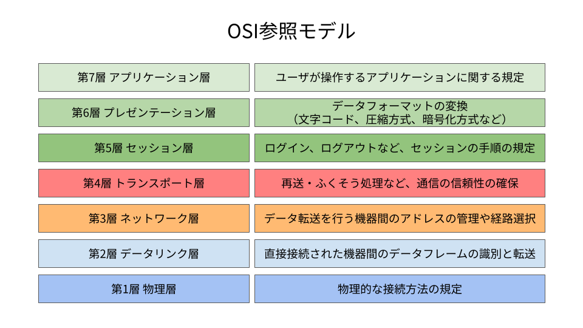

# 『ネットワークアーキテクチャ』ノート

（最終更新： 2023-06-25）

## 目次

1. [ネットワークアーキテクチャ](#ネットワークアーキテクチャ)
	1. [レイヤ](#レイヤ)
	1. [プロトコル](#プロトコル)
	1. [インタフェース](#インタフェース)
1. [OSI基本参照モデル](#osi基本参照モデル)
	1. [ISO](#iso)
	1. [アプリケーション層](#アプリケーション層)
	1. [プレゼンテーション層](#プレゼンテーション層)
	1. [セッション層](#セッション層)
	1. [トランスポート層](#トランスポート層)
	1. [ネットワーク層](#ネットワーク層)
	1. [データリンク層](#データリンク層)
	1. [物理層](#物理層)
1. [LAN間接続装置](#lan間接続装置)
	1. [スイッチ](#スイッチ)
	1. [リピータ](#リピータ)
	1. [ブリッジ](#ブリッジ)
	1. [ルータ](#ルータ)
	1. [レイヤ4-7スイッチ](#レイヤ4-7スイッチ)
	1. [ゲートウェイ](#ゲートウェイ)

## ネットワークアーキテクチャ

**ネットワークアーキテクチャ**は、通信のデータ形式や[ハードウェア](../../../computer/hardware/_/chapters/hardware.md#ハードウェア)の構成などを論理的に捉えて体系化したもの。ネットワークアーキテクチャには、各メーカが独自に用意しているものもあるが、異なる機種間の通信を実現するための標準的なネットワークアーキテクチャとして[OSI基本参照モデル](#osi基本参照モデル)が提唱されている。

### レイヤ

**レイヤ**（層）は、役割ごとに階層化された[ネットワークアーキテクチャ](#ネットワークアーキテクチャ)の各階層。

### プロトコル

**プロトコル**は、[コンピュータ](../../../computer/_/chapters/computer.md#コンピュータ)同士が通信を行う際の決まりごと（手順、規約）。階層化された[ネットワークアーキテクチャ](#ネットワークアーキテクチャ)においては、特に通信相手の同じ階層とやり取りする際の規約のことを言う。デファクトスタンダードとなっているプロトコルの実装として、[TCP/IP](./communication_protocol.md#tcpip)がある。

### インタフェース

**インタフェース**は、階層化された[ネットワークアーキテクチャ](#ネットワークアーキテクチャ)において、上位層と下位層の間でやり取りを行う際の決まりごと。

## OSI基本参照モデル

**OSI参照モデル**(OSI: Open Systems Interconnection)は、[ISO](#iso)が提唱した通信[プロトコル](#プロトコル)を設計するときの指標となるモデル。通信に必要な機能を7つの[レイヤ](#レイヤ)に分けて役割を分担することで、通信[プロトコル](#プロトコル)の単純化を目的としている。OSI参照モデルは、[コンピュータ](../../../computer/_/chapters/compuer.md#コンピュータ)の持つべき通信に関する機能を、役割ごとに階層構造で規定した、理想的なあるべき姿としてモデル化されているが、実際にインターネットの実装に用いられている[TCP/IP](./communication_protocol.md#tcpip)とは異なる部分も多い。

### ISO

**ISO**（国際標準化機構: International Organization for Standardization）は、国際的な規模で規格の標準化を行うことを目的とした団体。

### アプリケーション層

**アプリケーション層**は、[OSI基本参照モデル](#osi基本参照モデル)において、[アプリケーション](../../../computer/software/_/chapters/software.md#応用ソフトウェア)の中で通信に関係する規約を取り決めた[レイヤ](#レイヤ)。[Web](./web.md#web)や[ファイル転送](./application_layer.md#ファイル転送)、[電子メール](./application_layer.md#電子メール)、[遠隔ログイン](./application_layer.md#遠隔ログイン)（仮想端末）等がある。

### プレゼンテーション層

**プレゼンテーション層**は、[OSI基本参照モデル](#osi基本参照モデル)において、[アプリケーション](../../../computer/software/_/chapters/software.md#応用ソフトウェア)が扱う情報を通信に適したデータ形式に変換したり、下位層から来たデータを上位層が処理できるデータ形式にしたりと、データフォーマットに関する責任を負う[レイヤ](#レイヤ)。

例として、[コンピュータ](../../../computer/_/chapters/compuer.md#コンピュータ)内部でデータを[メモリ](../../../computer/hardware/_/chapters/memory.md#メモリ)上に配置する際の方式に、[ビッグエンディアン](../../../basics/information_theory/_/chapters/coding_theory.md#ビッグエンディアン)方式と[リトルエンディアン](../../../basics/information_theory/_/chapters/coding_theory.md#リトルエンディアン)方式という異なる表現方式がある。このような[コンピュータ](../../../computer/_/chapters/compuer.md#コンピュータ)内部での表現と、[ネットワーク](./network.md#ネットワーク)全体での共通表現を変換するのは、プレゼンテーション層の役割。

また、文字コードも同様で、[UTF-8](../../../basics/information_theory/_/chapters/character_representation.md#unicode)や[Shift_JIS](../../../basics/information_theory/_/chapters/character_representation.md#シフトjisコード)、EUP-JPなど多くの符号化形式がある。

### セッション層

**セッション層**は、[OSI基本参照モデル](#osi基本参照モデル)において、[コネクション](./network.md#コネクション)の確立や切断、転送するデータの切れ目の設定など、データの転送に関する管理を担う[レイヤ](#レイヤ)。

セッション層よりも下位の層が実際に[ネットワーク](./network.md#ネットワーク)を使ってデータの送信処理を行っている。

### トランスポート層

**トランスポート層**は、[OSI基本参照モデル](#osi基本参照モデル)において、通信相手の[アプリケーション](../../../computer/software/_/chapters/software.md#応用ソフトウェア)に対して、確実にデータを届ける責任を負う[レイヤ](#レイヤ)。データが正しく届いているかを確認したり、届かなかったデータを再送したりする。

### ネットワーク層

**ネットワーク層**は、[OSI基本参照モデル](#osi基本参照モデル)において、通信相手までデータを届ける役割を担う[レイヤ](#レイヤ)。この[レイヤ](#レイヤ)では、どの[コンピュータ](../../../computer/_/chapters/computer.md#コンピュータ)にデータを送ったらよいのかを決定する。

### データリンク層

**データリンク層**は、[OSI基本参照モデル](#osi基本参照モデル)において、[物理層](#物理層)で直接接続された[ノード](./network.md#ノード)間での通信を可能にする[レイヤ](#レイヤ)。直接接続された機器間でのデータのやり取りを実現する。

### 物理層

**物理層**は、[OSI基本参照モデル](#osi基本参照モデル)において、[ビット](../../../basics/_/chapters/computer_and_number.md#ビット)列と電圧の高低や光の点滅との相互変換などを行う[レイヤ](#レイヤ)。通信回線に流れる電気信号の取り決めや、接続用のケーブルやコネクタのピン形状などを規定する。

## LAN間接続装置

**LAN間接続装置**は、[LAN](./network.md#lan)を延長したり[LAN](./network.md#lan)同士を接続するために用いる装置。LAN間接続装置は、[OSI基本参照モデル](#osi基本参照モデル)のどの[レイヤ](#レイヤ)でデータを中継するのかによって各種装置がある。

### スイッチ

**スイッチ**は、[ネットワーク](./network.md#ネットワーク)間の接続を行う機器で、受信したデータの宛先を見て接続された各機器への転送の可否を判断する機能を内蔵する。どの[レイヤ](#レイヤ)までの転送を制御するかによって、レイヤ2スイッチ、レイヤ3スイッチのように呼ばれる。

### リピータ

**リピータ**は、[OSI基本参照モデル](#osi基本参照モデル)の[物理層](#物理層)レベルで伝送路を接続し、単純に電気信号を増幅・整形することで伝送距離を延ばす[LAN間接続装置](#lan間接続装置)。複数の[ポート](./address_on_network.md#ポート番号)を持つリピータを[ハブ](../../../computer/hardware/_/chapters/bus.md#ハブ)といい、受け取ったデータをすべての[ポート](./address_on_network.md#ポート番号)へ送出する。

### ブリッジ

**ブリッジ**は、[OSI基本参照モデル](#osi基本参照モデル)の[データリンク層](#データリンク層)レベルで[セグメント](./datalink_layer.md#セグメント)を接続する[LAN間接続装置](#lan間接続装置)。接続されている機器の[MACアドレス](./address_on_network.md#macアドレス)を自動的に学習し、送信データに含まれる宛先[MACアドレス](./address_on_network.md#macアドレス)の機器が接続されている[ポート](./address_on_network.md#ポート番号)にだけデータを中継する。

### ルータ

**ルータ**は、[OSI基本参照モデル](#osi基本参照モデル)の[ネットワーク層](#ネットワーク層)レベルで[パケット](./network.md#ネットワーク)を中継する[LAN間接続装置](#lan間接続装置)。[ルーティング](./internet_layer.md#ルーティング)機能や、パケットフィルタリングなどのセキュリティ機能、[OSI基本参照モデル](#osi基本参照モデル)の[ネットワーク層](#ネットワーク層)以下の[プロトコル](#プロトコル)変換などの機能を備えたものがある。

### レイヤ4-7スイッチ

**レイヤ4-7スイッチ**は、[OSI基本参照モデル](#osi基本参照モデル)の[トランスポート層](#トランスポート層)から[アプリケーション層](#アプリケーション層)までの情報に基づいた中継を行う[LAN間接続装置](#lan間接続装置)。負荷分散を行うためのロードバランサや、外部からのアクセスを制御するためのファイアウォールはレイヤ4-7スイッチである。

### ゲートウェイ

**ゲートウェイ**は、[OSI基本参照モデル](#osi基本参照モデル)の[トランスポート層](#トランスポート層)から[アプリケーション層](#アプリケーション層)の間でデータの変換をして中継する[LAN間接続装置](#lan間接続装置)。2つの異なる[プロトコル](#プロトコル)間での翻訳作業を行う。また、[ネットワーク](./network.md#ネットワーク)トラフィックの軽減やセキュリティ強化のために利用されるプロキシサーバは、**アプリケーションゲートウェイ**とも呼ばれる。
