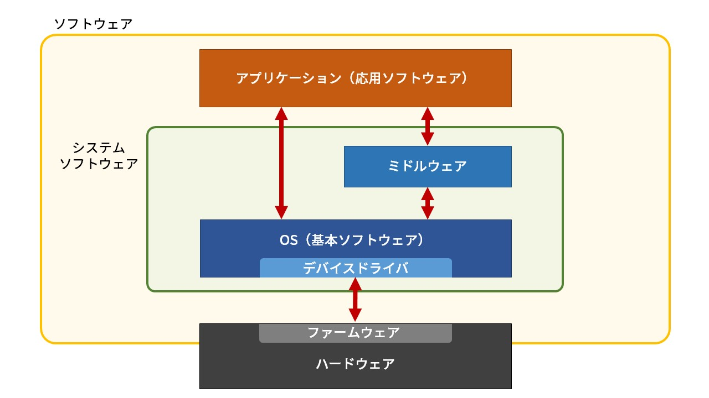

# Linuxの基礎知識

## 目次

1. [基本ソフトウェアと応用ソフトウェア](#基本ソフトウェアと応用ソフトウェア)
	1. [基本ソフトウェアの役割](#基本ソフトウェアの役割)
	1. [カーネルとユーザランド](#カーネルとユーザランド)
1. [UNIX](#unix)
	1. [BSD](#bsd)
1. [Linux](#linux)
	1. [Linuxの使用](#linuxの使用)
	1. [Linuxの利点](#linuxの利点)
	1. [ディストリビューション](#ディストリビューション)
	1. [パッケージとパッケージマネージャ](#パッケージとパッケージマネージャ)
1. [Linuxのインストール](#linuxのインストール)

## 基本ソフトウェアと応用ソフトウェア

コンピュータは大きく分けて、ハードウェアとソフトウェアからなる。**ハードウェア**はコンピュータ本体やキーボードなどの物理的な機械構成要素を指し、**ソフトウェア**はハードウェア上で動作するプログラムを指す。さらに、ソフトウェアは基本ソフトウェアと応用ソフトウェアに分類できる。**基本ソフトウェア**は**OS**(Operating System)のことを指し、**応用ソフトウェア**は基本ソフトウェアの上で動く**アプリケーション**指す。WindowsやLinux、MacOSなどは基本ソフトウェア、WordやExcelなどは応用ソフトウェアにあたる。

### 基本ソフトウェアの役割

ほとんどの応用ソフトウェアにはウィンドウやツールバー、確認メッセージなどの要素が含まれる。こういった要素を共通化してその部品を応用ソフトウェアに提供するのは基本ソフトウェアの役割のひとつ。また、ハードウェアが持つ資源（CPUやメモリ、その他の装置など）を管理して応用ソフトウェアに分配し、同時に複数の処理を行えるようにするのも基本ソフトウェアの役割となっている。

### カーネルとユーザランド

基本ソフトウェアにはカーネルとユーザランドという2つの領域が存在する。

**カーネル**はOSの中核となるプログラムで、すべてのハードウェアデバイスの制御を行う。**カーネル空間**で実行され、設定や動作への介入には管理ユーザー権限が必要となる。

**ユーザランド**はOSが動作するのに必要なカーネル以外の部分を指し、ファイルシステムやファイル操作のコマンド、シェルなどの基本的なソフトウェア群が含まれる。カーネルから割り当てられた**ユーザ空間**で実行されるプログラムで、一般ユーザが呼び出して利用することができる。

## UNIX

**UNIX**は1960年代にアメリカのAT&T社のベル研究所で誕生したOS。同研究所でもともと開発されていたMULTICSというOSがあったが、多機能なOSを目指したことで研究が頓挫し、その片隅で開発されていたミニマルなOSであるUNIXが様々な実験プロジェクトに用いられるようになった。当時UNIXは商用として考えられていなかったため、ライセンスが無料で自由に利用でき、ソースコードも配布されていたことから多くのユーザが研究や開発に利用できた。

このような背景から多くの企業や団体が独自実装したUNIXが登場したため、AT&Tが正式にライセンス契約を始めることとなった。AT&TのUNIXを**System V**と呼び、正式なライセンス契約を結んだ組織のみが自社のOSをUNIXと宣言できるようになった。一方でAT&Tとライセンス契約を結ばなかった組織のOSは**UNIX互換OS**と呼ばれるようになった。

### BSD

様々な種類のUNIXが広まる中、**BSD**（Berkeley Software Distribution, バークレー版UNIX）は初めて本格的に**TCP/IP**による通信をサポートしたことで広く知られるようになった。

## Linux

**Linux**はLinus Torvaldsによって実装されたOSであり、設計はUNIXに非常に似ていたものの、System Vの流れもBSDの流れも汲まない独自のUNIX互換OSとして開発された。UNIXは高いライセンス使用料が必要であり個人用として利用するには敷居が高かったが、Linuxは**GPL**(GNU General Public License)ライセンスであり誰でも無償で利用することができた。さらに、ソースコードの改変や再配布も自由に行えたため多くのディストリビューターにより改良され、一般に広まることとなった。

Linuxという表現には2通りの解釈があり、**狭義のLinux**はLinuxの中でもカーネル部分のみを指しており、**広義のLinux**は狭義のLinuxに様々な基本ソフトウェアや応用ソフトウェアを加えたものを指す。一般的にLinuxは広義のLinuxを指す言葉として用いられる。

### Linuxの使用

Linuxは基本的にコマンドにより操作するが、**X Window System**や**Wayland**といった**ウィンドウシステム**と**GNOME**や**KDE**、**Xfce**といった**デスクトップ環境**の導入によりGUI操作も可能となる。

Linuxをコマンドにより操作する場合、**シェル**というOSに同梱されるソフトウェアを介してOSの機能にアクセスする。シェルはコマンドの入力とOSからの出力からなる対話形式で行われる。また、**シェルスクリプト**を利用することでコマンドの実行を自動化することもできる。

Linuxを使い始めるときには、ユーザ名とパスワードからなる**アカウント**を作成する。このアカウントを使ってLinuxの機能やデータへのアクセスの許諾を得ることを**ログイン**という。

### Linuxの利点

Linuxは普段使いのOSとしても使用できるが、一般的にはサーバとして利用されることが多い。WindowsやMacOSはOSそのものが有料で販売されているが、Linuxはオープンソースで無償で利用できるためコストが抑えられる。また、必要のないソフトウェアがインストールされていないので資源を節約できたり、用途に併せたパッケージをインストールすることで様々なケースに柔軟に対応できるといった利点がある。

### ディストリビューション

Linuxカーネルとその他のソフトウェア群をまとめ、利用者が容易にインストールして利用できるようにしたものを**ディストリビューション**という。ディストリビューションを開発する団体は**ディストリビュータ**と呼ばれ、代表的なLinuxディストリビュータには**Red Hat**や**Debian Project**などがある。広く利用されているLinuxディストリビューションとしては、Red Hat系の**RHEL**(Red Hat Enterprise Linux)や**CentOS**、Debian系の**Debian**や**Ubuntu**、**Arch Linux**などがある。

### パッケージとパッケージマネージャ

ユーザがLinux上で容易に応用ソフトウェアを導入できるように、ディストリビュータによってまとめられ配布されているプログラムやファイルのことを**パッケージ**という。また、パッケージの依存関係の解決や導入、更新、削除などをサポートするツールを**パッケージマネージャ**（**パッケージ管理システム**）という。パッケージマネージャとしては、Red Hat系のOSでは**rpm**や**yum**が、Debian系のOSでは**apt-get**が、Arch Linuxでは**pacman**が使われている。

## Linuxのインストール

LinuxはWindowsやMacOSと同様に、いわゆるPCにインストールして動作させることができる。使わなくなったコンピュータなどにインストールしたり、**Docker**や**Virtual Box**といった**仮想環境**を用意できるようなソフトウェア上で動かすことができる。また、Windowsでは**WSL**(Windows Subsystem for Linux)というLinuxの実行環境が利用できる。**AWS**のようなクラウドコンピューティングサービスを利用することで、Linuxの仮想環境を借りることもできる。

具体的なインストール手順は環境やディストリビューションによって異なるので、詳しい説明は割愛する。

- [Arch Linuxのインストール](../topics/install_arch_linux.ja.md)
