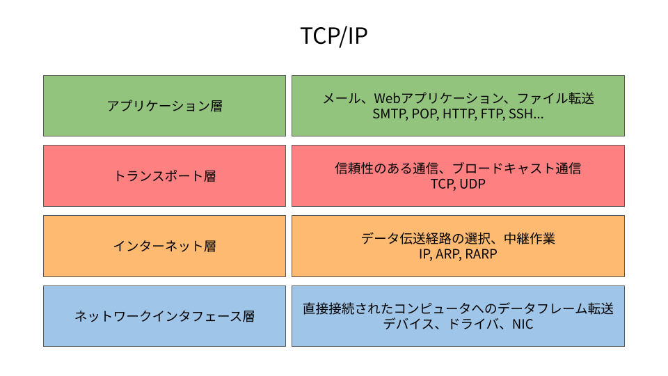

# 『通信プロトコル』ノート

（最終更新： 2023-06-27）

## 目次

1. [TCP/IP](#tcpip)
	1. [プロトコルスイート](#プロトコルスイート)
	1. [アプリケーション層](#アプリケーション層)
	1. [トランスポート層](#トランスポート層)
	1. [インターネット層](#インターネット層)
	1. [データリンク層](#データリンク層)
1. [TCP/IPの標準化](#tcpipの標準化)
	1. [IETF](#ietf)
	1. [RFC](#rfc)
	1. [STD](#std)
	1. [FYI](#fyi)
	1. [標準化の流れ](#標準化の流れ)

## TCP/IP

**TCP/IP**(Transmission Control Protocol/Internet Protocol)は、[IETF](#ietf)で標準化されている、[インターネット](./network.md#インターネット)で使われている[プロトコルスイート](#プロトコルスイート)。TCP/IPは、[OSI基本参照モデル](./network_architecture.md#osi基本参照モデル)によく似た[レイヤ](./network_architecture.md#レイヤ)構造で[プロトコル](./network_architecture.md#プロトコル)を体系化している。

TCP/IPは「実装すること」を念頭に作業が進められ、その方針から素早く[プロトコル](./network_architecture.md#プロトコル)を完成させることができた。そのため、[ISO](./network_architecture.md#iso)の[OSI](./network_architecture.md#osi基本参照モデル)よりも先に動作する[プロトコル](./network_architecture.md#プロトコル)を作り上げることができ、世の中に普及していくこととなった。

TCP/IPでは、[インターネット層](#インターネット層)と[トランスポート層](#トランスポート層)が[OS](../../../computer/software/_/chapters/operating_system.md#オペレーティングシステム)に組み込まれていることを想定しており、その上で[アプリケーション](../../../computer/software/_/chapters/software.md#応用ソフトウェア)が[インターネット](./network.md#インターネット)に接続されているような構成となっている。

### プロトコルスイート

**プロトコルスイート**は、複数の[プロトコル](./network_architecture.md#プロトコル)を一式で提供した[パッケージ](../../../computer/software/_/chapters/package.md#パッケージ)。

### アプリケーション層

**アプリケーション層**は、[アプリケーション](../../../computer/software/_/chapters/software.md#応用ソフトウェア)同士の通信に関する規約を取り決めた[レイヤ](./network_architecture.md#レイヤ)。標準で様々な[プロトコル](./network_architecture.md#プロトコル)が規定されており、[アプリケーション](../../../computer/software/_/chapters/software.md#応用ソフトウェア)ごとに独自の[プロトコル](./network_architecture.md#プロトコル)を実装することも可能。[TCP/IP](#tcpip)の[アプリケーション](../../../computer/software/_/chapters/software.md#応用ソフトウェア)の多くは、[クライアント/サーバモデル](../../../system/_/chapters/system_processing_model.md#クライアントサーバシステム)で作られている。サービスを提供する[プログラム](../../../programming/_/chapters/programming.md#プログラム)を[サーバ](../../../system/_/chapters/system_processing_model.md#クライアントサーバシステム)、サービスを受ける[プログラム](../../../programming/_/chapters/programming.md#プログラム)を[クライアント](../../../system/_/chapters/system_processing_model.md#クライアントサーバシステム)として、[サーバ](../../../system/_/chapters/system_processing_model.md#クライアントサーバシステム)はいつでも[クライアント](../../../system/_/chapters/system_processing_model.md#クライアントサーバシステム)の要求を受け取れるように常に起動しておく（このような常に起動して用いる[プログラム](../../../programming/_/chapters/programming.md#プログラム)を[デーモン](../../../computer/linux/_/chapters/process_and_job.md#デーモン)と呼ぶ）。

[WWW](./application_layer.md#www)は、[インターネット](./network.md#インターネット)が一般に普及する原動力となった[アプリケーション](../../../computer/software/_/chapters/software.md#応用ソフトウェア)で、[Webブラウザ](./web.md#webブラウザ)と呼ばれる[ソフトウェア](../../../computer/software/_/chapters/software.md#ソフトウェア)を通して、[ネットワーク](./network.md#ネットワーク)の中にある様々な情報を閲覧することができる。ここで、[ブラウザ](./web.md#webブラウザ)と[サーバ](./web.md#webサーバ)の間の通信に用いられる[プロトコル](./network_architecture.md#プロトコル)は[HTTP](./application_layer.md#http)で、送信に用いられる主なデータフォーマットは[HTML](./web.md#html)である。

[電子メール](./application_layer.md#電子メール)は、[ネットワーク](./network.md#ネットワーク)上で郵便の仕組みを再現したもの。[SMTP](./application_layer.md#smtp)や[POP](./application_layer.md#pop)といった[プロトコル](./network_architecture.md#プロトコル)が用いられている。もともとはテキスト形式での[電子メール](./application_layer.md#電子メール)が一般的であったが、現在は[電子メール](./application_layer.md#電子メール)で送信できるデータ形式を拡張する[MIME](./application_layer.md#mime)の仕様が整えられた。

[ファイル転送](./application_layer.md#ファイル転送)は、異なる[コンピュータ](../../../computer/_/chapters/computer.md#コンピュータ)の[ハードディスク](../../../computer/hardware/_/chapters/auxiliary_memory_unit.md#ハードディスク)上に存在する[ファイル](../../../computer/software/_/chapters/file_system.md#ファイル)を相互に転送することができる[アプリケーション](../../../computer/software/_/chapters/software.md#応用ソフトウェア)。[FTP](./application_layer.md#ftp)という[プロトコル](./network_architecture.md#プロトコル)が用いられ、[ファイル](../../../computer/software/_/chapters/file_system.md#ファイル)の転送を指示するための制御コネクションと、実際にデータを転送するためのデータコネクションという2つの[TCP](./transport_layer.md#tcp)[コネクション](./network.md#コネクション)を確立する。

[遠隔ログイン](./application_layer.md#遠隔ログイン)は、物理的に離れた場所にある[コンピュータ](../../../computer/_/chapters/computer.md#コンピュータ)にログインして、その[コンピュータ](../../../computer/_/chapters/computer.md#コンピュータ)で[プログラム](../../../programming/_/chapters/programming.md#プログラム)を走らせることができるようにするための機能。[TELNET](./application_layer.md#telnet)や[SSH](./application_layer.md#ssh)といった[プロトコル](./network_architecture.md#プロトコル)がよく用いられる。また、リモートデスクトップなどを用いる際はRDPが[プロトコル](./network_architecture.md#プロトコル)として用いられる。

[ネットワーク管理](./application_layer.md#ネットワーク管理)には、[SNMP](./application_layer.md#snmp)が用いられる。[SNMP](./application_layer.md#snmp)で管理される[ルータ](./network_architecture.md#ルータ)や[ブリッジ](./network_architecture.md#ブリッジ)、[ホスト](./network.md#ホスト)などを[エージェント](./application_layer.md#snmp)といい、これらを管理する[プログラム](../../../programming/_/chapters/programming.md#プログラム)を[マネージャ](./application_layer.md#snmp)という。[エージェント](./application_layer.md#snmp)は様々な情報を[MIB](./application_layer.md#mib)という構造によって管理する。

### トランスポート層

**トランスポート層**は、[アプリケーション](../../../computer/software/_/chapters/software.md#応用ソフトウェア)[プログラム](../../../programming/_/chapters/programming.md#プログラム)間の通信を実現する役割がある[レイヤ](./network_architecture.md#レイヤ)。そのため、どの[プログラム](../../../programming/_/chapters/programming.md#プログラム)がどの[プログラム](../../../programming/_/chapters/programming.md#プログラム)と通信しているかを識別するために、[ポート番号](./address_on_network.md#ポート番号)と呼ばれる識別子を用いる。トランスポート層では以下の2つの代表的な[プロトコル](./network_architecture.md#プロトコル)が用いられる。

[TCP](./transport_layer.md#tcp)は、[コネクション型](./network.md#コネクション型)で信頼性のある通信を実現するために用いられる。両端の[ホスト](./network.md#ホスト)間でのデータの到達性を保証する。経路の途中で[パケット](./network.md#パケット)が失われたり順番が入れ替わったりしても、[TCP](./transport_layer.md#tcp)がそれを解決する。[コネクション](./network.md#コネクション)の確立・切断をするだけで制御のために7回も[パケット](./network.md#パケット)をやり取りするため、データの転送量が少ない場合は無駄が多くなる。

[UDP](./transport_layer.md#udp)は、[コネクションレス型](./network.md#コネクションレス型)でデータの到達に関して信頼性のない[プロトコル](./network_architecture.md#プロトコル)である。送信したデータが相手に届いているかどうかの確認は行わない。[パケット](./network.md#パケット)数が少ない通信や、[ブロードキャスト](./network.md#ブロードキャスト)や[マルチキャスト](./network.md#マルチキャスト)通信、ビデオや音声などの[マルチメディア](../../../computer/software/_/chapters/multimedia.md#マルチメディア)通信に向いている。

### インターネット層

**インターネット層**（**ネットワーク層**）の代表的な[プロトコル](./network_architecture.md#プロトコル)は[IP](./internet_layer.md#ip)で、[IPアドレス](./address_on_network.md#ipアドレス)をもとにして[パケット](./network.md#パケット)を転送する役割を担う。

[IP](./internet_layer.md#ip)は、[ネットワーク](./network.md#ネットワーク)をまたいで[パケット](./network.md#パケット)を配送し、[インターネット](./network.md#インターネット)全体に[パケット](./network.md#パケット)を送り届けるための[プロトコル](./network_architecture.md#プロトコル)。それぞれの[ホスト](./network.md#ホスト)を識別するために、[IPアドレス](./address_on_network.md#ipアドレス)と呼ばれる識別子を用いる。

[ICMP](./internet_layer.md#icmp)は、[IP](./internet_layer.md#ip)[パケット](./network.md#パケット)の配送中に何らかの異常が発生して[パケット](./network.md#パケット)を転送できなくなったときに、送信元に異常を知らせるために用いられる[プロトコル](./network_architecture.md#プロトコル)。

[ARP](./internet_layer.md#arp)は、[パケット](./network.md#パケット)の送り先の[MACアドレス](./address_on_network.md#macアドレス)を[IPアドレス](./address_on_network.md#ipアドレス)から取得する[プロトコル](./network_architecture.md#プロトコル)。

### データリンク層

**データリンク層**（**ネットワークインタフェース層**）は、[データフレーム](./datalink_layer.md#フレーム)を[ネットワーク](./network.md#ネットワーク)上で隣接する[コンピュータ](../../../computer/_/chapters/computer.md#コンピュータ)に転送する役割をもつ[レイヤ](./network_architecture.md#レイヤ)。

具体的には、[NIC](./network.md#nic)を動かすための[デバイスドライバ](../../../computer/hardware/_/chapters/io_unit.md#デバイスドライバ)のこと。[OS](../../../computer/software/_/chapters/operating_system.md#オペレーティングシステム)が[NIC](./network.md#nic)を認識して、そのカードを利用できるように設定する必要がある。

## TCP/IPの標準化

### IETF

**IETF**(Internet Engineering Task Force)は、[インターネット](./network.md#インターネット)や[TCP/IP](#tcpip)の技術面に関する標準化団体。

### RFC

**RFC**(Request For Comments)は、[IETF](#ietf)によって議論されて標準化されている[TCP/IP](#tcpip)の[プロトコル](./network_architecture.md#プロトコル)の仕様に関するドキュメント。一度RFCになったものは、後からその内容を改定することはできない。そのため同じ[プロトコル](./network_architecture.md#プロトコル)でも、内容を更新するたびに新しいRFCを発行する必要がある。

- [RFCのホームページ](https://www.rfc-editor.org/)

### STD

**STD**(Standard)は、[TCP/IP](#tcpip)の主要な[プロトコル](./network_architecture.md#プロトコル)や標準に対して割り当てられた、変化しない番号。[RFC](#rfc)は[プロトコル](./network_architecture.md#プロトコル)の仕様が変更されるたびに番号が変わってしまい不便であるという意見から用意された。

### FYI

**FYI**(For Your Information)は、[インターネット](./network.md#インターネット)のユーザや管理者に向けて有益な情報を提供するための[RFC](#rfc)ドキュメント。

### 標準化の流れ

[TCP/IP](#tcpip)の標準化作業は、まず、仕様を煮詰める**インターネットドラフト**(I-D: Internet-Draft)から始まる。そして、標準化したほうが良いと認められると[RFC](#rfc)になり、**提案標準**(Proposed Standard)になる。次に標準の草案である**ドラフト標準**(Draft Standard)になり、最後に**標準**(Standard)となる。
