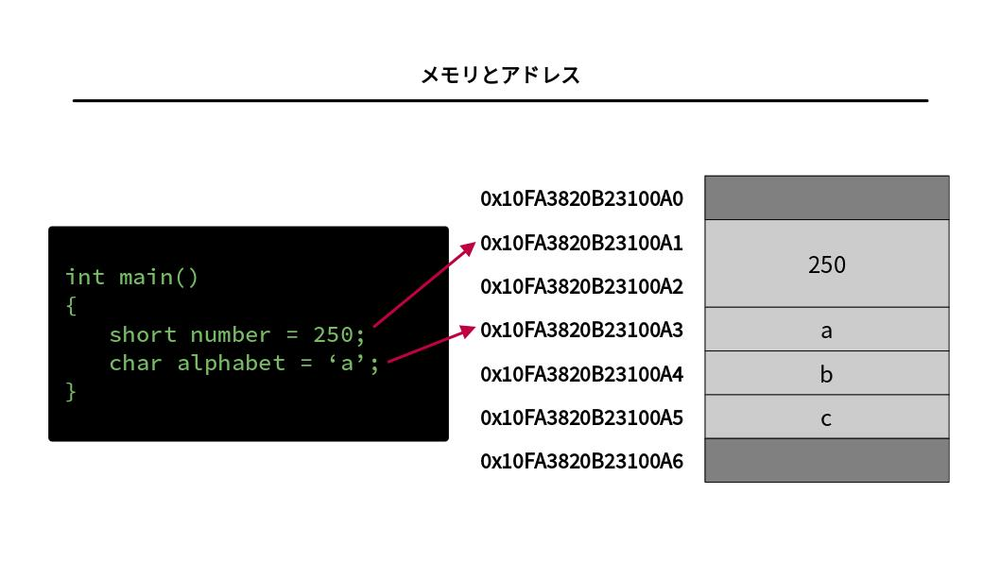

# プログラミングの基礎知識


## 目次

1. [プログラミングの概要](#プログラミングの概要)
1. [2進数とプログラミング](#2進数とプログラミング)
	1. [データの単位](#データの単位)
1. [プログラムが動く仕組み](#プログラムが動く仕組み)
	1. [論理回路](#論理回路)
	1. [処理装置](#処理装置)
	1. [記憶装置](#記憶装置)
	1. [入出力装置](#入出力装置)
	1. [メモリとアドレス](#メモリとアドレス)
	1. [メモリ上の領域](#メモリ上の領域)
	1. [プログラムの処理の実行](#プログラムの処理の実行)
	1. [プログラムの計算量](#プログラムの計算量)
1. [アセンブリ言語](#アセンブリ言語)
1. [高水準言語](#高水準言語)
	1. [コンパイラ言語](#コンパイラ言語)
	1. [インタプリタ言語](#インタプリタ言語)
	1. [JITコンパイラ](#jitコンパイラ)
	1. [スクリプト言語](#スクリプト言語)
1. [型システムによる分類](#型システムによる分類)
	1. [動的型付け言語](#動的型付け言語)
	1. [静的型付け言語](#静的型付け言語)
1. [プログラミングを始める](#プログラミングを始める)
	1. [プログラミングの準備](#プログラミングの準備)
	1. [プログラムの基礎文法](#プログラムの基礎文法)
	1. [コメント](#コメント)
	1. [エラー](#エラー)
	1. [識別子](#識別子)
	1. [予約語](#予約語)
	1. [命名規則](#命名規則)
1. [プログラミング言語の種類](#プログラミング言語の種類)
	1. [C言語](#c言語)
	1. [Java](#java)
	1. [Python](#python)
	1. [PHP](#php)
	1. [JavaScript](#javascript)


## プログラミングの概要

**コンピュータ**とは電気信号により計算を行う機械のことで、コンピュータの処理の手順や内容を示したものを**プログラム**と呼ぶ。**プログラム**を書く人を**プログラマ**といい、プログラムを実装することを**プログラミング**という。プログラムを記述する際には様々な**プログラミング言語**が用いられる。目的となるタスクを解決するための処理手順のことを**アルゴリズム**といい、良いアルゴリズムで書かれたプログラムは良いプログラム（[バグ](#エラー)がなく、処理が高速）であるといえる。プログラミング言語で書かれたプログラムのことを**ソースコード**（あるいは単にソース、コード）という。

プログラマには、世の中の様々なタスクや問題をプログラミングによって解決するという役割がある。毎日の単純作業のくり返しを減らしたり（表計算ソフトなど）、ミスが許されない場面で正確に動作することが保証されたシステムを利用したり（銀行のシステムや信号機など）、さらに人間には難しいタスクの解決を行ったり（AIによる異常検知など）と、プログラミングスキルの応用範囲は多岐にわたる。


## 2進数とプログラミング

[コンピュータ](#プログラミングの概要)は様々な電子部品から構成されており、これらの電子部品が電気信号を高速で伝達することで処理を行っている。[コンピュータ](#プログラミングの概要)の中で扱われる電気信号の種類は、**閾値**を超えているか超えていないかの2種類しかない。そのため閾値を超えていれば1、超えていなければ0という2つの数字でデータを表現することができる。このように0と1のみを用いて数を表現する方法を**2進数**といい、2進数のように離散的な値で表現される信号を**デジタル信号**という（反対に、連続的な値で表現される信号は**アナログ信号**）。一方で、一般的に普及している0~9までの10つの数字を用いて数を表現する方法を**10進数**という。その他にも、**8進数**や**16進数**などは2進数との相互変換が容易であるため、[コンピュータ](#プログラミングの概要)の世界では頻繁に利用されている。

**離散数学**において桁上がりの基準となる数字（10進数なら10、2進数なら2のような数）を**基数**と呼ぶ。

先述の通り、[コンピュータ](#プログラミングの概要)が理解して処理できる信号（**機械語**、マシン語）は2進数で表すことができるデータに限られるため、[プログラム](#プログラミングの概要)も最終的には2進数で記述しなければならない。例えば、次の2進数の羅列は標準出力に `Hello, world` を表示して終了する[プログラム](#プログラミングの概要)の一部である。

```
0111 1111 0100 0101 0100 1100 0100 0101 0000 0010 0000 0001 0000 0001 0000 0000
0000 0000 0000 0000 0000 0000 0000 0000 0000 0000 0000 0000 0000 0000 0000 0000
0000 0010 0000 0000 0011 1110 0000 0000 0000 0001 0000 0000 0000 0000 0000 0000
0000 0000 0000 0000 0000 0100 0100 0000 0000 0000 0000 0000 0000 0000 0000 0000

...(以下略)
```

上の例からわかる通り、機械語で人間が[プログラム](#プログラミングの概要)を記述することは非常に複雑で可読性に乏しい。そのため、人間が理解しやすいように[プログラミング言語](#プログラミングの概要)を用いて[プログラム](#プログラミングの概要)を作成し、これを機械語に変換して[コンピュータ](#プログラミングの概要)が処理できるようにする。

次の[C言語](#c言語)[ソースコード](#プログラミングの概要)は上の機械語コードと同じ処理を記述した[プログラム](#プログラミングの概要)で、こちらの方が人間が扱うのに適しているのは自明である。

```c
// C言語

#include <stdio.h>

int main()
{
    printf("Hello, world\n");
    return 0;
}
```

### データの単位

[コンピュータ](#プログラミングの概要)が扱うデータの最小単位は[2進数](#2進数とプログラミング)の1桁（0か1か）となっており、これを**ビット**という単位で表す。また、8ビットのデータをまとめたものに対しては**バイト**という単位を用いる。


## プログラムが動く仕組み

### 論理回路

**論理回路**は[デジタル信号](#2進数とプログラミング)を扱うための回路で、**論理素子**を組み合わせることによって構成される。論理素子の中でも最も基本的なものとして、**AND回路**、**OR回路**、**NOT回路**という**基本論理回路**がある。これらを組み合わせることで、**NAND回路**や**NOR回路**、**EXOR回路**といった論理素子やさらに複雑な論理回路を作ることができる。

[コンピュータ](#プログラミングの概要)の中身は、論理回路の組み合わせによって構成されている。

### 処理装置

[コンピュータ](#プログラミングの概要)の構成要素である**処理装置**（**プロセッサ**）は[機械語](#2進数とプログラミング)の命令を実行するためのハードウェアである。**CPU**（**中央演算装置**）などがこれにあたり、インテルやAMDといったメーカーのものが一般的に流通している。プロセッサは実際に命令を処理するための**演算装置**や、演算装置をコントロールするための**制御装置**、命令やデータを格納するための[レジスタ](#記憶装置)などから構成される。プロセッサの性能はその[コンピュータ](#プログラミングの概要)の処理性能に大きく影響するため、プロセッサが[プログラム](#プログラミングの概要)の実行要件を満たしていない場合は[プログラム](#プログラミングの概要)を利用できない場合もある。

### 記憶装置

[コンピュータ](#プログラミングの概要)の構成要素である**記憶装置**は[プログラム](#プログラミングの概要)やデータを保存しておくためのもので、役割によってレジスタやメモリ、ストレージなどに分類される。

**レジスタ**は[プロセッサ](#処理装置)内における記憶装置であり、[論理回路](#論理回路)が処理や演算に直接用いることから[コンピュータ](#プログラミングの概要)の中でもっとも高速に動作する記憶装置である。しかし、保持できるデータの容量は少ない。[プロセッサ](#処理装置)は他にも、直近に使用したデータや使用頻度の高いデータを保持しておくための**キャッシュメモリ**を持つ場合もある。

**メインメモリ**（**主記憶装置**）は[CPU](#処理装置)がアクセスできる記憶領域で、実行中の[プログラム](#プログラミングの概要)やその[プログラム](#プログラミングの概要)が用いるデータなどを保持する。また、[コンピュータ](#プログラミングの概要)の電源を落とすと保持していた内容が失われる**揮発性メモリ**のため、永続的に残したいデータについてはストレージに書き込む必要がある。[プログラム](#プログラミングの概要)の実行に関わる部分なので高速に動作する**RAM**(Random Access Memory)が用いられることが多い。

**ストレージ**（**補助記憶装置**）は[コンピュータ](#プログラミングの概要)の電源が切れても内容を保持し続ける**不揮発性メモリ**で、[CPU](#処理装置)から直接アクセスすることはできない。磁気ディスクを用いた**HDD**(Hard Disk Drive)やフラッシュメモリを用いた**SSD**(Solid State Drive)などの種類がある。また、ソフトウェアが焼かれたCDやゲームソフトなどは読み込み専用のストレージであるため**ROM**(Read Only Memory)と呼ばれる。

### 入出力装置

[コンピュータ](#プログラミングの概要)の構成要素である**入出力装置**は[プログラム](#プログラミングの概要)に対してデータを入力したり、[プログラム](#プログラミングの概要)の結果やデータを外部に出力したりするためのものである。マウスやキーボードなどは入力装置にあたり、ディスプレイやプリンタなどは出力装置にあたる。

[コンピュータ](#プログラミングの概要)に対して接続した周辺機器をコントロールするには**デバイスドライバ**と呼ばれるソフトウェアが必要となる。

### メモリとアドレス

[プログラム](#プログラミングの概要)がアクセスできる[記憶装置](#記憶装置)は[メモリ](#記憶装置)であり、[メモリ](#記憶装置)上のデータを[レジスタ](#記憶装置)に読み込んだり、[レジスタ](#記憶装置)の計算結果を[メモリ](#記憶装置)に書き出したりすることで処理を進める。[メモリ](#記憶装置)のどこにデータが存在するかを指し示すために、[メモリ](記憶装置)上には1[バイト](#データの単位)ごとに固有の**アドレス**が割り振られている。



### メモリ上の領域

[メモリ](#記憶装置)は大きく4つの領域にわかれており、それぞれ役割が異なる。

**テキスト領域**は機械語に[コンパイル](#高水準言語)された[プログラム](#プログラミングの概要)が格納され、この領域の[機械語](#2進数とプログラミング)命令が1行ずつ[プロセッサ](#処理装置)に読み込まれていくことで[プログラム](#プログラミングの概要)が実行される。

**静的領域**は[グローバル変数](./02_variable.ja.md#グローバル変数とローカル変数)などの静的[変数](./02_variable.ja.md#プログラミングにおける変数)が格納される。[プログラム](#プログラミングの概要)の開始から終了まで確保される固定的な領域。

**スタック領域**は[ローカル変数](./02_variable.ja.md#グローバル変数とローカル変数)が格納される領域で、[関数](./06_function.ja.md#プログラミングにおける関数)が実行されるときに一時的に利用される。[プログラム](#プログラミングの概要)が利用できる[メモリ](#記憶装置)領域の最下部から順番に[変数](./02_variable.ja.md#プログラミングにおける変数)が積まれていき、使い終わった[変数](./02_variable.ja.md#プログラミングにおける変数)は順に取り除かれていく。[プリミティブ](./03_data_type.ja.md#プリミティブ型)なデータ型などはスタック領域に直接格納され、[オブジェクト型](./03_data_type.ja.md#オブジェクト型)のデータなどは[ポインタ](./03_data_type.ja.md#ポインタ型)がスタック領域に格納されて実体はヒープ領域に格納される。

**ヒープ領域**は[プログラム](#プログラミングの概要)が動的に確保と解放を繰り返すことができる[メモリ](#記憶装置)領域で、[コンパイル](#高水準言語)時にサイズが決まっていないような可変長の[コンテナ](./03_data_type.ja.md#コンテナ型)や[オブジェクト型](./03_data_type.ja.md#オブジェクト型)のデータの実体が格納される。

スタック領域に格納されたデータは[関数](./06_function.ja.md#プログラミングにおける関数)の実行が終わると自動的に解放されるが、ヒープ領域に格納したデータは別の手段により解放する必要がある。ヒープ領域の[メモリ](#記憶装置)を解放する手段は各[プログラミング言語](#プログラミングの概要)によって異なる。[C言語](#c言語)や[C++](#c言語)では[プログラマ](#プログラミングの概要)が明示的に[ソースコード](#プログラミングの概要)中で確保・解放を宣言する必要があり、そのほかのほとんどの[プログラミング言語](#プログラミングの概要)では**ガベージコレクション**（GC）と呼ばれる[メモリ](#記憶装置)管理用の[プログラム](#プログラミングの概要)を利用する。ガベージコレクションを用いない[C言語](#c言語)などは、ガベージコレクションを用いる他の言語に比べて不要な[メモリ](#記憶装置)領域を使用せず、高速に動作させることができる。一方で、[プログラマ](#プログラミングの概要)が[メモリ](#記憶装置)の解放を忘れると**メモリリーク**という[バグ](#エラー)に繋がるなど、[プログラマ](#プログラミングの概要)が[メモリ](#記憶装置)管理に関する責任を背負う。また、Rustではガベージコレクションを用いずに[メモリ](#記憶装置)の解放に関する一定のルールを設けることで、[プログラマ](#プログラミングの概要)を[メモリ](#記憶装置)管理の責務から解放している。

### プログラムの処理の実行

[プロセッサ](#処理装置)が実行する1つの命令パターンを[2進数](#2進数とプログラミング)で表したものを**オペコード**といい、その操作対象を**オペランド**という。

実行される[プログラム](#プログラミングの概要)は[ストレージ](#記憶装置)から[メモリ](#記憶装置)に読み込まれ、[CPU](#処理装置)が[機械語](#2進数とプログラミング)を解釈しながら処理を実行していく。次に処理する命令が書かれている[アドレス](#メモリとアドレス)を保持する[レジスタ](#記憶装置)を**プログラムカウンタ**といい、プログラムカウンタが指す[アドレス](#メモリとアドレス)の命令を**命令レジスタ**に読み込むことで処理が実行される。プログラムカウンタが指す[アドレス](#メモリとアドレス)の[機械語](#2進数とプログラミング)コードを読み取ることを**フェッチ**、その意味を解析することを**デコード**、解析した命令を実行することを**エグゼキュート**、結果を[メモリ](#記憶装置)に書き込むことを**ストア**という。フェッチの後にプログラムカウンタを1つ進めることで、命令が順次実行されていくという流れとなる。

### プログラムの計算量

[プログラム](#プログラミングの概要)がどれほど高速に動作するかを表す指標として、**計算量**（**オーダー**）がある。これは、処理対象となるデータの数が増えたときに処理にかかる時間や必要となる[メモリ](#記憶装置)容量がどれほど増えるのかを表しており、**オーダー記法**（**ランダウの記号**）を用いて表される。**時間計算量**は処理時間の目安を見積もるための指標で、**空間計算量**はどれほどの[メモリ](#記憶装置)を消費するかを見積もるための指標。

代表的な計算量には以下のような種類があり、上に記載したものほど処理が高速である。

| オーダー記法  | 用語                     | 概要                                                           | 例                                                                              |
|---------------|--------------------------|----------------------------------------------------------------|---------------------------------------------------------------------------------|
| $O(1)$        | 定数時間                 | 処理時間がデータ量に依存しない                                 | 配列要素へのアクセス、ハッシュテーブルによるデータ検索、連結リストへの追加/削除 |
| $O(\log{N})$  | 対数時間                 | データ量が増えても計算量がほとんど増えない                     | ソート済み配列の二分探索                                                        |
| $O(N)$        | 線形時間                 | forループ1回分で、データ量の分だけ時間がかかる                 | ソートしていない配列の探索                                                      |
| $O(N\log{N})$ | 準線形時間、線形対数時間 | 線形時間に比べるとやや遅い                                     | クイックソート、マージソート、ヒープソート                                      |
| $O(N^2)$      | 二乗時間                 | 要素から全ての組み合わせについて調べるようなアルゴリズム       | 挿入ソート、バブルソート                                                        |
| $O(N^3)$      | 多項式時間               | かなり重いので場合によっては改善が必要                         | 行列計算                                                                        |
| $O(k^N)$      | 指数時間                 | 要素を取り出す時のすべての組み合わせを調べるようなアルゴリズム | ルービックキューブの総当たりによる解法                                          |
| $O(N!)$       | 階乗時間                 | $N$ の階乗に比例した時間                                        | 巡回セールスマン問題の総当たりによる解法                                        |


## アセンブリ言語

[オペコード](#プログラムの処理の実行)に1対1で対応する、英単語や記号で表記される命令ことを**ニーモニック**という。ニーモニックによる命令を組み合わせて記述する[プログラミング言語](#プログラミングの概要)を**アセンブリ言語**という。アセンブリ言語を[機械語](#2進数とプログラミング)に変換する操作を**アセンブル**といい、この操作を行うソフトウェアを**アセンブラ**という。[プロセッサ](#処理装置)が異なれば使用できるアセンブリ言語も異なるので注意が必要である。

アセンブリ言語の一種である**Netwide Assembler**を用いて `Hello, world` を出力する[プログラム](#プログラミングの概要)を以下に示す。

```asm
section .data
    msg db      "Hello, world"      ; データセクションで文字列を宣言

section .text
    global _start                   ; プログラムのエントリポイントとして_startを呼び出し

_start:
    mov     rax, 1                  ; sys_writeシステムコール(1)をraxレジスタにセット
    mov     rdi, 1                  ; 第一引数（ファイルディスクリプタ、1は標準出力）をrdiレジスタにセット
    mov     rsi, msg                ; 第二引数（出力したい文字列）をrsiレジスタにセット
    mov     rdx, 12                 ; 第三引数（データのサイズ）をrdxレジスタにセット
    syscall                         ; システムコールを発行
    mov     rax, 60                 ; exitシステムコール(60)をraxレジスタにセット
    mov     rdi, 0                  ; 第一引数（終了コード、0は正常終了）をrdiレジスタにセット
    syscall                         ; システムコールを発行
```

[プログラミング言語](#プログラミングの概要)の中でも[機械語](#2進数とプログラミング)に近い言語を**低水準言語**（低級言語）と呼び、アセンブリ言語もこれに分類される。低水準言語は[コンピュータ](#プログラミングの概要)資源を効率よく使うことができ高速に動作するという利点があるが、[プログラム](#プログラミングの概要)が長くなりやすく柔軟性に乏しいことから、性能を最大限引き出すなどの目的がない限りは[高水準言語](#高水準言語)が用いられることがほとんどとなる。


## 高水準言語

世の中の多くの[プログラミング言語](#プログラミングの概要)は[機械語](#2進数とプログラミング)を意識することなく記述できるようになっている。このように、[低水準言語](#アセンブリ言語)に比べて抽象度が高く人間にとって分かりやすい[プログラミング言語](#プログラミングの概要)のことを**高水準言語**（高級言語）と呼ぶ。高水準言語には、[プロセッサ](#処理装置)に依存した[プログラム](#プログラミングの概要)を書かなくてよい（[機械語](#2進数とプログラミング)への変換の段階で様々な[プロセッサ](#処理装置)に対応させることができる）というメリットもある。代表的な高水準言語には、[C系言語（C, C#, C++）](#c言語)、[Java](#java)、[Python](#python)、[PHP](#php)、[JavaScript](#javascript)などがある。高水準言語には広い用途で利用される**汎用プログラミング言語**と、限られた分野で活躍する**専用プログラミング言語**がある。それぞれの言語には得手不得手があり、[C言語](#c言語)は処理速度が高速であることから[CPU](#処理装置)やサーバなどの低レイヤの実装に向いており、[JavaScript](#javascript)は一般的なWebブラウザで動作することからWebコンテンツ向けとなる。

高水準言語で書かれた[プログラム](#プログラミングの概要)を[コンピュータ](#プログラミングの概要)に処理させるためには、[アセンブリ言語](#アセンブリ言語)と同じく[機械語](#2進数とプログラミング)への変換が必要となる。高水準言語を[機械語](#2進数とプログラミング)へ変換する操作を**コンパイル**といい、この操作を行うソフトウェアを**コンパイラ**という。高水準言語は、[ソースコード](#プログラミングの概要)をコンパイルして実行する際の方式によって[コンパイラ言語](#コンパイラ言語)と[インタプリタ言語](#インタプリタ言語)に分類することができる。

### コンパイラ言語

**コンパイラ言語**では、[プログラム](#プログラミングの概要)の処理を実行する前にあらかじめ[機械語](#2進数とプログラミング)への変換を行っておくという方式を用いる。実際に[プログラム](#プログラミングの概要)を利用する際には、[機械語](#2進数とプログラミング)に変換された**実行ファイル**を実行する。事前に変換処理を済ませているため、実行前に不具合を発見できる、[インタプリタ言語](#インタプリタ言語)に比べて実行速度が高速であるといった利点がある。一方で、実行時に起こりうる様々なパターンに対応できるように[プログラミング](#プログラミングの概要)する必要があり、[インタプリタ言語](#インタプリタ言語)と比較しても難易度が高い言語が多い。[コンパイル](#高水準言語)した実行ファイルは[プロセッサ](#処理装置)に依存するため、マルチプラットフォームに対応できないという欠点もある。

代表的なコンパイラ言語としては、[C言語](#c言語)やGo, Rustなどがある。

### インタプリタ言語

**インタプリタ言語**では、[プログラム](#プログラミングの概要)の実行時に[ソースコード](#プログラミングの概要)を1行ずつ[コンパイル](#高水準言語)しながら処理を進めるという方式を用いる。実行時に毎回[コンパイル](#高水準言語)作業が必要となるため、実行速度は[コンパイラ言語](#コンパイラ言語)に比べて遅い傾向にある。しかし、[コンパイル](#高水準言語)を行わずにすぐに実行結果を確認できるため[デバッグ](#エラー)が容易で、実装にかかるコストが小さくなるという利点がある。

代表的なインタプリタ言語としては、[Python](#python)や[PHP](#php)、[JavaScript](#javascript)などがある。

### JITコンパイラ

**JITコンパイラ**では、[ソースコード](#プログラミングの概要)を環境に依存しない**中間コード**（**バイトコード**）に変換しておき、実行時にバイトコードを[コンパイル](#高水準言語)して実行する方式をとる。実行時に[コンパイル](#高水準言語)するという点では[インタプリタ言語](#インタプリタ言語)と似ているが、[インタプリタ言語](#インタプリタ言語)に比べて高速な動作を実現できる。[コンパイラ言語](#コンパイラ言語)は直接[機械語](#2進数とプログラミング)のコードを生成するため環境に対する依存が発生するが、この方式では[プログラム](#プログラミングの概要)の実行機である**ランタイム**が利用できる環境であればどこでも実行できるというメリットがある。

JITコンパイラを用いる代表的な言語としては[Java](#java)があげられる。

### スクリプト言語

[プログラミング言語](#プログラミングの概要)のうち、比較的容易に記述・実行ができるものを**スクリプト言語**という。定義は曖昧であるが、[インタプリタ言語](#インタプリタ言語)の多くはスクリプト言語に分類され、[Python](#python)や[JavaScript](#javascript)、[PHP](#php)、Rubyなどがこれに含まれる。


## 型システムによる分類

[プログラミング](#プログラミングの概要)においては使用するデータの[型](./03_data_type.ja.md#型)（数値、文字列など）を意識する必要がある。データの[型](./03_data_type.ja.md#型)を実行時に決定するか、実行前に決定するかによって、[プログラミング言語](#プログラミングの概要)を[動的型付け言語](#動的型付け言語)と[静的型付け言語](#静的型付け言語)に分類することができる。

### 動的型付け言語

**動的型付け言語**では、実行時にデータの[型](./03_data_type.ja.md#型)を決定する方式を用いる。[プログラム](#プログラミングの概要)中にデータ[型](./03_data_type.ja.md#型)を記述する必要がないため、[ソースコード](#プログラミングの概要)がシンプルになり読みやすくなる。ただし、データが読み込まれるたびにそのデータの[型](./03_data_type.ja.md#型)を推測する必要があるため、実行速度は[静的型付け言語](#静的型付け言語)に比べて遅い傾向にある。

また実行時に[型](./03_data_type.ja.md#型)が決定するという抽象化の性質から、ある[関数](./06_function.ja.md#プログラミングにおける関数)の[引数](./06_function.ja.md#引数)として同じインタフェースを持つ異なる[オブジェクト](./07_class.ja.md#オブジェクト指向)を取ることができる。これを利用した[プログラミング](#プログラミングの概要)スタイルとして[ダックタイピング](./07_class.ja.md#ポリモーフィズム)がある。

### 静的型付け言語

**静的型付け言語**では、実行前にデータの[型](./03_data_type.ja.md#型)を決定する方式を用いる。[コンパイラ言語](#コンパイラ言語)の多くは静的片付け言語となっている。[プログラム](#プログラミングの概要)中で使用するデータに対して、そのデータをどの[型](./03_data_type.ja.md#型)として扱うかを明示（**型注釈**）する必要がある。事前にデータの[型](./03_data_type.ja.md#型)を確定させておくことで、想定外のデータに対して処理が行われるような不具合を防ぐことができる。

Rustのような新しい言語では、[ソースコード](#プログラミングの概要)中に[型](./03_data_type.ja.md#型)を明示せずとも文脈から自動的に[型](./03_data_type.ja.md#型)を決定する**型推論**の機能が搭載されているものもあり、記述量が抑えられるという[動的型付け言語](#動的型付け言語)の利点を享受することができる。


## プログラミングを始める

### プログラミングの準備

[プログラミング](#プログラミングの概要)を始めるために必要なものは、各種[プログラム](#プログラミングの概要)を実行するための実行環境と、[プログラム](#プログラミングの概要)を記述するためのテキストエディタのみで、基本的には特別なものは必要としない。**実行環境**とは、[プログラマ](#プログラミングの概要)が記述した[プログラム](#プログラミングの概要)を[コンピュータ](#プログラミングの概要)が処理可能な[機械語](#2進数とプログラミング)に変換する工程を行うための環境のこと。**テキストエディタ**には[プログラミング](#プログラミングの概要)を便利に行うための補助機能が搭載されたものなど様々な種類があるが、PCに最初からインストールされている（Windowsのメモ帳など）ようなものでも問題ない。代表的なテキストエディタには次のようなものがある。

- [サクラエディタ](https://sakura-editor.github.io/)
- [秀丸エディタ（有料）](https://hide.maruo.co.jp/software/hidemaru.html)
- [Visual Studio Code](https://code.visualstudio.com/)
- [Neovim](https://neovim.io/)

### プログラムの基礎文法

[プログラム](#プログラミングの概要)を作成する際には、各[プログラミング言語](#プログラミングの概要)が規定する**文法**（シンタックス）を守らなければならない。これは[コンパイラ](#高水準言語)が[ソースコード](#プログラミングの概要)を解析する際に、誤った文法で記された[プログラム](#プログラミングの概要)があると[機械語](#2進数とプログラミング)に変換できなくなるためである。[プログラミング言語](#プログラミングの概要)の文法は人間が使う**自然言語**に比べて非常に厳密であるため、常に正しい文法を心掛ける必要がある。

文法には言語による差異はあるが、例として次のようなものがあげられる。

- [プログラム](#プログラミングの概要)は半角アルファベットと数字、各種記号を用いて記述する
- `{` と `}` は対応しており、 `{}` で囲まれた部分は1つの処理のまとまりを表す
- ひとつの文は `;` で終わらなければならない
- 基本的には、[プログラム](#プログラミングの概要)は上から下へと順次実行される

### コメント

[ソースコード](#プログラミングの概要)中には処理の内容を分かりやすくするために**コメント**（注釈）を記すことができる。コメントは[コンパイル](#高水準言語)時に無視されるため、処理の内容やデータに関する情報などを自然言語を用いて示すことが可能である。

一般的な[プログラミング言語](#プログラミングの概要)におけるコメントの書き方は次のようになっている。

```
; アセンブリ言語などで用いられる1行のコメント

// 高水準言語でよく用いられる1行のコメント

/*
    高水準言語でよく用いられる
    複数行に対応したコメント
*/
```

### エラー

**エラー**は実行中の[プログラム](#プログラミングの概要)が正常に処理を続行できなくなるような致命的な問題の発生により中断・終了されることを指す。[シンタックス](#プログラムの基礎文法)の誤りや、[アルゴリズム](#プログラミングの概要)の**バグ**（プログラムの欠陥）などにより発生する場合がある。エラーを解消するための作業のことを**デバッグ**という。

代表的なエラーには次のようなものがある。

- 0除算（整数を0で割るような[演算](./04_operation.ja.md#プログラミングにおける演算)を試みた）
- [配列](./03_data_type.ja.md#配列)の要素数より大きい[インデックス](./03_data_type.ja.md#配列)を指定してアクセスした
- ユーザが想定外の入力を行った
- データベースやサーバへの接続に失敗した
- 存在しないファイルを参照しようとした

このようなエラーのうち、[プログラミング言語](#プログラミングの概要)が想定可能なものについては発生時の処理を[ソースコード](#プログラミングの概要)中に記述しておくことができ、このような仕組みを**例外**（**例外処理**）という。

### 識別子

[ソースコード](#プログラミングの概要)中では、データや処理のまとまりなどに[プログラマ](#プログラミングの概要)が任意の名前（**識別子**）をつけるができる。識別子には、そのデータの性質や状態、役割を表す名前を用いることが一般的。

識別子の命名に関しては、各[プログラミング言語](#プログラミングの概要)ごとにルールが存在する。次に示すのは、多くの[プログラミング言語](#プログラミングの概要)で共通しているルールである。

- [変数](./02_variable.ja.md#プログラミングにおける変数)名にはアルファベット、数字、アンダースコアが使用できる
- アルファベットの大文字と小文字は区別される
- 1文字目はアルファベットかアンダースコアのみ使用できる（数字から始まる[変数](./02_variable.ja.md#プログラミングにおける変数)名は使用できない）
- [予約語](#予約語)は使用できない
- 複数の単語からなる識別子において、単語間にスペースを用いることはできない

[プログラミング](#プログラミングの概要)において良い識別子を命名することは、[ソースコード](#プログラミングの概要)の保守性を高める意味で非常に重要である。開発チームごとのルールや文化に従い、よく使われる単語を用いた誰が見ても分かりやすい識別子を心がけるべきである。

### 予約語

**予約語**とは、各[プログラミング言語](#プログラミングの概要)で規程されている[識別子](#識別子)として利用できない文字列のことである。データの[型](./03_data_type.ja.md#型)や[制御構文](./05_control_flow.ja.md#制御フロー)に用いられる単語などがこれにあたり、[プログラム](#プログラミングの概要)の構文解析の妨げになる等の理由から使用できない。また、将来的に[プログラミング言語](#プログラミングの概要)に取り入れられる予定の機能に関するキーワードも予約語となっている場合がある。

予約語でなくても、他の[プログラミング言語](#プログラミングの概要)で予約語になっているものや将来的に使用できなくなる可能性のある文字列は[識別子](#識別子)としてふさわしくないため避けるべきである。

以下に示すのは[C言語](#c言語)における予約語の一部。

```c
auto, break, case, char, const, continue, default, do, double, else, enum,
extern, float, for, goto, if, int, long, register, return, signed, sizeof,
...
```

### 命名規則

**命名規則**とは[識別子](#識別子)の命名に関する規則である。[プログラミング言語](#プログラミングの概要)の仕様として定められているものではなく、開発チーム内などで[識別子](#識別子)に一貫性を持たせるために設けることが多い。また、各[プログラミング言語](#プログラミングの概要)によっても文化が異なり、どの命名規則を用いるのが正しいといった正解はない。1つの[プログラム](#プログラミングの概要)中で複数の命名規則を組み合わせることも多い（[変数](./02_variable.ja.md#プログラミングにおける変数)はスネークケース、[関数](./06_function.ja.md#プログラミングにおける関数)はキャメルケースを用いるといった具合）。

特に複数の単語からなる[識別子](#識別子)を使用する場合には、それらの単語の区切りをどのように判別するかによって分類することができる（[識別子](#識別子)にスペースは使用できないため）。

**パスカルケース**ではすべての単語の1文字目を大文字で始め、単語をそのままつなげる。

```
User
UserName
UpdateUserName
```

**キャメルケース**では2つ目以降の単語の1文字目を大文字で始め、単語をそのままつなげる。

```
user
userName
updateUserName
```

**スネークケース**ではすべての単語を小文字にし、単語同士をアンダースコアでつなげる。

```
user
user_name
update_user_name
```

**アッパーケース**ではすべての単語を大文字にし、単語同士をアンダースコアでつなげる。

```
USER
USER_NAME
UPDATE_USER_NAME
```

**ケバブケース**ではすべての単語を小文字にし、単語同士をハイフンでつなげる。

```
user
user-name
update-user-name
```

**ハンガリアン記法**では[識別子](#識別子)の先頭や末尾にデータの性質を表すプレフィックス/サフィックスをつける。


## プログラミング言語の種類

### C言語

**C言語**は1972年に開発された[汎用プログラミング言語](#高水準言語)で、[高水準言語](#高水準言語)ではあるがハードウェアよりの記述が可能な[低水準言語](#アセンブリ言語)のような特徴も持つ。[コンパイラ言語](#コンパイラ言語)・[静的型付け言語](#静的型付け言語)に分類される。OSやデバイスドライバの開発などあらゆる分野で利用されており、[プログラミング言語](#プログラミングの概要)の中でも実行速度は最速の部類となる。習得難易度は[スクリプト言語](#スクリプト言語)に比べて高く、限られたハードウェア資産で効率的に実行できる[プログラム](#プログラミングの概要)を要するケースに適している。

```c
// C言語

#include <stdio.h>

int main()
{
    int input_num;
    printf("> ");
    scanf("%d", &input_num);

    if( input_num % 2 == 0 )
    {
        printf("It is an even number : %d\n", input_num);
    }
    else
    {
        printf("It is an odd number : %d\n", input_num);
    }

    return 0;
}
```

C言語の機能や特徴を継承しつつ表現力を高めたC++では、[オブジェクト指向](./07_class.ja.md#オブジェクト指向)言語で用いられる[クラス](./07_class.ja.md#クラスとインスタンス)の機能を取り入れている。他にも、テンプレートや演算子のオーバーロードなど、豊富な機能を持つ。

C#もC言語に影響を受けて開発された[プログラミング言語](#プログラミングの概要)であり、CやC++と比較して様々な制限や改良が加えられている。基本的にはWindowsの.NET Framework上で開発・実行される[プログラミング言語](#プログラミングの概要)であるが、中間言語に[コンパイル](#高水準言語)することでマルチプラットフォームでの実行にも対応することができる。

### Java

**Java**は[C](#c言語)に影響を受けた[汎用プログラミング言語](#高水準言語)。[静的型付け言語](#静的型付け言語)に分類され、[メモリ](#記憶装置)管理には[ガベージコレクション](#メモリ上の領域)を用いる。様々なプラットフォームで実行できるように[JITコンパイラ](#jitコンパイラ)方式を用いており、Java[プログラム](#プログラミングの概要)を実行するためのソフトウェアを**JVM**（Java仮想マシン）という。また、[C++](#c言語)と同じく[オブジェクト指向](./07_class.ja.md#オブジェクト指向)を取り入れた言語でもある。非常に人気が高く、世界中で最も使用されている[プログラミング言語](#プログラミングの概要)のひとつとなっている。

```java
// Java

import java.util.Scanner;

public class Oddeven
{
    public static void main( String[] args )
    {
        Scanner scanner = new Scanner(System.in);
        System.out.print("> ");
        int input_num = scanner.nextInt();

        if( input_num % 2 == 0 )
        {
            System.out.println("It is an even number : " + input_num);
        }
        else
        {
            System.out.println("It is an odd number : " + input_num);
        }

        scanner.close();
    }
}
```

### Python

**Python**は[インタプリタ](#インタプリタ言語)方式の[汎用プログラミング言語](#高水準言語)。[動的型付け言語](#動的型付け言語)に分類され、[メモリ](#記憶装置)の管理には[ガベージコレクション](#メモリ上の領域)を用いる。可読性が高く記述が容易であるため、[プログラミング](#プログラミングの概要)の入門やスピード感のある開発に適している。機械学習分野の[ライブラリ](./08_library.ja.md#ライブラリ-1)が充実しているほか、Web開発にも用いられる。

```python
# Python

input_num = int(input("> "))

if ( input_num % 2 ) == 0:
    print("It is an even number : {0}".format(input_num))
else:
    print("It is an even number : {0}".format(input_num))
```

### PHP

**PHP**は動的なWebサイトを作成するためのツールから派生した[スクリプト言語](#スクリプト言語)。Web開発に特化しており、HTMLに埋め込むような記法を用いることができるという特徴がある。そのほかにも、学習コストが低い点やデータベースアクセスを容易に行えるという強みもある。

```php
<?php

// PHP

$input_num = $_POST["input_num"];

if( $input_num % 2 === 0 )
{
    echo("It is an even number : " . $input_num);
}
else
{
    echo("It is an odd number : " . $input_num);
}

?>
```

### JavaScript

**JavaScript**は一般的なWebブラウザ上で実行される[プログラミング言語](#プログラミングの概要)。[インタプリタ言語](#インタプリタ言語)・[動的型付け言語](#動的型付け言語)に分類される。Webページ上のコンテンツに動きを与える目的でよく用いられており、近年ではサーバサイドにおける[実行環境](#プログラミングの準備)の登場や**SPA**(Single Page Application)の普及により使用機会が増えている。習得難易度は比較的低く、ブラウザさえあれば[実行環境](#プログラミングの準備)が整うという手軽さもメリットのひとつである。

```javascript
// JavaScript

let input_num = document.getElementById('#input_num').value;

if( input_num % 2 === 0 )
{
    console.log("It is an even number : " + input_num);
}
else
{
    console.log("It is an even number : " + input_num);
}
```
