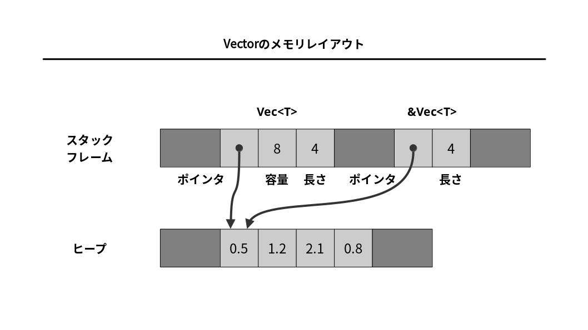

# 『データ型』ノート

（最終更新： 2023-06-27）


## 目次

1. [Rustの型システム](#rustの型システム)
	1. [型推論](#型推論)
	1. [ジェネリック](#ジェネリック)
1. [固定長数値型](#固定長数値型)
	1. [整数型](#整数型)
	1. [浮動小数点数型](#浮動小数点数型)
	1. [チェック付き演算](#チェック付き演算)
	1. [ラップ演算](#ラップ演算)
	1. [飽和演算](#飽和演算)
	1. [オーバフロー演算](#オーバフロー演算)
1. [真偽値型](#真偽値型)
1. [文字型](#文字型)
1. [タプル型](#タプル型)
1. [ポインタ型](#ポインタ型)
	1. [参照](#参照)
	1. [Box](#box)
	1. [rawポインタ](#rawポインタ)
1. [配列](#配列)
1. [ベクタ](#ベクタ)
1. [スライス](#スライス)
1. [文字列型](#文字列型)
	1. [文字列リテラル](#文字列リテラル)
	1. [バイトリテラル](#バイトリテラル)
1. [型エイリアス](#型エイリアス)


## Rustの型システム

[Rust](./rust.md#rust)は[静的型付け言語](../../../_/chapters/programming.md#静的型付け言語)であり、[JavaScript](../../../_/chapters/programming_language.md#javascript)や[Python](../../../_/chapters/programming_language.md#python)といった[動的型付け言語](../../../_/chapters/programming.md#動的型付け言語)とは異なり、[変数](../../../_/chapters/variable.md#変数)の型が[コンパイル](../../../../basics/information_theory/_/chapters/compiler_theory.md#コンパイラ)時に確定する。[静的型付け言語](../../../_/chapters/programming.md#静的型付け言語)では、[プログラム](../../../_/chapters/programming.md#プログラム)中の[変数](../../../_/chapters/variable.md#変数)には明示的に[型](../../../_/chapters/data_type.md#型)を示しておく必要があり、[コード](../../../_/chapters/programming.md#ソースコード)が煩雑になってしまう傾向がある。また、[型](../../../_/chapters/data_type.md#型)を確定させてしまうことで、[関数](../../../_/chapters/function.md#関数)の汎用性が低下してしまう（[ダックタイピング](../../../_/chapters/object_oriented.md#ダックタイピング)ができない）というデメリットもある。

[Rust](./rust.md#rust)ではこれらのデメリットを軽減するために、[型推論](#型推論)と[ジェネリック](#ジェネリック)という機能を提供している。

### 型推論

**型推論**は、[プログラム](../../../_/chapters/programming.md#プログラム)中に[型](../../../_/chapters/data_type.md#型)を明示せずとも、いくつかの[型](../../../_/chapters/data_type.md#型)情報から自動で[変数](../../../_/chapters/variable.md#変数)の[型](../../../_/chapters/data_type.md#型)を推論する[Rust](./rust.md#rust)[コンパイラ](../../../../basics/information_theory/_/chapters/compiler_theory.md#コンパイラ)の機能。これにより、[コンパイル](../../../../basics/information_theory/_/chapters/compiler_theory.md#コンパイル)時の[エラー](../../../_/chapters/programming.md#エラー)検出というメリットを残したまま、[動的型付け言語](../../../_/chapters/programming.md#動的型付け言語)の可読性の高さという恩恵を受けることができる。

### ジェネリック

**ジェネリック**は、反復的な[コード](../../../_/chapters/programming.md#ソースコード)を記述する必要性を減らすための機能で、[引数](../../../_/chapters/function.md#引数)や[戻り値](../../../_/chapters/function.md#戻り値)として複数の種類の[型](../../../_/chapters/data_type.md#型)を取りうるような[関数](../../../_/chapters/function.md#関数)を1つの定義で表現することができるようになる。

[JavaScript](../../../_/chapters/programming_language.md#javascript)や[Python](../../../_/chapters/programming_language.md#python)といった[動的型付け言語](../../../_/chapters/programming.md#動的型付け言語)では、すべての[関数](../../../_/chapters/function.md#関数)が自然とこのよう動作となる。[関数](../../../_/chapters/function.md#関数)は、その[関数](../../../_/chapters/function.md#関数)が必要とする[プロパティ](../../../_/chapters/object_oriented.md#プロパティ)や[メソッド](../../../_/chapters/object_oriented.md#メソッド)を持つすべての[オブジェクト](../../../_/chapters/object_oriented.md#オブジェクト)を[引数](../../../_/chapters/function.md#引数)として取ることができる（[引数](../../../_/chapters/function.md#引数)として取りうる[オブジェクト](../../../_/chapters/object_oriented.md#オブジェクト)を明示的に制限しない）。このような性質を[ダックタイピング](../../../_/chapters/object_oriented.md#ダックタイピング)といい、これにより[プログラム](../../../_/chapters/programming.md#プログラム)が効率的になる一方で、[エラー](../../../_/chapters/programming.md#エラー)や[バグ](../../../_/chapters/programming.md#バグ)の原因ともなりうる。

[Rust](./rust.md#rust)ではジェネリック機構を利用することで、厳密な[コンパイル](../../../../basics/information_theory/_/chapters/compiler_theory.md#コンパイラ)時の[型](../../../_/chapters/data_type.md#型)チェックと柔軟性を両立している。


## 固定長数値型

[Rust](./rust.md#rust)がサポートする固定長数値型は以下の通り。

| サイズ（ビット数） | 符号なし整数 | 符号付き整数 | 浮動小数点数 |
| ------------------ | ------------ | ------------ | ------------ |
| 8                  | `u8`         | `i8`         |              |
| 16                 | `u16`        | `i16`        |              |
| 32                 | `u32`        | `i32`        | `f32`        |
| 64                 | `u64`        | `i64`        | `f64`        |
| 128                | `u128`       | `i128`       |              |
| 計算機のワード長   | `usize`      | `isize`      |              |

### 整数型

[Rust](./rust.md#rust)の整数型に関する特徴は以下の通り。

- [Rust](./rust.md#rust)の符号付き整数は[2の補数](../../../../basics/discrete_mathematics/_/chapters/numeric_representation.md#2の補数)表現となっている。
- [Rust](./rust.md#rust)では、[バイト](../../../../basics/_/chapters/computer_and_number.md#バイト)値に対して `u8` 型を用いる。[バイナリファイル](../../../../computer/software/_/chapters/file_system.md#バイナリファイル)や[ソケット](../../../../computer/linux/_/chapters/process_and_job.md#ソケット)からデータを読み取ると、 `u8` の値のストリームが得られる。
- [C](../../../_/chapters/programming_language.md#c言語)や[C++](../../../_/chapters/programming_language.md#c)では数値と文字の[型](../../../_/chapters/data_type.md#型)を区別しない（ `u8` と `char` は同じ）が、[Rust](./rust.md#rust)ではこれらを区別する。ただし、[バイトリテラル](#バイトリテラル)の機能が用意されており、例えば `b'X'` は、文字"X"に対する[ASCII](../../../../basics/information_theory/_/chapters/character_representation.md#asciiコード)コードの `u8` 値になる。
- `usize` と `isize` は、実行対象の計算機のアドレス空間サイズに依存しており、32[ビット](../../../../basics/_/chapters/computer_and_number.md#ビット)アーキテクチャでは32[ビット](../../../../basics/_/chapters/computer_and_number.md#ビット)、64[ビット](../../../../basics/_/chapters/computer_and_number.md#ビット)アーキテクチャでは64[ビット](../../../../basics/_/chapters/computer_and_number.md#ビット)となる。
- `0x` 、 `0o` 、 `0b` を接頭辞としてつけると、それぞれ[16進数](../../../../basics/discrete_mathematics/_/chapters/radix.md#16進数)、[8進数](../../../../basics/discrete_mathematics/_/chapters/radix.md#8進数)、[2進数](../../../../basics/discrete_mathematics/_/chapters/radix.md#2進数)のリテラルになる。
- 整数型から別の整数型への変換は `as` 演算子を用いて行う。[Rust](./rust.md#rust)は[C](../../../_/chapters/programming_language.md#c言語)や[C++](../../../_/chapters/programming_language.md#c)とは異なり、数値型の**暗黙の型変換**をほとんど行わないので、[プログラマ](../../../_/chapters/programming.md#プログラム)自身が明示する必要がある。

### 浮動小数点数型

[Rust](./rust.md#rust)は、IEEE標準準拠の[単精度](../../../../basics/discrete_mathematics/_/chapters/numeric_representation.md#浮動小数点数)と[倍精度](../../../../basics/discrete_mathematics/_/chapters/numeric_representation.md#浮動小数点数)の浮動少数点数をサポートしている。 `f32` と `f64` はそれぞれ、IEEE規格が要求する型関連定数である、 `INFINITY` 、 `NEG_INFINITY` 、 `NAN` 、 `MIN` 、 `MAX` を持つ。

### チェック付き演算

**チェック付き演算**は、演算結果を `Option` 型で返却する。数学的に正しい答えが得られた場合には `Some(v)` を、そうでない場合は `None` を返す。これによって、計算結果が[オーバフロー](../../../../basics/discrete_mathematics/_/chapters/arithmetic_operation_and_precision.md#オーバフロー)した場合などの挙動を制御することができる。

[演算子](../../../_/chapters/operation.md#演算)名に接頭辞 `check_` をつけることで利用できる。

### ラップ演算

**ラップ演算**は、[オーバフロー](../../../../basics/discrete_mathematics/_/chapters/arithmetic_operation_and_precision.md#オーバフロー)が発生した場合に、溢れた桁を無視した結果を返却する。

[演算子](../../../_/chapters/operation.md#演算)名に接頭辞 `wrapping_` をつけることで利用できる。

### 飽和演算

**飽和演算**は、[オーバフロー](../../../../basics/discrete_mathematics/_/chapters/arithmetic_operation_and_precision.md#オーバフロー)が発生した場合に、計算結果としてその[型](../../../_/chapters/data_type.md#型)の最大値（もしくは最小値）を返却する。

[演算子](../../../_/chapters/operation.md#演算)名に接頭辞 `saturating_` をつけることで利用できる。

### オーバフロー演算

**オーバフロー演算**は、[ラップ演算](#ラップ演算)の結果（ `result` ）と、[オーバフロー](../../../../basics/discrete_mathematics/_/chapters/arithmetic_operation_and_precision.md#オーバフロー)が発生したか否かの[真偽値](#真偽値型)（ `overflowed` ）を、 `(result, overflowed)` という形式の[タプル](#タプル型)で返却する。

[演算子](../../../_/chapters/operation.md#演算)名に接頭辞 `overflowing_` をつけることで利用できる。


## 真偽値型

[Rust](./rust.md#rust)の[真偽値型](../../../../basics/discrete_mathematics/_/chapters/set_and_proposition.md#真偽値)である `bool` は、 `true` と `false` という2種類の値を持つ。[プログラム](../../../_/chapters/programming.md#プログラム)中で行われる[比較演算](../../../_/chapters/operation.md#比較演算)は、結果として[真偽値型](../../../../basics/discrete_mathematics/_/chapters/set_and_proposition.md#真偽値)を返却する。

[真偽値](../../../../basics/discrete_mathematics/_/chapters/set_and_proposition.md#真偽値)を表現するのに必要な[メモリ](../../../../computer/hardware/_/chapters/memory.md#メモリ)は1[ビット](../../../../basics/_/chapters/computer_and_number.md#ビット)であるが、[Rust](./rust.md#rust)では `bool` に対する[ポインタ](#ポインタ型)を作れるようにするために1[バイト](../../../../basics/_/chapters/computer_and_number.md#バイト)を使用している。


## 文字型

[Rust](./rust.md#rust)は[Unicode](../../../../basics/information_theory/_/chapters/character_representation.md#unicode)の1文字を表現するために32[ビット](../../../../basics/_/chapters/computer_and_number.md#ビット)の `char` [型](../../../_/chapters/data_type.md#型)を用いる。[C++](../../../_/chapters/programming_language.md#c)における `char` [型](../../../_/chapters/data_type.md#型)は1[バイト](../../../../basics/_/chapters/computer_and_number.md#バイト)=8[ビット](../../../../basics/_/chapters/computer_and_number.md#ビット)の[ASCII](../../../../basics/information_theory/_/chapters/character_representation.md#asciiコード)文字のみ扱える。


## タプル型

**タプル型**は、様々な[型](../../../_/chapters/data_type.md#型)の組み合わせを表現するための[型](../../../_/chapters/data_type.md#型)。要素へのアクセスには定数のインデックスを用いる。

```rust
let profile: (&str, usize, usize, usize) = ("ichigo", 2001, 8, 21);
println!("Birth year: {}", profile.1);
```

タプルは[配列](#配列)とよく似ているが、[配列](#配列)は同じ型の要素を複数格納する[コンテナ](../../../_/chapters/data_type.md#コンテナ型)であるのに対し、タプルは異なる[型](../../../_/chapters/data_type.md#型)の要素をまとめることができる。また、[配列](#配列)は[変数](../../../_/chapters/variable.md#変数)インデックスによる要素へのアクセス( `array[i]` )ができるのに対して、タプルは定数インデックスしか用いることができない。

タプルは[関数](../../../_/chapters/function.md#関数)の[返り値](../../../_/chapters/function.md#返り値)などに頻繁に用いられる。[関数](../../../_/chapters/function.md#関数)は1つしか値を返却することができないので、複数の値をまとめて返却したい場合はタプルを利用する。

また、構造体にするほどでもない自明な値をまとめるときにもタプルが用いられる。例えば、 `(height, width)` や `(latitude, longitude)` などである。

0要素のタプルもタプルの典型的な活用例で、 `()` のように記述され、**ユニット型**と呼ばれる。


## ポインタ型

[Rust](./rust.md#rust)には、ポインタ[アドレス](../../../../computer/hardware/_/chapters/memory.md#アドレス)を表す[型](../../../_/chapters/data_type.md#型)がいくつかある。

### 参照

**参照**は、[Rust](./rust.md#rust)の最も基本的な[ポインタ型](#ポインタ型)。

`String` 型の値への参照は `&String` であり、これは `String` のアドレスを保持した1[ワード](../../../../basics/_/chapters/computer_and_number.md#ワード)長のデータとなる。

[Rust](./rust.md#rust)のポインタは[C](../../../_/chapters/programming_language.md#c言語)とは異なり、決して `null` になることはない。また、値の[所有権](./ownership_and_move.md#所有権)と[ライフタイム](./reference_and_lifetime.md#ライフタイム)の管理により、[ダングリングポインタ](../../../_/chapters/memory_management.md#ダングリングポインタ)や[多重開放（多重フリー）](../../../_/chapters/memory_management.md#二重フリー)、[ポインタ](#ポインタ型)の無効化（nullポインタ）といった[バグ](../../../_/chapters/programming.md#バグ)を[コンパイル](../../../../basics/information_theory/_/chapters/compiler_theory.md#コンパイラ)時に取り除くことができる。

参照には、[共有参照](./reference_and_lifetime.md#共有参照)と[可変参照](./reference_and_lifetime.md#可変参照)がある。

### Box

`Box` は、[ヒープ](../../../../computer/hardware/_/chapters/memory.md#ヒープ領域)上に値を確保するための[型](../../../_/chapters/data_type.md#型)。 `Box<T>` の値は、事前に[移動](./ownership_and_move.md#移動)されていない限りは[スコープ](../../../_/chapters/control_flow.md#スコープ)を抜けると自動的に[メモリ](../../../../computer/hardware/_/chapters/memory.md#メモリ)が解放される。

### rawポインタ

**rawポインタ**は、[C++](../../../_/chapters/programming_language.md#c)が扱う[ポインタ](#ポインタ型)とよく似ており、[Rust](./rust.md#rust)が管理する[ポインタ](#ポインタ型)とは異なって[メモリ](../../../../computer/hardware/_/chapters/memory.md#メモリ)安全ではない(unsafe Rust)。


## 配列

[配列](../../../_/chapters/data_type.md#配列)は[メモリ](../../../../computer/hardware/_/chapters/memory.md#メモリ)上に値の列を表現する方法のひとつで、サイズが[コンパイル](../../../../basics/information_theory/_/chapters/compiler_theory.md#コンパイラ)時に決定され、動的に新しい要素を追加したり縮小したりすることはできない。

```rust
let prime_number: [u32; 6] = [2, 3, 5, 7, 11, 13];
```

同じ値で[配列](../../../_/chapters/data_type.md#配列)を埋めたいときは次のように書くことができる。この記法は、固定長バッファを初期化するためによく用いられる。

```rust
let true_array = [true; 100];
let buff = [0u8; 1024];
```


## ベクタ

ベクタは、動的にサイズを変更することができ、新しい要素を追加したり、既存の要素を削除したりできる[配列](../../../_/chapters/data_type.md#配列)。

```rust
let mut fibonacci_number = vec![0, 1, 1, 2, 3, 5, 8];
fibonacci_number.push(13);
fibonacci_number.push(21);
```

[配列](../../../_/chapters/data_type.md#配列)と同様、同じ値でベクタを埋めて初期化することもできる。

```rust
let mut false_vec = vec![false; 100];
```
空のベクタの初期化は次のように記述することもできる。

```rust
let mut empty_vec = Vec::new();
```

ベクタのデータの実体は[ヒープ](../../../../computer/hardware/_/chapters/memory.md#ヒープ領域)上に確保される。[スタックフレーム](../../../../computer/hardware/_/chapters/memory.md#スタック領域)上には3[ワード](../../../../basics/_/chapters/computer_and_number.md#ワード)長のフレームが用意され、要素を保持している[ヒープ](../../../../computer/hardware/_/chapters/memory.md#ヒープ領域)上のバッファへの[ポインタ](#ポインタ型)、バッファに保持できる容量、現在保持している要素数が格納される。



バッファが容量の上限に達したときに新しい要素が追加されると、より大きいバッファが再確保（アロケート）され、中身がコピーされる。[アロケート](../../../_/chapters/memory_management.md#アロケート)は処理に時間がかかるため、事前に必要な容量がわかっている場合は十分な大きさを確保して初期化しておくのが良い。

```rust
let mut v = Vec::with_capacity(100);
```

ベクタの任意の位置に要素を挿入したり削除したりすることもできるが、これはそれ以降の要素をすべてシフトする必要があるため、効率的ではない。このような操作が頻繁に行われるケースにおいては、ベクタの代わりにリスト( `LinkedList` )を用いたほうが良い。


## スライス

**スライス**は、[配列](#配列)や[ベクタ](#ベクタ)のうちの特定の領域を指す[参照](#参照)。スライスはファットポインタであり、スライスが指す最初の要素への[ポインタ](#ポインタ型)とスライスに含まれる要素数という2[ワード](../../../../basics/_/chapters/computer_and_number.md#ワード)長で表される。

```rust
let even: [i32; 5] = [2, 4, 6, 8, 10];
let evel_slice: &[i32] = &even;
```

通常の[参照](#参照)は[メモリ](../../../../computer/hardware/_/chapters/memory.md#メモリ)上の独立の値に対する[所有権](./ownership_and_move.md#所有権)のない[ポインタ](#ポインタ型)であるのに対し、スライスの[参照](#参照)（あるいは単にスライス）は[メモリ](../../../../computer/hardware/_/chapters/memory.md#メモリ)上の独立した値の領域に対する[参照](#参照)であると考えることができる。

同じ[型](../../../_/chapters/data_type.md#型)のデータ列に対する[関数](../../../_/chapters/function.md#関数)を実装する際には、[引数](../../../_/chapters/function.md#引数)としてスライスをとるように設計すると、[配列](#配列)に対しても[ベクタ](#ベクタ)に対しても適用できるようになる。

```rust
fn print_num( n: &[i32] )
{
    for elm in n
    {
        println!("{}", elm);
    }
}
```


## 文字列型

[Rust](./rust.md#rust)の文字列型は[Unicode](../../../../basics/information_theory/_/chapters/character_representation.md#unicode)文字の[ベクタ](#ベクタ)となっており、[メモリ](../../../../computer/hardware/_/chapters/memory.md#メモリ)上には可変長のエンコーディングである[UTF-8](../../../../basics/information_theory/_/chapters/character_representation.md#unicode)で格納される。文字列を格納する[型](../../../_/chapters/data_type.md#型)としては `String` が用いられ、文字列[スライス](#スライス)は `&str` で表現される。

| 文字列の種類                                             | 可変長文字列型       | スライス |
| :------------------------------------------------------- | :------------------- | :------- |
| Unicode文字列                                            | `String`             | `&str`   |
| ファイル名                                               | `std::path::PathBuf` | `&Path`  |
| UTF-8でエンコードされていないバイナリデータ              | `Vec<u8>`            | `&[u8]`  |
| 環境変数名やコマンドライン引数などoSのネイティブな文字列 | `OsString`           | `&OsStr` |
| null文字終端の文字列                                     | `std::ffi::CString`  | `&Cstr`  |

### 文字列リテラル

**文字列リテラル**は、[プログラム](../../../_/chapters/programming.md#プログラム)中でダブルクォーテーションで囲まれた文字列。文字列リテラルには改行を含めることができ、文字列の行の最後にバックスラッシュをつけた場合は、改行文字と次の行の空白文字が無視される。

```rust
"Lorem ipsum dolor sit amet, consectetuer adipiscing elit.
Aenean commodo ligula eget dolor.
Aenean massa.
Cum sociis natoque penatibus et magnis dis parturient montes, \
nascetur ridiculus mus."
```

文字列中の意味のある文字をエスケープするのが面倒なケース（[Windows](../../../../computer/software/_/chapters/operating_system.md#windows)のパスを記述するときなど）は、**生文字列**(raw string)を用いることができる。

```rust
r"C:\Program Files\App"
```

さらに、ダブルクォーテーションのエスケープすらも省略したい場合には、開始と終了のダブルクォーテーションを任意の数のハッシュ文字で挟む（ハッシュ文字の数は、わかりやすいように決めればよい）。

```rust
r###"She said "Hello"."###
```

### バイトリテラル

[文字列リテラル](#文字列リテラル)の冒頭に `b` をつけた場合はバイトリテラルとなり、[Unicode](../../../../basics/information_theory/_/chapters/character_representation.md#unicode)テキストからなる[スライス](#スライス)ではなく `u8` （バイト）値の列からなる[スライス](#スライス)となる。

```rust
let method = b"GET";
```

バイトリテラルには[Unicode](../../../../basics/information_theory/_/chapters/character_representation.md#unicode)文字を含めることはできず、[ASCII](../../../../basics/information_theory/_/chapters/character_representation.md#asciiコード)文字とエスケープシーケンスのみを含むことができる。


## 型エイリアス

**型エイリアス**は、ある型に対して別名をつける機能。 `type` キーワードを用いると、既存の[型](../../../_/chapters/data_type.md#型)に対して別名をつけることができる。

```rust
type Bytes = Vec<u8>;
```
