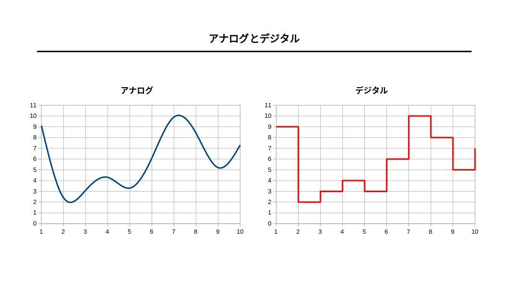

# 『コンピュータと数学』

（最終更新： 2023-01-09）


## 目次

1. [離散数学](#離散数学)
1. [アナログとデジタル](#アナログとデジタル)
1. [コンピュータとデータ](#コンピュータとデータ)
	1. [データの単位](#データの単位)
1. [2進数による数の表現](#2進数による数の表現)
	1. [数の正負](#数の正負)
	1. [補数表現](#補数表現)
	1. [固定少数点数](#固定少数点数)
	1. [浮動少数点数](#浮動少数点数)
1. [誤差](#誤差)
	1. [桁落ち](#桁落ち)
	1. [情報落ち](#情報落ち)
	1. [丸め誤差](#丸め誤差)
	1. [打ち切り誤差](#丸め誤差)
	1. [オーバフロー](#オーバフロー)
	1. [アンダーフロー](#アンダーフロー)
1. [10進数の表現](#10進数の表現)
	1. [BCDコード](#bcdコード)
	1. [ゾーン10進数](#ゾーン10進数)
	1. [パック10進数](#パック10進数)
1. [シフト演算](#シフト演算)
	1. [論理シフト](#論理シフト)
	1. [算術シフト](#算術シフト)
1. [論理式と集合](#論理式と集合)
	1. [命題と真偽値](#命題と真偽値)
	1. [論理式](#論理式)
	1. [ベン図](#ベン図)
	1. [真理値表](#真理値表)
	1. [集合](#集合)
1. [論理演算](#論理演算)
	1. [AND演算](#and演算)
	1. [OR演算](#or演算)
	1. [NOT演算](#not演算)
	1. [NAND演算](#nand演算)
	1. [NOR演算](#nor演算)
	1. [XOR演算](#xor演算)
	1. [マスクビット](#マスクビット)
	1. [ビットマスク](#ビットマスク)
	1. [ビットの反転](#ビットの反転)
1. [確率と統計](#確率と統計)
	1. [基本用語](#基本用語)
	1. [確率](#確率)
	1. [余事象](#余事象)
	1. [排反](#排反)
	1. [独立](#独立)


## 離散数学

**離散数学**とは有限で離散的な値を扱う数学のうち、非計算の分野を対象としたもの。コンピュータでは主に離散値を扱うため、離散数学の考え方が基本となる。コンピュータの分野で重要となる離散数学の範囲は、基数や集合、論理演算などである。


## アナログとデジタル

**アナログ**はデータを連続的に変化していく量（連続値）で表したもの。区切られることなく緩やかに変化していくものはアナログ値として記録することができる。アナログデータは通信の際にノイズの影響を受けやすく、完全な複製を行うことができないために時間の経過やコピーによって情報が劣化するという欠点がある。

**デジタル**は連続しているデータを一定の値で区切って離散値として表したもの。ある瞬間のアナログ値を、その値に最も近い離散値に置き換えて記録する（**量子化**）。デジタルデータはコンピュータによる処理がしやすく、通信時のノイズによる情報の劣化にも強い。ただし値を近似値として記録しているため正確な値をデータにすることができない。




## コンピュータとデータ

コンピュータは多くの電子回路から構成されており、スイッチのON/OFFや電圧の高低により信号を伝達している。これらの信号を0と1に対応させる（ONなら1でOFFなら0、5V（電圧高）なら1で0V（電圧低）なら0など）ことで、コンピュータ内部では情報を2進数として扱っている。コンピュータが扱う情報は数字であろうと文字であろうと命令であろうとすべて2進数で表現することができる。また2進数で様々な情報を表現しようとすると桁数が大きくなるため、2進数との基数変換が容易な8進数や16進数（これらは2のべき乗が基数となっているため）もコンピュータの世界ではよく使用されている。

一般的な数は10進数で扱われているため、2進数や8進数、16進数との相互変換がよく行われる。

### データの単位

コンピュータ内部で扱われるデータの最小単位は2進数で表された数の1桁で、これを**ビット**(bit)という。

複数のビットを集めたデータ量の単位を**バイト**(byte)といい、一般的には1バイトは8ビットと等価である。1バイトは256通りの情報を表現することができる。

複数のビットを集めたデータ量の単位としては他にも**ワード**があり、これはコンピュータ内部でCPUやメモリによって処理されるときのデータの単位を表している。ワードサイズはコンピュータやOSによって異るが、4バイトや8バイトが一般的。

ビット列のまとまりにおいて一番左側のビットのことを**最上位ビット**(**MSB**: Most Significant Bit)、一番右側のビットのことを**最下位ビット**(**LSB**: Least Significant Bit)という。


## 2進数による数の表現

### 数の正負

2進数で表された数において最上位ビットを**符号ビット**として扱うことで数の正負を表現することができる。符号ビットが0ならば正の数、1ならば負の数として扱う。また、負の数の表現方法としては補数表現を用いる。

### 補数表現

**補数**とはn進数のある数に対して補うことで、ちょうどnのべき乗（あるいはnのべき乗から1を引いたもの）になる自然数のうち最小のもののこと。言い換えると、ある数に対して足し合わせることで桁が1つ上がる数のこと。例として $560_{10}$ に対する補数は $440_{10}$ （ $560_{10} + 440_{10} = 1000_{10}$ となるため ）となる。

**2の補数**は2進数において負の数を表現する際に用いられる。これは、符号ビットを含めたすべてのビットを反転したもの（**1の補数**）に1を加算することで求めることができる。2の補数においてnビットで表現できる数の範囲は $-(2^{n-1}) ~ (2^{n-1} - 1)$ となる。これに対して1の補数では $-(2^{n-1} - 1) ~ (2^{n-1} - 1)$ となり、表現できる範囲が1少なくなる（0が正と負で2種類存在してしまうため）。

補数を用いた場合、減算は加算として扱うことができる。例として $01100100_2 (=100_{10})$ から $11101111_2 (=-17_{10})$ を引いた結果は次のようにして求められる（溢れた桁は無視して良い）。

```
    0 1 1 0 0 1 0 0
+   1 1 1 0 1 1 1 1
―――――――――――――――――――
  1 0 1 0 1 0 0 1 1
```

### 固定小数点数

**固定少数点数**ではどのビットを小数点とするかをあらかじめ決めておき小数を表現する。データの解析は容易であるが、表現できる数値の範囲が限定されてしまうため浮動小数点数を用いる場合が多い。

### 浮動小数点数

**浮動小数点数**は限られたバイト数の中で効率よく実数を表現する方法で、[IEEE 754](https://ja.wikipedia.org/wiki/IEEE_754)によって規定された浮動小数点方式と呼ばれる方式を用いる。浮動小数点数の基本は指数表現で、実数を $数値 = 仮数部 \times 基数部^{指数部}$ の形式で表す。

- **基数部**は2進数であれば必ず2となる
- **指数部**には基数に対する指数部分を2進数で表記したものを格納する（指数部が負の場合は2の補数表現を使用）
- **仮数部**には正規化した小数点数以下の値を格納する

小数点数の演算では制度が重要になるため、仮数部で有効桁数を確保して指数部で数の大きさを表現する。仮数部の最上位ビットが0にならないように仮数部と指数部を調整することで有効桁数を最大にすることを、**正規化**という。

浮動小数点数には単精度と倍精度があり、**単精度**では32ビット（符号部1ビット、指数部8ビット、仮数部23ビット）、**倍精度**では64ビット（符号部1ビット、指数部11ビット、仮数部52ビット）で表現する。


## 誤差

**誤差**とは限られた桁数で表現された値と真の値との差。

固定小数点数では限られた範囲の中であれば誤差なく計算することができるが、範囲内すべての値を正確に表現できない（近似値を用いる場合がある）ため、誤差が生じる可能性がある。10進数で表したときに有限小数であっても、2進数で表すと無限小数となる場合もあるので注意が必要（ $0.01$ など）。

小数点計算以外でも、四則演算やシフト演算などにおいても誤差が発生する場合があるので注意が必要。

### 桁落ち

**桁落ち**は値がほぼ等しい2つの数値の差を求めたときに、有効桁数が減ってしまう誤差。次の例では、もともとの値の有効桁数は10桁であるが、計算後の値の有効桁数は2桁になってしまう。

```
1.110100101 \times 2^3 - 1.110100010 \times 2^3 = 0.000000011 \times 2^3 = 1.100000000 \times 2^{-5}
```

### 情報落ち

**情報落ち**は絶対値が非常に大きい数値と小さい数値で加算や減算を行ったときに、小さい数値が計算結果に反映されない誤差。下記の例で有効桁数が8桁であるとすると、計算結果に小さい方の数値が反映されない。

```
1234.5678 + 0.0000001 = 1234.5678001 \simeq 1234.5678
```

### 丸め誤差

**丸め誤差**は数値の有効桁数の関係で切り捨て、切り上げ、四捨五入などによって下位の桁を削除することで発生する誤差。

### 打ち切り誤差

**打ち切り誤差**は無限少数などの桁が無限に続く数値を途中で打ち切ることによって発生する誤差。

### オーバフロー

**オーバフロー**（**桁あふれ**）は演算結果が桁内で表すことができる数値の範囲を超えることで発生する誤差。例えば1バイトの整数データであれば表現できる範囲は `-128 ~ 127` であるが、上限である127を超える数値になるような演算を行うと発生する。

### アンダーフロー

**アンダーフロー**は浮動小数点数の演算において、演算結果の指数部が小さくなりすぎることで数値を表現できなくなるような誤差。浮動小数点数の指数部で表現可能な範囲の最小値よりも小さい数となった場合に発生する。


## 10進数の表現

コンピュータが計算を行う際は数を2進数として扱うが、キーボードから入力された数字はそのまま10進数の文字として表現され、計算に使うときに2進数に変換される。コンピュータが10進数を表現する一般的な方法として、BCDコード、ゾーン10進数、パック10進数がある。

### BCDコード

**BCDコード**(Binary Coded Decimal)は10進数の1桁を2進数4桁（1ビット）に対応させて表現したもので、数字を表すコードの基本となる。

| 10進数 | BCDコード |
|--------|-----------|
|      0 |      0000 |
|      1 |      0001 |
|      2 |      0010 |
|      3 |      0011 |
|      4 |      0100 |
|      5 |      0101 |
|      6 |      0110 |
|      7 |      0111 |
|      8 |      1000 |
|      9 |      1001 |

### ゾーン10進数

**ゾーン10進数**（**アンパック10進数**）は10進数を1バイトで表現する方法で、上位4ビット（**ゾーン部**）は文字コードの種類を表し、下位4ビットは数値を表すBCDコードが入る。また、最下位桁のゾーン部は符号部として使用する。

JISコード形式では数字を表す文字の上位4ビットを0011としている。また符号部は数が正の場合は1100、負の場合は1101となる。

```
# JISコード形式で表した987
00111001 00111000 11000111

# JISコード形式で表した-987
00111001 00111000 11010111
```

### パック10進数

**パック10進数**は10進数1桁をBCDコードで表現し、最下位の4ビットに符号を付加する。バイト単位で扱うため偶数桁の場合は符号部を含めて8ビットの倍数にならないため先頭に0000を追加する。

```
# パック10進数で表した-6078
0000 0110 0000 0111 1000 1101
```


## シフト演算

**シフト演算**は桁を移動することでべき乗を計算する方法。n進法において桁を左へシフトすると数は元のn倍に、右へシフトすると数は元の1/n倍になる。 

2進数で表された数は左にkビットシフトすることで元の数の $2^k$ 倍に、右にkビットシフトすることで元の数の $2^{-k}$ 倍になる。ただしあふれたビットは捨てらるため、必ず正しい結果になるとは限らない。

### 論理シフト

**論理シフト**は最上位ビットを符号ビットとして扱わずにシフト演算を行う。符号ビットが存在しないため、負の数を扱うことはできない。

**論理右シフト**は2進数の全てのビットをそのまま右へ移動し、空いた左端のビットには0を埋める。

**論理左シフト**は2進数の全てのビットをそのまま左へ移動し、空いた右端のビットには0を埋める。

### 算術シフト

**算術シフト**は最上位ビットを符号ビットとして固定しシフト演算を行う。

**算術右シフト**は符号付き2進素の符号ビット以外の全てのビットをそのまま右へ移動し、左の空いたビットには符号ビットと同じ値を埋める。

**算術左シフト**は符号付き2進数の符号ビット以外の善美っとをそのまま左へ移動し、空いた右端のビットには0を埋める。


## 論理式と集合

### 命題と真偽値

**命題**とは正誤が明確にできる文章や条件式のことで、**真**(true)か**偽**(false)のどちらかの値を持つ。このような値のことを**真偽値**（**ブール値**）といい、2進数においては0を真、1を偽として1ビットで表現する。

### 論理式

**論理式**は複数の命題を組み合わせた新しい命題の正誤を判断するために用いられる。論理式には次のような種類がある。

| 論理式         | 意味     | 記号                      |
|----------------|----------|---------------------------|
| 論理積(AND)    | ～かつ   | $\cdot \land$             |
| 論理和(OR)     | ～または | $+ \lor$                  |
| 論理否定(NOT)  | ～でない | $\neg$                    |
| 論理包含       | ～ならば | $\Rightarrow \to \supset$ |

### ベン図

**ベン図**は論理式の入力の組み合わせと出力を図で表現したもの。図中の円で示された部分が入力変数にあたり、円の内側が入力変数が真の場合、円の外側が入力変数が偽の場合を表している。また、出力が真となる領域は図中に色をつけるなどして表わされる。

### 真理値表

**真理値表**は論理式の入力の組み合わせと出力を表で表現したもの。2つの入力変数をそれぞれ $x, y$ とおくと、各論理式の真理値表は次のようになる。

| $x$ | $y$ | $x \dot y$ | $x + y$ | $\bar{x}$ | $x \Rightarrow y$ |
|-----|-----|------------|---------|-----------|-------------------|
|  0  |  0  |      0     |    0    |     1     |         1         |
|  0  |  1  |      0     |    1    |     1     |         1         |
|  1  |  0  |      0     |    1    |     0     |         0         |
|  1  |  1  |      1     |    1    |     0     |         1         |

### 集合

**集合**は単一または複数のものの集まりのことで、一定のルールや条件によってグループ化されている。集合に含まれるもののことを**要素**という。

**部分集合**は集合同士の包含関係を示す集合で、ある集合 $x$ のすべての要素が集合 $y$ の要素に含まれていれば、 $x$ は $y$ の部分集合であるという。中でも $x \neq y$ であれば、 $x$ は $y$ の**真部分集合**であるという。

**和集合**は2つ以上の集合において、少なくとも一方に属する要素を集めた集合。

**積集合**（**共通集合**）は2つ以上の集合において、どちらにも属する要素を集めた集合。

**補集合**はある集合（全体集合）の部分集合に対して、そこに含まれない要素を集めた集合。


## 論理演算

**論理演算**（**ブール演算**）は真偽値に対して行われる演算。

基本的な論理演算にはAND演算、OR演算、NOT演算があり、これらはコンピュータが行う演算の最小単位となる。真偽値は2進数1桁で表現することができ、これはコンピュータが扱う情報の最小単位であるため、コンピュータが行う演算は全てこれらの論理演算の組み合わせからなる。

また基本論理演算を組み合わせた複合的な論理演算として、NAND演算、NOR演算、XOR演算などがある。

### AND演算

**AND演算**は論理式における論理積にあたり、2つの真偽値の入力値のうち両方が真であるときにだけ真を出力する。

2つの入力変数をそれぞれ $x, y$ 、出力を $z$ とすると、真理値表とベン図は次のようになる。

| $x$ | $y$ | $z$ |
|-----|-----|-----|
|  0  |  0  |  0  |
|  0  |  1  |  0  |
|  1  |  0  |  0  |
|  1  |  1  |  1  |

### OR演算

**OR演算**は論理式における論理和にあたり、2つの真偽値の入力値のうちどちらか一方でも真であれば真を出力する。

2つの入力変数をそれぞれ $x, y$ 、出力を $z$ とすると、真理値表とベン図は次のようになる。

| $x$ | $y$ | $z$ |
|-----|-----|-----|
|  0  |  0  |  0  |
|  0  |  1  |  1  |
|  1  |  0  |  1  |
|  1  |  1  |  1  |

### NOT演算

**NOT演算**は論理式における論理否定にあたり、1つの真偽値の入力値を反転した値を出力する。　

入力変数を $x$ 、出力を $z$ とすると、真理値表とベン図は次のようになる。

| $x$ | $z$ |
|-----|-----|
|  0  |  1  |
|  1  |  0  |

### NAND演算

**NAND演算**は論理式における論理積と論理否定を組み合わせたもので、2つの真偽値の入力値のうち両方が真であるときにだけ偽を出力する。

2つの入力変数をそれぞれ $x, y$ 、出力を $z$ とすると、真理値表とベン図は次のようになる。

| $x$ | $y$ | $z$ |
|-----|-----|-----|
|  0  |  0  |  1  |
|  0  |  1  |  1  |
|  1  |  0  |  1  |
|  1  |  1  |  0  |

### NOR演算

**NOR演算**は論理式における論理和と論理否定を組み合わせたもので、2つの真偽値の入力値のうちどちらか一方でも真であれば偽を出力する。

2つの入力変数をそれぞれ $x, y$ 、出力を $z$ とすると、真理値表とベン図は次のようになる。

| $x$ | $y$ | $z$ |
|-----|-----|-----|
|  0  |  0  |  1  |
|  0  |  1  |  0  |
|  1  |  0  |  0  |
|  1  |  1  |  0  |

### XOR演算

**XOR演算**は**排他的論理和**と呼ばれ、2つの真偽値の入力値の値が異なる場合にのみ真を出力する。

2つの入力変数をそれぞれ $x, y$ 、出力を $z$ とすると、真理値表とベン図は次のようになる。

| $x$ | $y$ | $z$ |
|-----|-----|-----|
|  0  |  0  |  0  |
|  0  |  1  |  1  |
|  1  |  0  |  1  |
|  1  |  1  |  0  |

### マスクビット

**マスクビット**はあるビット列の特定のビットにだけ操作を行いたい場合などに用いるビット列で、操作対象となるビットに対応するビットを1、それ以外を0としたビット列である。

```
# 8ビットのビット列の下位6ビットを対象としたマスクビット
00111111
```

### ビットマスク

**ビットマスク演算**はビット列のうち特定の部分だけを取り出す操作。取り出したいビットに対するマスクビットとのAND演算を行うことで得られる。対象としなかった部分は0で埋められる。

```
      1 0 0 1 1 0 1 1   # 対象のビット列
AND   0 0 0 0 1 1 1 1   # マスクビット（下位4ビットを対象とする）
―――――――――――――――――――――
      0 0 0 0 1 0 1 1   # 下位4ビットを取り出したビット列
```

### ビットの反転

2進数で表された数の各桁を反転した（0を1に、1を0にした）新しい数を出力するには、反転したいビットに対するマスクビットとの排他的論理和をとる。

```
      1 0 0 1 1 0 1 1   # 対象のビット列
XOR   1 1 1 1 1 1 1 1   # マスクビット（全ビットを対象とする）
―――――――――――――――――――――
      0 1 1 0 0 1 0 0   # 反転後のビット列
```


## 確率と統計

### 基本用語

**場合の数**とは示された条件を満たす場合が何通りあるかを表す数。

**試行**とは同じ条件の基で何回も繰り返して行うことができ、その結果が偶然によるような実験や観測のこと。

**根源事象**（**基本事象**）とはある試行において最も基本的であると考えられる事象のこと。

**全事象**とは根源事象全体からなる事象のこと。

**和事象**とは2つの事象において少なくとも一方が起こる事象。

**積事象**とは2つの事象において両方が同時に起こる事象。

### 確率

**確率**とはある事象の起こる可能性の度合いを数値化したもの。事象 $A$ が起こる確率 $P(A)$ は次のように表される。

$P(A) = \frac{事象Aに含まれる根源事象の数}{全事象に含まれる根源事象の数}$

### 余事象

**余事象**とはある事象が起こらない事象のこと。ある事象 $A$ が起こらない確率 $P(\bar{A})$ （余事象）は次のように求められる。

$P(\bar{A}) = 1 - P(A)$

### 排反

**排反**とは2つの事象において両方が同時に起こることがないこと。

### 独立

**独立**とは2つの事象においてそれぞれが無関係に起こったり起こらなかったりすること。


## 参考文献

- [角谷一成.令和05年 基本情報技術者合格教本.株式会社技術評論社, 2022, 575](https://gihyo.jp/book/2022/978-4-297-13164-7)
