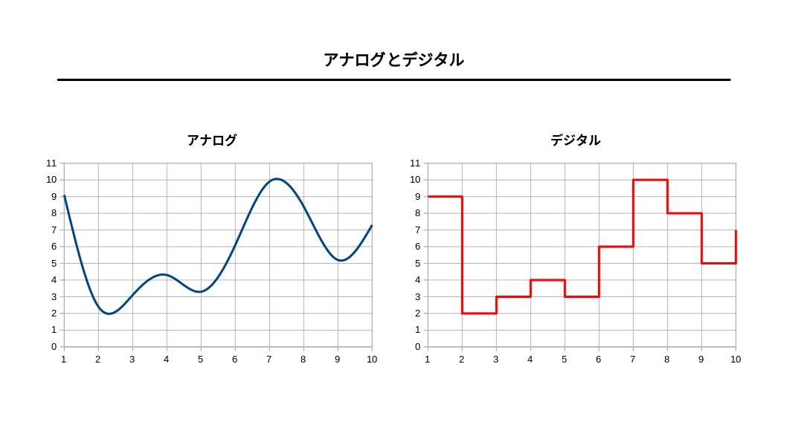

# 『コンピュータと数』

（最終更新： 2023-01-10）

## 目次

1. [アナログとデジタル](#アナログとデジタル)
1. [コンピュータとデータ](#コンピュータとデータ)
	1. [データの単位](#データの単位)
	1. [MSBとLSB](#msbとlsb)

## アナログとデジタル

**アナログ**はデータを連続的に変化していく量（連続値）で表したもの。アナログデータは通信の際にノイズの影響を受けやすく、完全な複製を行うことができないため、時間の経過やコピーによって情報が劣化する。

**デジタル**はデータを一定の間隔で区切った値（離散値）で表したもの。デジタルデータはコンピュータによる処理がしやすく、通信時のノイズによる情報の劣化にも強い。ただし値を近似値として記録しているため、正確な値をデータにすることはできない。

自然界に存在するほとんどの情報は、人間が観測するスケールにおいてはアナログである。ある瞬間の値を最も近い離散値に置き換えて記録することを**量子化**といい、これによりアナログデータをデジタルデータに変換して記録することができる。逆に、デジタルデータを正確にアナログデータに変換することはできない。

## コンピュータとデータ

コンピュータは多くの電子回路から構成されており、スイッチのON/OFFや電圧の高低により信号を伝達している。これらの信号を0と1に対応させる（ONなら1でOFFなら0、5V（電圧高）なら1で0V（電圧低）なら0など）ことで、コンピュータ内部では情報を2進数として扱っている。コンピュータが扱う情報は数字であろうと文字であろうとすべて2進数の羅列で表現される。

2進数で様々な情報を表現しようとすると桁数が大きくなってしまうため、1桁でより多くの情報を有らせるように8進数や16進数もコンピュータの世界でよく使用される。これらの基数が用いられることが多いのは、2進数との相互変換が容易なためである。また一般的に数は10進数で扱われるため、2進数や8進数、16進数との相互変換もよく行われる。

### データの単位

コンピュータ内部で扱われるデータの最小単位は2進数で表された1桁で、これを**ビット**(bit)という。

複数のビットを集めたデータ量の単位を**バイト**(byte)といい、一般的には1バイトは8ビットと等価である。1バイトは256通りの情報を表現することができる。

複数のビットを集めたデータ量の単位としては他にも**ワード**があり、これはコンピュータ内部で情報をCPUやメモリによって処理する際の単位を表している。ワードサイズはコンピュータやOSによって異なるが、4バイトや8バイトが一般的。

### MSBとLSB

ビット列において一番左のビットのことを**最上位ビット**(**MSB**: Most Significant Bit)、一番右側のビットのことを**最下位ビット**(**LSB**: Least Significant Bit)という。
