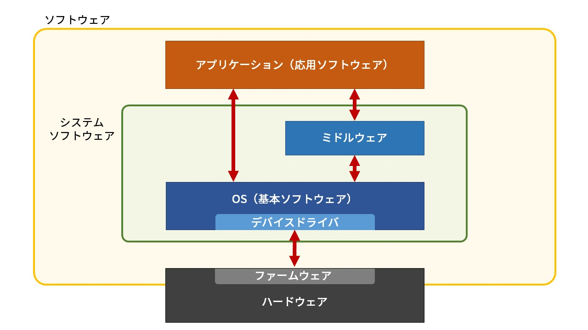

# 『コンピュータの基礎知識』

（最終更新： 2023-01-20）

## 目次

1. [コンピュータ](#コンピュータ)
1. [コンピュータの歴史](#コンピュータの歴史)
	1. [第1世代](#第1世代)
	1. [第2世代](#第2世代)
	1. [第3世代](#第3世代)
	1. [第3.5世代](#第35世代)
	1. [第4世代](#第4世代)
1. [コンピュータの種類](#コンピュータの種類)
	1. [パーソナルコンピュータ](#パーソナルコンピュータ)
	1. [ワークステーション](#ワークステーション)
	1. [サーバ](#サーバ)
	1. [メインフレーム](#メインフレーム)
	1. [スーパーコンピュータ](#スーパーコンピュータ)
	1. [量子コンピュータ](#量子コンピュータ)
1. [コンピュータ構成要素](#コンピュータ構成要素)
	1. [ハードウェア](#ハードウェア)
	1. [ソフトウェア](#ソフトウェア)
	1. [ファームウェア](#ファームウェア)
	1. [ミドルウェア](#ミドルウェア)
1. [コンピュータアーキテクチャ](#コンピュータアーキテクチャ)
	1. [プログラム内蔵方式](#プログラム内蔵方式)
	1. [逐次制御方式](#逐次制御方式)

## コンピュータ

**コンピュータ**は与えられた手順に従って計算やデータ処理を自動的に行う装置全般のことで、特に電子回路を用いてデジタルデータの入出力や演算、変換などを連続的に行うことができる電気機械を指す。

パソコンやゲーム機、スマートフォンやタブレットといった機器は全てコンピュータであり、最近では家電製品や自動車などにコンピュータが組み込まれることも珍しくない。

コンピュータについて正しく理解して使いこなす能力を持っていることを**コンピュータリテラシ**と呼ぶ。

## コンピュータの歴史

文明の発展において「計算」は非常に重要な要素であり、人類は計算を簡単に、正確に、高速に行うために様々な道具を発明してきた。[コンピュータ](#コンピュータ)も計算を自動化するために生まれた装置であり、その歴史は[コンピュータ](#コンピュータ)を構成する主要素子によって区分できる。

### 第1世代

第1世代の[コンピュータ](#コンピュータ)は主に真空管を使用している。**真空管**は真空の容器中に電極を設けたもので、その間の電子流を制御することによって増幅や整流、発信などを行うことができる。

1942年に世界初の[コンピュータ](#コンピュータ)（電子計算機）としてアメリカ・アイオワ州立大学で開発された**ABC**(Atanasoff-Berry Computer)は、現在の[コンピュータ](#コンピュータ)につながる様々な発明が詰め込まれていたが、実用機ではなかった。

1946年にアメリカ・ペンシルバニア大学で開発された**ENIAC**(Electronic Numerical Integrator and Computer)は世界初の実用[コンピュータ](#コンピュータ)で、大砲の弾道計算を行うことを目的としていた。ENIACは世界初のプログラム可能な[コンピュータ](#コンピュータ)であったが、計算手順を変更するために配線をつなげ直さなければならないという欠点があった。

1949年にイギリス・ケンブリッジ大学で開発された**EDSAC**(Electronic Delay Storage Automatic Calculator)は世界初の[プログラム内蔵方式](#プログラム内蔵方式)の[コンピュータ](#コンピュータ)。EDVACに関するレポートに刺激を受けて開発が進められ、結果としてEDVACよりも先に完成することとなった。

1950年にアメリカ・レミントンランド社で開発された**UNIVAC-I**(UNIVersal Automatic Computer)は[プログラム内蔵方式](#プログラム内蔵方式)で世界初の商用[コンピュータ](#コンピュータ)。

1952年にENIACを改良して開発された**EDVAC**(Electronic Discrete Variable Automatic Computer)は2進数と[プログラム内蔵方式](#プログラム内蔵方式)を採用した[コンピュータ](#コンピュータ)。「コンピュータの父」とも呼ばれる**ジョン・フォン・ノイマン**が携わっていることでも有名。

### 第2世代

第2世代の[コンピュータ](#コンピュータ)は主にトランジスタなどの半導体を使用している。**トランジスタ**は電子回路中で信号を増幅したりスイッチングしたりすることができる半導体素子。トランジスタの登場により[コンピュータ](#コンピュータ)の小型化（**ダウンサイジング**）、低価格化が進んだ。また[真空管](#第1世代)と比べても信頼性が高く、発熱量も少ないため寿命が長いという利点があった。

この世代の[コンピュータ](#コンピュータ)としてはIBMが開発した**IBM1400シリーズ**が世界的に人気が高かった。

### 第3世代

第3世代の[コンピュータ](#コンピュータ)は主に集積回路を使用している。**集積回路**(**IC**: Integrated Circuit)は半導体基板上に様々な回路素子を連結したもので、大変サイズが小さいことから**チップ**と呼ばれる。ICの登場により[コンピュータ](#コンピュータ)の小型化、高速化が一気に進んだ。

この世代の[コンピュータ](#コンピュータ)としてはIBMが開発した**IBM 360シリーズ**が有名。

### 第3.5世代 

第3.5世代の[コンピュータ](#コンピュータ)は[IC](#第3世代)回路の進歩により生まれたLSIを使用している。**LSI**(Large Scale Integration)は[IC](#第3世代)と同じ意味で使われることもあるが、もともとは[IC](#第3世代)よりも集積度が高いものを指す用語。

インテルが演算回路や制御回路を1[チップ](#第3世代)に集積した**マイクロプロセッサ**を開発したことで、さらに[コンピュータ](#コンピュータ)の小型化、高速化が進んだ。また、[スーパーコンピュータ](#スーパーコンピュータ)の登場により科学技術計算などの高速演算も可能となった。

### 第4世代

第4世代の[コンピュータ](#コンピュータ)は主にVLSIを使用している。**VLSI**(Very Large Scale Integration)は[LSI](#第35世代)よりもさらに集積度を高めた素子で、VLSIの登場により個人向けの[パーソナルコンピュータ](#パーソナルコンピュータ)が普及した。

## コンピュータの種類

[コンピュータ](#コンピュータ)は活躍した時代や用途、サイズなどによっていくつかの種類に分類することができる。

### パーソナルコンピュータ

**パーソナルコンピュータ**（パソコン、PC）は個人が使用するのに適した小型で低価格の[コンピュータ](#コンピュータ)。形状やサイズに焦点を当てるとノートPC（ラップトップPC）、デスクトップPC、タブレットPCなどに分類できる。

### ワークステーション

**ワークステーション**は3次元の設計やCG、科学計算などに用いられる、一般の[PC](#パーソナルコンピュータ)よりも高速な処理が可能な[PC](#パーソナルコンピュータ)のこと。CPUを複数台搭載していたり、高速なグラフィックボードを搭載していたりと、[PC](#パーソナルコンピュータ)の中でも高額な部類。

### サーバ

**サーバ**はクライアントと呼ばれる他の[コンピュータ](#コンピュータ)やソフトウェアからの要求に応じてデータやサービスを提供するための[コンピュータ](#コンピュータ)。ホームページを配信するWebサーバやメールを配信するメールサーバ、ファイルを管理するためのファイルサーバなどに分類できる。

### メインフレーム

**メインフレーム**は企業などの巨大な組織の根幹情報システムなどに使用される[コンピュータ](#コンピュータ)。多数の利用者や業務で共有し、大量の重要なデータや処理を扱うため、高い性能や信頼性を求められる。

### スーパーコンピュータ

**スーパーコンピュータ**は科学的な研究目的で用いられる、大量の数値演算を高速で行うことができるコンピュータ。気象の予測や宇宙産業の領域で活躍している。

### 量子コンピュータ

**量子コンピュータ**は量子力学の原理を計算に応用した[コンピュータ](#コンピュータ)。素粒子の世界にみられる状態である**重ね合わせ**を利用して、従来の電子回路では不可能な超並列的な処理を行うことができる。

## コンピュータ構成要素

[コンピュータ](#コンピュータ)を構成する要素は大きく[ハードウェア](#ハードウェア)と[ソフトウェア](#ソフトウェア)に分類できる。

### ハードウェア

**ハードウェア**は[コンピュータ](#コンピュータ)を構成する要素のうち、回路や装置、設備などの物理的な実体を伴うもの。ディスプレイやキーボード、マウス、プリンタ等はハードウェアに分類される。

### ソフトウェア

**ソフトウェア**は[コンピュータ](#コンピュータ)を動作させるためのプログラムのこと。[コンピュータ](#コンピュータ)の根幹的な制御に関わる基本ソフトウェアと、特定の機能や目的のためにつくられた応用ソフトウェアがある。

### ファームウェア

**ファームウェア**は[コンピュータ](#コンピュータ)に内蔵される[ソフトウェア](#ソフトウェア)の一種で、本体内部の回路や装置などの基本的な制御を行う機能を持ったもの。機械の内部に固定的に組み込まれ内容の変更が少ないことから、[ハードウェア](#ハードウェア)と[ソフトウェア](#ソフトウェア)の中間的な存在として扱われる。

### ミドルウェア

**ミドルウェア**は[ソフトウェア](#ソフトウェア)の一種で、基本ソフトウェアと応用ソフトウェアの中間に位置し、様々な[ソフトウェア](#ソフトウェア)から共通して利用される機能を提供するもの。基本ソフトウェアよりも分野や用途が限定された具体的な機能を提供する場合が多い。

## コンピュータアーキテクチャ

**コンピュータアーキテクチャ**とは[コンピュータ](#コンピュータ)における[ハードウェア](#ハードウェア)や[ソフトウェア](#ソフトウェア)、ネットワークなどの設計思想のこと。

### プログラム内蔵方式

**プログラム内蔵方式**（**ストアドプログラム方式**）はプログラムをデータとして記憶装置に格納しておき、これを読み込みながら実行する[コンピュータアーキテクチャ](#コンピュータアーキテクチャ)。プログラム内蔵方式ではない最初期の[コンピュータ](#コンピュータ)は、計算手順を変えるために配線をつなぎなおす必要があったため、汎用性が乏しかった。プログラム内蔵方式ではプログラムを外部から与えることで、ひとつの[コンピュータ](#コンピュータ)で様々な処理を行えるようになっている。現在使われているほとんどの[コンピュータ](#コンピュータ)はプログラム内蔵方式を採用している。

プログラム内蔵方式を採用した[コンピュータ](#コンピュータ)は**ノイマン型コンピュータ**と呼ばれている。これはプログラム内蔵方式を採用した初期の[コンピュータ](#コンピュータ)である[EDVAC](#第1世代)に関する論文の著者、[ジョン・フォン・ノイマン](#第1世代)に由来している。

ノイマン型コンピュータでは、記憶装置から演算装置にプログラムをデータとして伝送する際の速度がボトルネックとなりやすい。これを**フォンノイマンボトルネック**という。

### 逐次制御方式

**逐次制御方式**とは、命令を主記憶装置から取り出して解読し、その内容によってデータを取り出し、処理を実行するという一連の流れを繰り返すことでプログラムを実行する方式。
